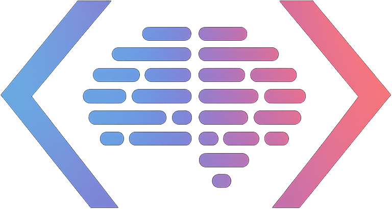

<div align="center">
  

  # DevFoundry

  **Build Your Way to Financial Independence: Software as Accessible Leverage**
</div>

---

<div align="center">

### 📚 [View Full Documentation](https://episk-pos.github.io/DevFoundry) 📚

</div>

---

## What is DevFoundry?

DevFoundry is an educational repository and community designed to teach software architecture, systems thinking, and AI-assisted development. We believe **software is the most accessible form of leverage ever created** — and the only barrier to using it is understanding.

This isn't just a coding tutorial. It's a **mental model builder** that teaches you to think about software the way professional architects do: as systems of collaborating components, flowing data, and conscious design decisions.

**Our goal**: Help you build a portfolio of small, sustainable software products that collectively provide financial independence.

👉 **[Read the full thesis](https://episk-pos.github.io/DevFoundry/docs/thesis)** to understand the vision.

---

## Quick Links

| I want to... | Go here |
|--------------|---------|
| Understand the core thesis | [The DevFoundry Thesis](https://episk-pos.github.io/DevFoundry/docs/thesis) |
| Start learning from scratch | [Part I: Foundations](https://episk-pos.github.io/DevFoundry/docs/curriculum/part-1-foundations/what-software-is) |
| See the full curriculum | [Curriculum Overview](https://episk-pos.github.io/DevFoundry/docs/overview) |
| Learn the mental models | [Mental Models](https://episk-pos.github.io/DevFoundry/docs/mental-models/protocol-thinking) |
| Look up software terms | [Glossary](https://episk-pos.github.io/DevFoundry/docs/glossary) |
| Get LLM prompt templates | [Prompts](https://episk-pos.github.io/DevFoundry/docs/prompts) |
| See architecture decisions | [ADRs](https://episk-pos.github.io/DevFoundry/docs/adr) |
| Join the community | [Community](https://episk-pos.github.io/DevFoundry/docs/community) |

---

## Repository Structure

```
devfoundry/
├── docs/               # Core concepts, mental models, glossary
│   └── mental-models/  # Protocol thinking, friction to opportunity, etc.
├── curriculum/         # Structured learning modules (Parts I-IV)
├── examples/           # Progressive lemonade stand implementations
├── exercises/          # Hands-on practice activities
├── prompts/            # LLM prompt templates and strategies
├── adr/                # Architecture Decision Records
├── community/          # Problems, projects, and collaboration
│   ├── problems/       # Friction documented by the community
│   ├── projects/       # Active work being built
│   ├── showcases/      # Completed projects and stories
│   └── resources/      # Curated tools and materials
└── website/            # Docusaurus documentation site
```

---

## Local Development

To run the documentation site locally:

```bash
cd website
npm install
npm start
```

This starts a local development server at `http://localhost:3000/DevFoundry/`.

To build for production:

```bash
npm run build
```

---

## Contributing

This curriculum is under active development. We welcome:

- Suggestions for clarity improvements
- Additional examples and exercises
- Translations
- Accessibility improvements
- Diagram refinements
- Bug fixes and typo corrections

Please open an issue or submit a pull request.

---

## Technology Choices

This curriculum uses:

- **Frontend**: TypeScript, React, Vite
- **Backend**: Node.js, Express
- **Database**: SQLite (for learning)
- **Testing**: Vitest
- **Diagrams**: Mermaid (renders on GitHub)
- **Documentation**: Docusaurus

All architectural choices are documented in [ADRs](https://episk-pos.github.io/DevFoundry/docs/adr) with rationale.

---

## License

- **Code examples**: AGPLv3 (see [LICENSE](LICENSE))
- **Curriculum content**: CC BY 4.0

You are free to use, adapt, and share this material with attribution.

---

<div align="center">

**[Get Started →](https://episk-pos.github.io/DevFoundry)**

*Built for people who want to build their way to freedom — together.*

</div>
