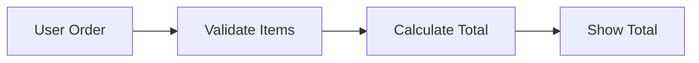
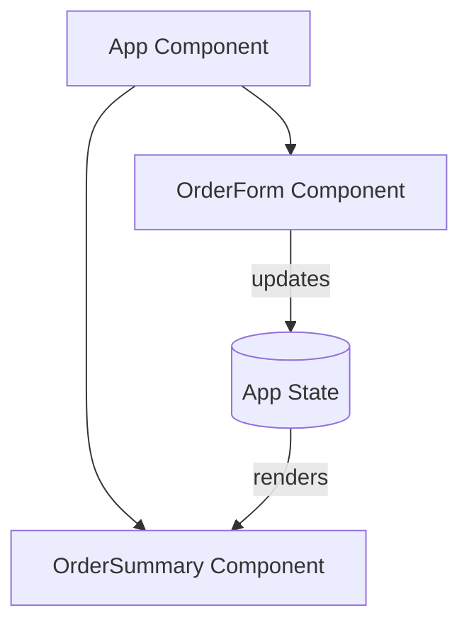
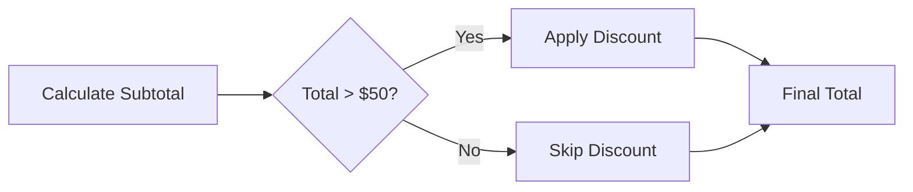
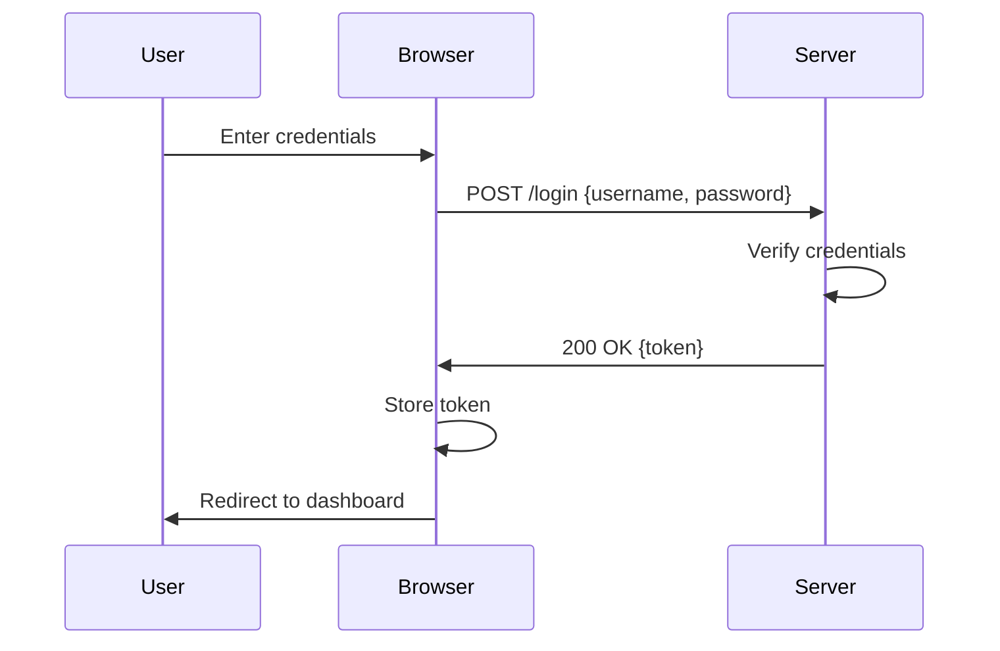

# Flow-Based Development

**The core philosophy of devfoundry**

---

## Introduction

**Flow-Based Development** is an approach to software that prioritizes understanding *how things work* over memorizing *how to write code*.

Traditional programming education often starts with:
1. Learn syntax (variables, loops, functions)
2. Learn algorithms (sorting, searching)
3. Now build something!

**Flow-Based Development inverts this**:
1. Understand the problem as a flow (input → processing → output)
2. Design the architecture (components and connections)
3. Implement the design (write code)

This approach aligns naturally with:
- How software actually works
- How professional architects think
- How LLMs can assist you most effectively

---

## Core Principles

### 1. Think in Flows, Not Procedures

**Traditional approach**:
> "I need to loop through an array and calculate the sum."

**Flow-based approach**:
> "Data flows from user input → validation → calculation → display.
> Where does the calculation fit in this flow?"

### Example: Lemonade Stand

**Procedural thinking**:
```javascript
let total = 0;
for (let i = 0; i < items.length; i++) {
  total += items[i].price * items[i].quantity;
}
console.log(total);
```

**Flow-based thinking**:


Then implement:
```javascript
function processOrder(order) {
  const validated = validateItems(order);
  const total = calculateTotal(validated);
  return displayTotal(total);
}
```

**Why it's better**:
- Each step is a clear, testable function
- The flow is explicit and documentable
- Easy to modify (add discount step before calculateTotal)
- Matches how you'd explain it to someone

---

### 2. Components That Collaborate

Software is not a monolithic block of code. It's a **system of collaborating components**.

**Mental model**:
> Think of components like people on a team. Each has a specific role.
> They communicate by passing messages.

**Example: Lemonade Stand SPA**



**Key insight**: Components are independent but connected. Change one without breaking others.

---

### 3. Intuition Before Abstraction

Don't introduce concepts until learners have the mental scaffolding to understand *why* they exist.

**Traditional approach**:
- "Here's how inheritance works"
- (Learner: "Why do I need this?")

**Flow-based approach**:
- Show duplication problem: "We have three similar components with copy-pasted code"
- Demonstrate manual solution: "We could extract common logic"
- Introduce abstraction: "React has a pattern for this called hooks"
- (Learner: "Oh! That solves the problem I was just facing")

**Progression example in devfoundry**:
1. **Stage 1 (CLI)**: Inline logic — no abstraction
2. **Stage 2 (Static web)**: Extracted functions — simple abstraction
3. **Stage 3 (SPA)**: React components — compositional abstraction
4. **Stage 4 (Fullstack)**: Client/server separation — distributed abstraction

Each stage introduces abstraction *after* you've felt the pain of not having it.

---

### 4. Start Simple, Add Complexity Deliberately

**Anti-pattern**: Introduce all concepts at once
> "This is a React app with TypeScript, Redux, React Router, styled-components, testing library, and..."

**Flow-based pattern**: Introduce one new concept per stage
> "Stage 2 adds the DOM. That's the only new thing. Everything else stays the same."

**Example progression**:

| Stage | New Concept | What Stays the Same |
|-------|-------------|---------------------|
| 1. CLI | Basic program flow | Order logic |
| 2. Static web | DOM, events | Order logic |
| 3. SPA | React, components | Order logic, DOM (abstracted) |
| 4. Fullstack | Client/server, API | Frontend logic |
| 5. Deployment | Hosting, environment variables | Application logic |

**Result**: Each step feels manageable because you're only learning one new thing.

---

### 5. Visualize Everything

**If you can't draw it, you don't understand it.**

Every system in devfoundry is accompanied by diagrams showing:
- **Module view**: Files and structure
- **Component-connector view**: Runtime flow
- **Allocation view**: Where it runs

**Why diagrams matter**:
- Force you to articulate structure
- Reveal gaps in understanding
- Enable communication with others (humans and AI)
- Serve as design documentation

---

### 6. Architecture First, Implementation Second

**Traditional workflow**:
1. Start coding
2. Figure out structure as you go
3. End up with spaghetti code

**Flow-based workflow**:
1. Understand the problem
2. Design the flow (diagram it)
3. Define components and connections
4. Implement components (now it's straightforward)

**Example: Adding a discount feature**

**Architecture-first approach**:

1. **Understand**: "10% off orders over $50"

2. **Design the flow**:


3. **Define components**:
   - `calculateSubtotal(items)`
   - `applyDiscount(total, percentage)`
   - `calculateFinalTotal(subtotal)`

4. **Implement** (now each piece is small and clear):
```javascript
function processOrder(items) {
  const subtotal = calculateSubtotal(items);
  const discount = subtotal > 50 ? applyDiscount(subtotal, 0.10) : 0;
  return subtotal - discount;
}
```

**Result**: Clear code that matches the design. Easy to test, modify, and explain.

---

## How Flow-Based Development Enables LLM Success

### Problem: Vague Prompts Lead to Generic Code

❌ **Vague prompt**:
```
"Build a lemonade stand app"
```

Result: AI generates something, but it doesn't match your mental model, architecture, or constraints.

### Solution: Flow-Based Prompting

✅ **Architecture-first prompt**:
```
I'm building a lemonade stand app. Here's the flow:

1. User inputs: item (select dropdown), quantity (number input)
2. Click "Add to Order" → validates input → adds to order list (array in state)
3. Order list displays below with item, quantity, line total
4. Calculate and display order total
5. "Submit Order" button finalizes order

Module view:
- App.jsx (main component, holds state)
- OrderForm.jsx (input form)
- OrderList.jsx (displays current order)
- utils/pricing.js (calculation logic)

Please implement OrderForm.jsx. It should:
- Accept props: onAddItem (callback)
- Have controlled inputs for item and quantity
- Validate that quantity > 0 before calling onAddItem
- Clear form after successful add
```

**Result**: AI generates code that fits your architecture, uses your structure, and matches your flow.

---

## Practical Application

### Exercise: Think in Flows

Pick a simple app (to-do list, calculator, weather app). Before writing any code:

1. **Draw the flow**: User input → processing → output
2. **Identify components**: What are the major pieces?
3. **Define connections**: How do components communicate?
4. **Specify data flow**: What data moves where?

Only after steps 1-4 should you start coding (or prompting an AI).

---

## Flow-Based Development in Practice

### Real-World Example: Adding Authentication

**Procedural approach**:
- Jump into code: install library, copy-paste example, tweak until it works
- Result: Works, but you don't understand the flow

**Flow-based approach**:

**Step 1: Understand the flow**


**Step 2: Identify components**
- LoginForm (UI)
- AuthService (handles API calls)
- TokenStore (manages token storage)
- ProtectedRoute (checks authentication)

**Step 3: Define connections**
- LoginForm → AuthService (sends credentials)
- AuthService → Server (HTTP request)
- AuthService → TokenStore (saves token)
- ProtectedRoute → TokenStore (checks token)

**Step 4: Implement each component**
Now you can code (or prompt AI) for each piece independently.

**Result**: You understand the system. You can modify it confidently. You can explain it to others.

---

## Flow-Based Development vs Traditional Approaches

| Aspect | Traditional | Flow-Based |
|--------|-------------|------------|
| **Starting point** | Syntax, loops | Problem as a flow |
| **Focus** | How to write code | How the system works |
| **Mental model** | Sequential instructions | Collaborating components |
| **Diagram usage** | Rare, after-the-fact | Central, design-time |
| **Abstraction** | Introduced upfront | Introduced when needed |
| **Complexity** | All at once | One new concept at a time |
| **LLM collaboration** | Vague prompts | Architecture-first prompts |
| **Learning curve** | Steep cliff | Gradual stairs |

---

## Common Misconceptions

### Misconception 1: "Flow-based means no code"

**Reality**: Flow-based development emphasizes understanding before implementing. You still write code — but with clarity.

### Misconception 2: "This is only for beginners"

**Reality**: Professional architects think this way. Seniors draw diagrams before big features. Juniors often jump straight to code.

### Misconception 3: "It's slower to design first"

**Reality**: Thoughtful design saves time debugging and refactoring. Quick hacks create technical debt.

---

## Related Concepts

### Flow-Based Programming (FBP)
A programming paradigm where applications are defined as networks of processes exchanging data. Similar philosophy, but devfoundry focuses on mental models, not a specific paradigm.

### Domain-Driven Design (DDD)
Emphasizes understanding the problem domain before coding. Aligns with architecture-first thinking.

### Test-Driven Development (TDD)
Write tests before implementation. Complements flow-based dev: define behavior (flow), write tests, implement.

---

## Summary

**Flow-Based Development** means:

1. ✓ Thinking in flows (input → processing → output)
2. ✓ Seeing software as collaborating components
3. ✓ Building intuition before introducing abstraction
4. ✓ Starting simple, adding complexity deliberately
5. ✓ Visualizing with diagrams
6. ✓ Designing architecture before writing code

**Why it matters**:
- Aligns with how software actually works
- Makes systems understandable
- Enables effective LLM collaboration
- Reduces cognitive load
- Builds solid mental models

**Next**: See [architecture-first.md](architecture-first.md) for how to apply this when prompting AI assistants.

---

## Further Reading

- [architectural-views.md](../architectural-views.md) — Visualizing flows
- [prompts/02-architecture-first.md](../../prompts/02-architecture-first.md) — Flow-based prompting
- [curriculum/part-1-foundations/01-what-software-is.md](../../curriculum/part-1-foundations/01-what-software-is.md) — Start learning
