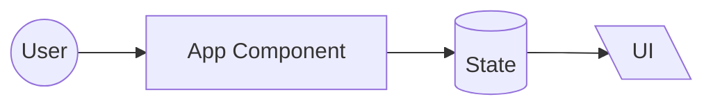

# 0003. Use Mermaid with Conservative Styling for All Diagrams

**Date**: 2025-11-18

## Status

Accepted

## Context

The devfoundry curriculum heavily emphasizes architectural visualization. Every major example requires diagrams showing module views, component-connector views, and allocation views.

**Requirements**:
- Must render on GitHub automatically (no build step)
- Must be version-controllable (diffable, not binary images)
- Must work with AI assistants (AI can generate and modify diagrams)
- Must be accessible (light/dark mode, screen readers)
- Must support all three architectural views (module, component-connector, allocation)
- Must be consistent across all examples
- Must be pedagogically clear (not visually complex)

**Diagram tool alternatives**:

| Option | Pros | Cons |
|--------|------|------|
| **Mermaid** | Markdown-based, GitHub renders, AI-friendly | Limited styling, requires learning syntax |
| **PlantUML** | Powerful, widely used in enterprise | Requires external rendering, more complex syntax |
| **Draw.io / Excalidraw** | Visual editor, flexible | Binary/XML files (not diffable), not AI-friendly |
| **ASCII diagrams** | Universal, plain text | Limited visual quality, hard to maintain |
| **Graphviz** | Powerful graph layouts | Requires build step, complex for beginners |
| **SVG files** | Precise control, beautiful | Not AI-editable, requires design tools |

**Styling alternatives**:

| Approach | Pros | Cons |
|----------|------|------|
| **No color (default)** | Accessible, works in light/dark mode | Less visual distinction |
| **Heavy color coding** | Visually clear categories | Fails in dark mode, accessibility issues |
| **Conservative color** | Subtle emphasis, accessible | Requires careful palette selection |

**Format alternatives**:

| Format | Pros | Cons |
|--------|------|------|
| **Inline in README** | Single file, context co-located | README files can get long |
| **Separate .mmd files** | Modular, reusable | Requires rendering step to view |
| **Mixed approach** | Flexibility | Inconsistent |

## Decision

Use **Mermaid** for all architectural diagrams, with **conservative styling** (minimal color), **inline in markdown** files.

**Specific standards**:

### Diagram Types
- **Module View**: `graph` or `flowchart`
- **Component-Connector View**: `flowchart` or `sequenceDiagram`
- **Allocation View**: `graph` with `subgraph` for boundaries

### Node Shapes (standard legend)
- `[Rectangle]` — Processes, components, functions
- `[(Cylinder)]` — Data stores, databases
- `{{Hexagon}}` — Decision points
- `[/Input/]` — User input, requests
- `[\Output\]` — Rendered UI, responses
- `((Circle))` — Events, start/end points

### Connector Styles
- `-->` Solid arrow: Primary flow, synchronous calls
- `-.->` Dotted arrow: Optional, async, or secondary flow
- `==>` Thick arrow: Emphasized critical path
- `---|Label|-->` Labeled arrows for clarity

### Color Usage
- **Default: No colors** for most diagrams (ensures light/dark mode compatibility)
- **Exceptions**: When distinguishing categories is essential
  - Use conservative fills: `fill:#f9f9f9,stroke:#333`
  - Override text color if needed: `color:#fff`
- **Testing**: All diagrams must be verified in both light and dark modes

### Format
- Diagrams inline in README.md or curriculum/*.md files
- Wrap in code fences: ` ```mermaid ... ``` `
- Include legend only in diagram-standards.md (don't repeat in every diagram)

**Example inline usage**:
````markdown
## Architecture


````

### Documentation
- Full style guide and legend (to be created)
- When to use each diagram type (to be created)
- All examples follow these standards consistently

## Consequences

**Positive**:
- **GitHub integration**: Renders automatically in README files, issues, pull requests
- **Version control**: Text-based diffs show diagram changes clearly
- **AI collaboration**: LLMs can generate, modify, and explain Mermaid diagrams
- **Consistency**: Standards ensure uniform look across all examples
- **Accessibility**: Conservative colors work in light/dark modes, shapes convey meaning
- **Maintainability**: Easy to update diagrams (edit text, not recreate images)
- **Learning**: Students learn a valuable documentation skill (Mermaid is industry-used)
- **Performance**: No image files to load, faster page rendering

**Negative**:
- **Mermaid limitations**: Less control than visual editors (layout, precise positioning)
- **Learning curve**: Students must learn Mermaid syntax (though it's similar to markdown)
- **Rendering inconsistencies**: GitHub's Mermaid renderer occasionally has bugs
- **Color constraints**: Can't use full color palette without accessibility issues

**Neutral**:
- **Not as pretty**: Visual editors can produce more polished diagrams
- **Syntax errors**: Malformed Mermaid fails to render (but easy to debug)

**Mitigation strategies**:
- **Comprehensive guide**: Provide all conventions and examples (to be created)
- **Templates**: Provide copy-paste templates for common patterns
- **Validation**: Use [mermaid.live](https://mermaid.live) to preview diagrams before committing
- **Error handling**: Test all diagrams in both light and dark GitHub themes
- **Fallback**: If Mermaid can't represent something, use ASCII art or external image with explanation
- **Tool recommendations**: Suggest VS Code extension "Markdown Preview Mermaid Support" for local preview

**AI assistant integration**:
When prompting AI for diagrams:
```
"Create a Mermaid diagram following devfoundry standards.
Use component-connector view showing how data flows when user submits an order.
Use standard shapes: rectangles for components, cylinders for state.
No colors unless necessary."
```

**Future considerations**:
- If GitHub improves Mermaid rendering (e.g., better styling options), update standards
- If a better text-based diagramming tool emerges, consider ADR to supersede this decision
- Consider tooling to auto-generate diagrams from code (advanced curriculum module)

## Related Decisions

- [ADR-0001: Frontend Stack](frontend-stack) — Diagrams show React component trees
- [ADR-0002: Backend Stack](backend-stack) — Diagrams show client/server interactions

## References

- [Mermaid Documentation](https://mermaid.js.org/)
- [GitHub Mermaid Support](https://github.blog/2022-02-14-include-diagrams-markdown-files-mermaid/)
- [Mermaid Live Editor](https://mermaid.live) — For testing diagrams
