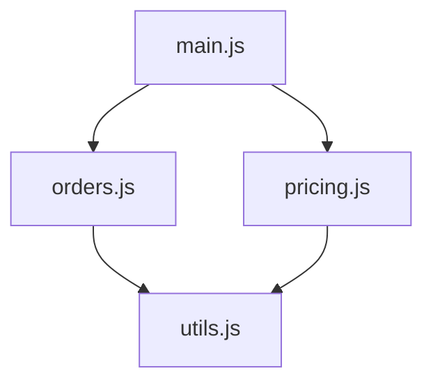
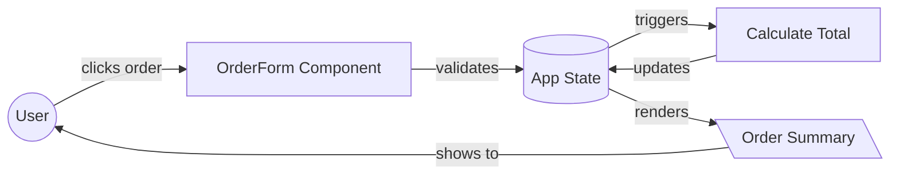
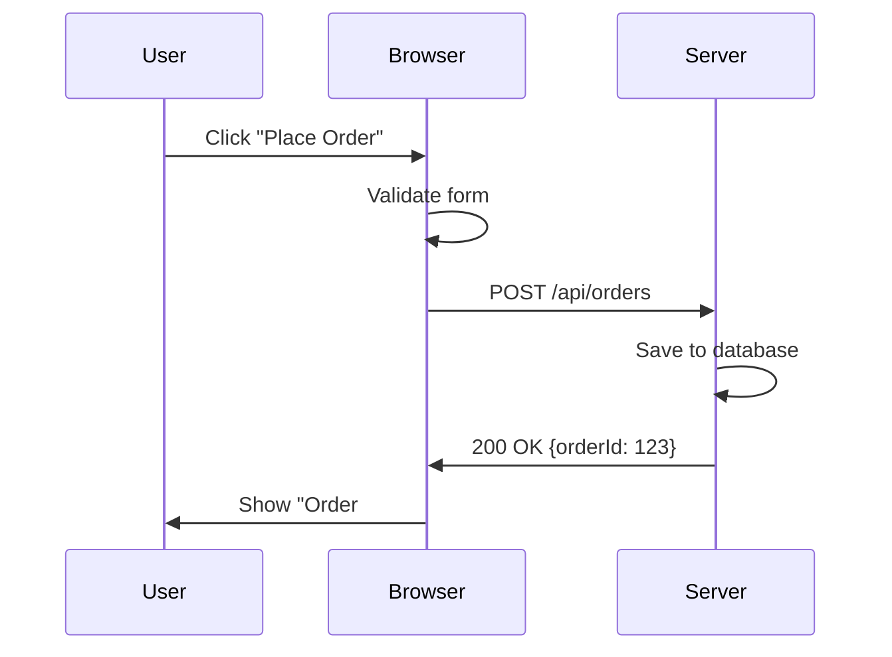

# Architectural Views

**Understanding software from multiple perspectives**

---

## Introduction

A software system is like a building. You can look at it from different angles:

- **Floor plan** (where rooms are and how they connect)
- **Plumbing diagram** (how water flows through pipes)
- **Electrical diagram** (how power is distributed)

Each view answers different questions. All views describe the **same building**, but show different aspects.

Software is the same. We use **architectural views** to understand different aspects of the system.

---

## Why Multiple Views Matter

### The Blind Men and the Elephant

You may know the parable: blind men touch an elephant and describe different things (trunk, leg, tail) because they're examining different parts.

Software is similar. If you only look at:
- **Files**: You miss runtime behavior
- **Runtime**: You miss code organization
- **Deployment**: You miss logic flow

**Professional architects switch between views fluidly.** This curriculum teaches you to do the same.

### Benefits of Multi-View Thinking

1. **Clearer communication** — Different stakeholders care about different views
2. **Better design decisions** — See tradeoffs from multiple angles
3. **Effective LLM prompting** — Specify which view you're discussing
4. **Systematic troubleshooting** — Different bugs appear in different views
5. **Comprehensive documentation** — Cover all important aspects

---

## The Three Views We Use

This curriculum uses a simplified version of the framework from **"Documenting Software Architectures: Views and Beyond"** by Clements et al.

### View Summary

| View | Static or Dynamic | Answers | Best For |
|------|-------------------|---------|----------|
| **Module** | Static | "What code exists? How is it organized?" | Understanding structure |
| **Component-Connector** | Dynamic | "How does it behave at runtime?" | Understanding flow |
| **Allocation** | Static/Dynamic | "Where does it run?" | Understanding deployment |

Let's explore each in detail.

---

## 1. Module View (Static Structure)

### What It Shows

- Files, folders, and their organization
- Dependencies (imports, requires)
- Layers and modules
- Code structure

### What It Doesn't Show

- Runtime behavior
- User interactions
- Data flow during execution

### Key Questions Answered

- "Where is the `calculateTotal` function defined?"
- "Which file imports the `orderUtils` module?"
- "How is the codebase organized?"
- "What are the major subsystems?"

### Example: Lemonade Stand CLI (Module View)



**What this tells us**:
- `main.js` is the entry point
- `orders.js` and `pricing.js` are separate modules
- Both depend on `utils.js` for shared functionality
- This is a simple, flat structure

### When to Use Module View

- Onboarding new developers
- Planning refactoring
- Understanding dependencies
- Designing module boundaries
- Explaining project structure to AI assistants

### LLM Prompting Example

:::danger[Vague prompt]
"Where's the pricing code?"
:::

:::tip[Clear prompt (specifies view)]
"In the module view, which file contains the pricing logic? What other modules does it depend on?"
:::

---

## 2. Component-Connector View (Runtime Behavior)

### What It Shows

- How the system behaves when running
- Data flow between components
- User interactions
- State changes
- API calls
- Event handling

### What It Doesn't Show

- File organization
- Where code is deployed
- Static structure

### Key Questions Answered

- "What happens when the user clicks 'Submit Order'?"
- "How does data flow from input to database?"
- "What triggers a re-render in React?"
- "How do the frontend and backend communicate?"

### Example: Lemonade Stand SPA (Component-Connector View)



**What this tells us**:
- User interaction initiates the flow
- OrderForm validates input
- State is central (all updates flow through it)
- Calculation happens between state updates
- Display is re-rendered based on state

### Variations: Sequence Diagrams

For interactions over time (especially APIs), sequence diagrams work well:



### When to Use Component-Connector View

- Explaining features to stakeholders
- Debugging runtime issues
- Planning state management
- Designing API interactions
- Understanding data transformations

### LLM Prompting Example

:::danger[Vague prompt]
"How does the app work?"
:::

:::tip[Clear prompt (specifies view)]
"Show me the component-connector view of what happens when a user submits an order. Include validation, state updates, and UI feedback."
:::

---

## 3. Allocation View (Deployment)

### What It Shows

- Where code runs (browser, server, mobile device, etc.)
- Network boundaries
- Infrastructure (databases, services, CDNs)
- Physical or virtual resources
- Deployment environments (dev, staging, production)

### What It Doesn't Show

- How code is organized in files
- Runtime data flow details
- Business logic

### Key Questions Answered

- "What runs in the browser vs the server?"
- "Where is the database hosted?"
- "How is the app deployed?"
- "What external services are used?"

### Example: Lemonade Stand Fullstack (Allocation View)


**What this tells us**:
- Frontend runs in the browser
- Backend runs on Render (cloud platform)
- Database lives on the same server as the API
- Static files are served by Vercel CDN
- Browser caches some data locally

### When to Use Allocation View

- Planning deployment
- Understanding infrastructure costs
- Debugging network issues
- Explaining architecture to ops/DevOps
- Designing for scalability

### LLM Prompting Example

:::danger[Vague prompt]
"How do I deploy this?"
:::

:::tip[Clear prompt (specifies view)]
"Create an allocation view diagram showing where each part of the lemonade stand app should be deployed. Include browser, server, database, and any CDN or static hosting."
:::

---

## How Views Relate

### Same System, Different Lenses

Consider a simple web app:

**Module View**:
```
src/
  components/
    OrderForm.jsx
  utils/
    pricing.js
  App.jsx
```

**Component-Connector View**:
```
User → OrderForm → validateInput → updateState → render
```

**Allocation View**:
```
Browser (React)
    ↓ HTTP
Server (Express)
    ↓
Database (PostgreSQL)
```

All three views describe the **same system**. Each emphasizes different aspects.

### Views Answer Different "Why" Questions

| Question | View to Use |
|----------|-------------|
| "Why is the build slow?" | Module View (check dependencies) |
| "Why does the UI freeze?" | Component-Connector View (check state updates) |
| "Why is latency high?" | Allocation View (check network hops) |

---

## Practical Application: Debugging Example

### Scenario: "The total price is wrong"

**Step 1: Module View**
- Find where `calculateTotal` is defined
- Check what it imports
- Verify it's being used in the right place

**Step 2: Component-Connector View**
- Trace data flow from user input to calculation
- Check state updates
- Verify the calculation is triggered correctly

**Step 3: Allocation View** (if applicable)
- Check if calculation happens client-side or server-side
- Verify data sent to/from API is correct
- Look for caching issues

**Result**: Systematic debugging by examining each view.

---

## Practical Application: Prompting AI Assistants

### Scenario: "Add a discount feature"

**Vague prompt** (no view specified):
```
"Add a 10% discount if the user orders more than 5 items."
```

The AI doesn't know where to start. Module? UI? Backend?

**Architecture-first prompts** (view-specific):

**Module View prompt**:
```
"In the module view, we have:
- pricing.js with calculateTotal()
- OrderForm.jsx component

Create a new function calculateDiscount() in pricing.js that
applies 10% off when quantity > 5. Export it."
```

**Component-Connector View prompt**:
```
"In the component-connector view:
- User input flows to OrderForm
- OrderForm calls calculateTotal
- Result is stored in state

Modify the flow to:
1. Check quantity
2. If > 5, apply calculateDiscount
3. Update state with discounted total
```

**Allocation View prompt**:
```
"This is a client-side-only app (all logic in browser).
Ensure the discount logic runs in the browser, not the server.
```

**Result**: Clear, actionable guidance for the AI.

---

## View Selection Cheatsheet

| I need to... | Use this view |
|--------------|---------------|
| Explain file organization | Module |
| Onboard a new developer | Module |
| Plan a refactor | Module |
| Show a user flow | Component-Connector |
| Debug a feature | Component-Connector |
| Explain API calls | Component-Connector (sequence diagram) |
| Plan deployment | Allocation |
| Estimate infrastructure costs | Allocation |
| Explain client vs server | Allocation |
| Debug network issues | Allocation |

---

## Advanced: Additional Views (Beyond This Curriculum)

The "Views & Beyond" framework includes more view types. We simplify to three for pedagogy, but you may encounter:

- **Layered View**: System layers (presentation, business logic, data)
- **Uses View**: Which modules depend on which
- **Generalization View**: Inheritance and abstraction
- **Work Assignment View**: Which teams own which modules

These are useful in larger projects but unnecessary for learning fundamentals.

---

## Exercises

### Exercise 1: Identify the View

For each description, identify which view it represents:

1. "The App component renders OrderForm and Summary components"

<details>
<summary>Answer</summary>
Component-Connector View
</details>

2. "The src folder contains components, utils, and assets"

<details>
<summary>Answer</summary>
Module View
</details>

3. "The React app runs in the browser and calls an API on Heroku"

<details>
<summary>Answer</summary>
Allocation View
</details>

4. "When the user clicks submit, the form data is validated, then sent to the server"

<details>
<summary>Answer</summary>
Component-Connector View
</details>

### Exercise 2: Draw Multiple Views

Pick a simple app you use (e.g., a to-do list):

1. Draw the **Module View** (what files might it have?)
2. Draw the **Component-Connector View** (what happens when you add a to-do?)
3. Draw the **Allocation View** (where does it run?)

### Exercise 3: Prompt Engineering

Rewrite this vague prompt with view-specific language:

:::danger[Vague]
"Make the lemonade stand faster."
:::

<details>
<summary>View-specific prompts</summary>

**Module View**:
"In the module view, analyze dependencies. Are there any unnecessary imports or large libraries that slow down the build?"

**Component-Connector View**:
"In the component-connector view, show the state update flow. Are there unnecessary re-renders or inefficient state updates?"

**Allocation View**:
"In the allocation view, examine network calls. Are there ways to reduce latency between browser and server?"

</details>

---

## Summary

**Three views, three purposes**:

1. **Module View**: Static structure, code organization
2. **Component-Connector View**: Runtime behavior, data flow
3. **Allocation View**: Deployment, infrastructure

**Key insight**: The same system looks different from each view. Professional architects switch between views naturally.

**For LLM workflows**: Specifying the view makes prompts clearer and results better.

---

## Further Reading

- **Book**: "Documenting Software Architectures: Views and Beyond" (Clements et al.)
- **Standard**: ISO/IEC/IEEE 42010 (architecture description)
- **devfoundry docs**:
  - [Diagram Standards](diagram-standards) — How to draw views
  - [Architecture-First Prompts](prompts/02-architecture-first) — Using views in prompts
  - [ADRs](adr/index) — Example architectural decisions

---

## Next Steps

- Review [Diagram Standards](diagram-standards) to learn how to draw these views
- Explore [Examples](examples/00-hello-world-console/index) to see all three views in practice
- Start [What Software Is](curriculum/part-1-foundations/what-software-is) to begin learning
