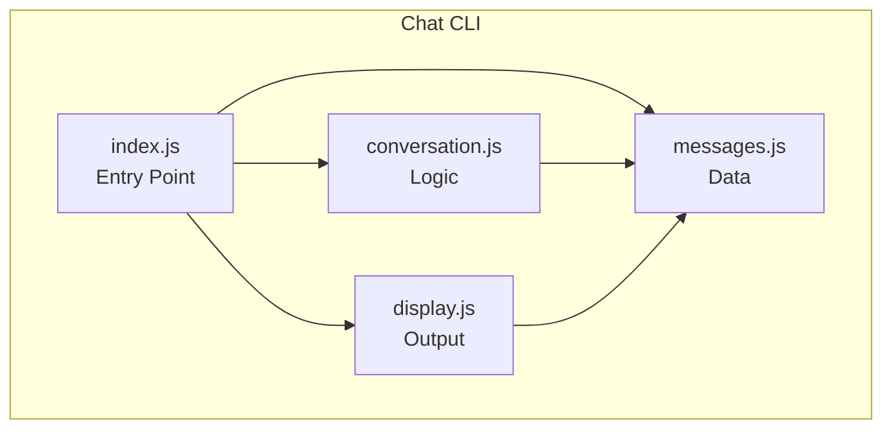
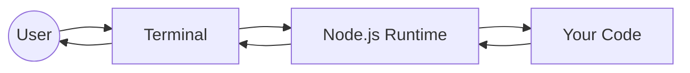

# Module 02: Anatomy of Modern Software Projects

**Understanding how real projects are organized and why**

---

## Overview

In Module 01, you learned what a program is: instructions that execute following the Input → Processing → Output pattern. In the chat-cli example, you saw how code can be organized into multiple files.

Now we zoom out. What does a *complete* software project look like? How do professional teams organize code? What tools and patterns exist, and why?

**Time to complete**: 2-3 hours

---

## Learning Objectives

By the end of this module, you will be able to:

- [ ] Distinguish between compiled and interpreted languages
- [ ] Identify different software architecture types (CLI, desktop, web, mobile, cloud)
- [ ] Read and understand a typical project's file structure
- [ ] Explain what a "toolchain" is and why it exists
- [ ] Navigate a real open-source project with confidence

---

## Prerequisites

- Completed [Module 01: What Software Is](what-software-is)
- Completed [Chat CLI example](/docs/examples/chat-cli)
- Familiarity with terminal/command line

---

## Part 1: Programming Language Categories

### The Fundamental Split: Compiled vs Interpreted

Computers only understand **machine code** — binary instructions specific to their processor. Human-readable code must somehow become machine code. There are two main approaches:

#### Compiled Languages

The code is **translated before running**:

```
Source Code → Compiler → Executable → Runs
    (once)                 (many times)
```

**Examples**: C, C++, Go, Rust

**Characteristics**:
- Fast execution (already translated)
- Catches many errors before running
- Must compile for each target platform
- Executable file can be distributed

#### Interpreted Languages

The code is **translated while running**:

```
Source Code → Interpreter → Runs
                (translates line by line)
```

**Examples**: Python, Ruby, PHP

**Characteristics**:
- Slower execution (translating as you go)
- Errors found at runtime
- Same code runs on any platform with the interpreter
- Must have interpreter installed to run

#### JavaScript: A Special Case

JavaScript is technically interpreted, but modern engines use **Just-In-Time (JIT) compilation**:

```
Source Code → JIT Compiler → Machine Code → Runs
              (compiles hot paths for speed)
```

This gives JavaScript much of the speed benefit of compiled languages while maintaining the flexibility of interpreted languages.

**Why this matters for you**: When we run `node hello.js`, Node.js interprets your JavaScript and compiles performance-critical parts on the fly.

---

### Exercise 1: Language Categories

Categorize these languages:

| Language | Compiled, Interpreted, or Both? |
|----------|--------------------------------|
| Python | ? |
| Java | ? |
| TypeScript | ? |
| C++ | ? |
| JavaScript | ? |

<details>
<summary>Solution</summary>

| Language | Category | Notes |
|----------|----------|-------|
| Python | Interpreted | Runs in Python interpreter |
| Java | Both | Compiled to bytecode, then JIT-compiled in JVM |
| TypeScript | Compiled (to JS) | Transpiled to JavaScript, then interpreted |
| C++ | Compiled | Produces native executables |
| JavaScript | Interpreted + JIT | Interpreted with JIT compilation for performance |

</details>

---

## Part 2: Software Architecture Types

Different problems call for different architectures. Let's explore the major categories:

### Command-Line Interface (CLI)

**What it is**: Programs that run in the terminal

**Examples**: `git`, `npm`, `node`, your chat-cli

**Characteristics**:
- Text-based input and output
- No graphical interface
- Often used for developer tools and automation
- Can be scripted and combined with other tools

**Our chat-cli is a CLI application**:
```
User types → Terminal → Node.js → Your code → Terminal → User reads
```

---

### Desktop Applications

**What it is**: Programs with graphical windows that run on your computer

**Examples**: VS Code, Slack, Spotify

**Characteristics**:
- Rich graphical interface
- Runs on user's machine
- Can access local files and hardware
- Must be installed

**Modern approach**: Many "desktop" apps are actually web apps wrapped in a shell (Electron):
```
Web technologies (HTML/CSS/JS) → Electron wrapper → Desktop app
```

---

### Web Applications

**What it is**: Software that runs in a browser

**Examples**: Gmail, Google Docs, Twitter

**Characteristics**:
- Accessible from any device with a browser
- No installation required
- Updates instantly for all users
- Requires internet connection (usually)

**Two-part architecture**:
```
Browser (Frontend)  ←→  Server (Backend)
   HTML/CSS/JS              Any language
   What user sees           Data & logic
```

---

### Mobile Applications

**What it is**: Apps for phones and tablets

**Examples**: Instagram, Uber, your banking app

**Characteristics**:
- Optimized for touch interfaces
- Can access device features (camera, GPS, sensors)
- Distributed through app stores
- Platform-specific (iOS, Android) or cross-platform

**Approaches**:
- **Native**: Swift/Kotlin — best performance, platform-specific
- **Cross-platform**: React Native, Flutter — one codebase, multiple platforms
- **PWA**: Web app that installs like native app

---

### Cloud/Server Applications

**What it is**: Software that runs on remote servers

**Examples**: APIs, databases, background processors

**Characteristics**:
- No direct user interface
- Accessed over network (usually HTTP)
- Can scale to handle many users
- Runs 24/7

**This is the "backend" in web applications**:
```
Your app → HTTP request → Cloud server → Process → HTTP response → Your app
```

---

### The Chat App Across Architectures

The same business logic can exist in different architectures:

| Architecture | Input | Processing | Output |
|--------------|-------|------------|--------|
| CLI | Command line args | Node.js | Terminal text |
| Desktop | Window with buttons | Electron + Node | Window updates |
| Web | HTML form | Browser JS or server | DOM updates |
| Mobile | Touch interface | React Native | Screen updates |
| Cloud API | HTTP request | Express server | JSON response |

**Key insight**: The *business logic* (managing messages, formatting conversations) stays the same. Only the I/O changes.

---

### Exercise 2: Identify the Architecture

For each application, identify its primary architecture type:

1. A script that renames files in a folder
2. Microsoft Word
3. Netflix (watching on your laptop)
4. Stripe's payment processing
5. TikTok

<details>
<summary>Solution</summary>

1. **CLI** — Command-line script
2. **Desktop** — Native desktop application
3. **Web** — Web application (runs in browser)
4. **Cloud/API** — Backend service (no direct UI)
5. **Mobile** — Mobile application (could also have web version)

</details>

---

## Part 3: Modern Project Structure

Let's examine what makes up a real project. We'll use patterns from JavaScript/Node.js since that's what we're learning.

### The Typical Layout

```
my-project/
├── package.json         # Project manifest
├── package-lock.json    # Locked dependency versions
├── node_modules/        # Installed dependencies (don't edit!)
├── src/                 # Your source code
│   ├── index.js         # Entry point
│   ├── components/      # Reusable pieces
│   └── utils/           # Helper functions
├── tests/               # Test files
├── docs/                # Documentation
├── .gitignore           # Files Git should ignore
├── README.md            # Project introduction
└── LICENSE              # Legal terms
```

### Key Files Explained

#### `package.json` — The Project Manifest

```json
{
  "name": "chat-cli",
  "version": "1.0.0",
  "description": "A command-line chat application",
  "main": "src/index.js",
  "scripts": {
    "start": "node src/index.js",
    "test": "jest"
  },
  "dependencies": {
    "chalk": "^4.1.0"
  },
  "devDependencies": {
    "jest": "^29.0.0"
  }
}
```

**What each field means**:
- `name`: Package identifier
- `version`: Semantic versioning (major.minor.patch)
- `main`: Entry point when imported as a module
- `scripts`: Commands you can run with `npm run <name>`
- `dependencies`: Packages needed to run
- `devDependencies`: Packages needed only for development

#### `node_modules/` — The Dependency Folder

When you run `npm install`, packages are downloaded here. This folder:
- Can be huge (hundreds of MB)
- Should never be edited manually
- Should never be committed to Git (it's in `.gitignore`)
- Can be recreated from `package.json`

#### `.gitignore` — What Git Ignores

```
node_modules/
.env
dist/
*.log
```

Some files shouldn't be tracked:
- `node_modules/` — Recreatable from package.json
- `.env` — Contains secrets
- `dist/` — Build output (recreatable)
- `*.log` — Temporary log files

---

### Exercise 3: Read a Project Structure

Look at the chat-cli structure:

```
11-chat-cli/
├── README.md
└── src/
    ├── index.js
    ├── messages.js
    ├── conversation.js
    └── display.js
```

Answer these questions:

1. Why is there no `package.json`?
2. Why is all code in `src/`?
3. Which file would you modify to change how messages are stored?
4. Which file would you modify to change how conversations look?

<details>
<summary>Solution</summary>

1. **No package.json**: The example has no external dependencies — it only uses Node.js built-ins. In a real project, you'd add package.json.

2. **Code in src/**: Convention separates source code from configuration, documentation, and tests. Makes it clear what's code vs. what's supporting files.

3. **Change message storage**: `messages.js` — it contains the data

4. **Change conversation display**: `display.js` — it handles all output formatting

</details>

---

## Part 4: Tool Chains

### What is a Tool Chain?

A **tool chain** is the set of tools used to develop, build, and deploy software. As projects grow more complex, the tool chain grows too.

### The Basic Node.js Tool Chain

For simple projects like chat-cli:

```
You write code → Node runs it
```

That's it! This simplicity is why we started here.

### A Typical Web Development Tool Chain

For modern web applications:

```
TypeScript → Compiler → JavaScript
     ↓
  Bundler (Vite/webpack)
     ↓
  Minified bundle
     ↓
  Dev server (local testing)
     ↓
  Build (production bundle)
     ↓
  Deploy to hosting
```

**Why so complex?**

| Tool | Problem It Solves |
|------|-------------------|
| TypeScript | Catches errors before runtime |
| Bundler | Combines many files into few (faster loading) |
| Minifier | Shrinks code size (faster downloads) |
| Dev server | Live reload during development |
| Linter | Enforces code style consistency |
| Test runner | Automated verification |

### Evolution of Complexity

```
Hello World:        1 file,  1 tool  (node)
Chat CLI:           4 files, 1 tool  (node)
Simple web app:     10 files, 3 tools (html, css, js + browser)
Modern web app:     100+ files, 10+ tools (TypeScript, React, Vite, ESLint, ...)
Production app:     1000+ files, 20+ tools
```

**Key insight**: Start simple. Add tools only when you feel the pain they solve.

---

### Common Tools You'll Encounter

| Category | Tools | Purpose |
|----------|-------|---------|
| Package managers | npm, yarn, pnpm | Install dependencies |
| Compilers | tsc (TypeScript), Babel | Transform code |
| Bundlers | Vite, webpack, esbuild | Combine files |
| Test runners | Jest, Vitest, Mocha | Run tests |
| Linters | ESLint, Prettier | Enforce code style |
| Version control | Git | Track changes |

---

### Exercise 4: Tool Chain Matching

Match each problem to the tool that solves it:

| Problem | Tool |
|---------|------|
| "I want to catch type errors before running code" | ? |
| "I need to download a library someone else wrote" | ? |
| "My 50 JavaScript files load too slowly in the browser" | ? |
| "Team members format code differently" | ? |
| "I want to automatically verify my code works" | ? |

<details>
<summary>Solution</summary>

| Problem | Tool |
|---------|------|
| Catch type errors before running | **TypeScript** (compiler) |
| Download a library | **npm** (package manager) |
| Too many files load slowly | **Bundler** (webpack, Vite) |
| Inconsistent code formatting | **Prettier/ESLint** (linter) |
| Automatically verify code | **Jest/Vitest** (test runner) |

</details>

---

## Part 5: Exploring Real Projects

### How to Read an Unfamiliar Project

When you encounter a new codebase:

1. **Read the README** — What is this? How do I run it?
2. **Check package.json** — What's the entry point? What scripts exist?
3. **Look at the folder structure** — Where's the main code?
4. **Find the entry point** — Where does execution start?
5. **Follow the flow** — Trace from entry point through the code

### Project Reading Template

Use this template with AI assistants:

```
I'm exploring [PROJECT NAME].

I see these top-level files and folders:
[LIST THEM]

package.json shows:
- main: [ENTRY POINT]
- scripts: [LIST SCRIPTS]
- dependencies: [KEY DEPENDENCIES]

Questions:
1. What type of application is this? (CLI, web, etc.)
2. Where should I start reading to understand the main logic?
3. What do the key dependencies do?
```

---

### Exercise 5: Explore a Real Project

Visit the DevFoundry repository structure:

```
devfoundry/
├── docs/
├── curriculum/
├── examples/
├── exercises/
├── prompts/
├── adr/
├── community/
└── website/
```

Answer:
1. What type of project is this?
2. Where would you find learning content?
3. Where would you find working code examples?
4. What's in the `website/` folder?

<details>
<summary>Solution</summary>

1. **Project type**: Educational repository / documentation site
2. **Learning content**: `curriculum/` and `docs/`
3. **Working code**: `examples/`
4. **website/ folder**: Docusaurus documentation site (the deployed version at dev.episkopos.community)

</details>

---

## Architectural Views Applied

Let's apply the three architectural views from the [Architectural Views](/docs/architectural-views) document to understand projects:

### Module View: What Files Exist?



**Module view answers**: What code exists? How is it organized? What depends on what?

### Component-Connector View: What Happens at Runtime?



**Component-connector view answers**: How does data flow? What components interact? What's the sequence?

### Allocation View: Where Does It Run?

```
┌─────────────────────────────────┐
│         Your Computer           │
│  ┌───────────────────────────┐  │
│  │       Node.js             │  │
│  │  ┌─────────────────────┐  │  │
│  │  │      Chat CLI       │  │  │
│  │  └─────────────────────┘  │  │
│  └───────────────────────────┘  │
└─────────────────────────────────┘
```

**Allocation view answers**: What hardware/environment runs this? What are the deployment constraints?

---

## Using AI Assistants

### Understanding Project Structure

```
I'm looking at a new project with this structure:

[PASTE FOLDER TREE]

The package.json shows these dependencies:
- express
- react
- mongoose

What type of application is this?
What does each major folder likely contain?
Where should I start reading?
```

### Understanding Tool Chains

```
I'm trying to understand this project's build process.

package.json scripts:
{
  "dev": "vite",
  "build": "tsc && vite build",
  "preview": "vite preview"
}

Questions:
1. What does each script do?
2. What's the difference between dev and build?
3. What is "tsc"?
```

---

## Common Questions

### "Do I need to understand the whole tool chain?"

Not yet. Start with the simplest tools (node, npm) and add understanding as you need it. You don't need to master webpack to build your first web app.

### "Why are there so many JavaScript tools?"

The JavaScript ecosystem evolved organically. Many tools exist because:
- The language lacked features (solved by TypeScript, Babel)
- Browsers couldn't handle many files (solved by bundlers)
- Different developers had different needs (hence many options)

### "How do I know which tools to use?"

Follow established patterns. Use what tutorials and examples use. For DevFoundry, we use:
- **Frontend**: TypeScript, React, Vite
- **Backend**: Node.js, Express
- **Testing**: Vitest

These are documented in our [ADRs](/docs/adr).

---

## Next Module

**Module 03: How the Web Works**

You'll learn:
- How browsers request and display pages
- HTML, CSS, and JavaScript working together
- The client-server model
- HTTP requests and responses

This prepares you to build the web version of the chat application.

👉 [Module 03: How the Web Works](how-the-web-works)

---

## Further Reading

### Internal Resources

- [Glossary](/docs/glossary) — Look up unfamiliar terms
- [Architectural Views](/docs/architectural-views) — Deep dive on views
- [ADR: Frontend Stack](/docs/adr/frontend-stack) — Why we chose React/TypeScript/Vite
- [ADR: Backend Stack](/docs/adr/backend-stack) — Why we chose Node/Express

### External Resources

- [Node.js Documentation](https://nodejs.org/docs/)
- [npm Documentation](https://docs.npmjs.com/)
- [MDN: JavaScript Guide](https://developer.mozilla.org/en-US/docs/Web/JavaScript/Guide)

---

## Reflection

Before moving on, ensure you can:

- [ ] Explain the difference between compiled and interpreted languages
- [ ] Identify what type of architecture an application uses
- [ ] Navigate a project folder and find key files
- [ ] Explain what package.json contains and why
- [ ] Name at least 3 common developer tools and what they do
- [ ] Look at an unfamiliar project and know where to start reading

---

**You've completed Module 02!** You now understand the landscape of software projects — the types, the structures, the tools. You can look at any codebase with more confidence about what you're seeing.

Next: Understand how the web works so you can build browser-based applications. 🌐
