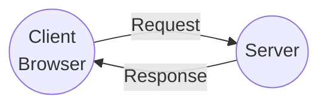
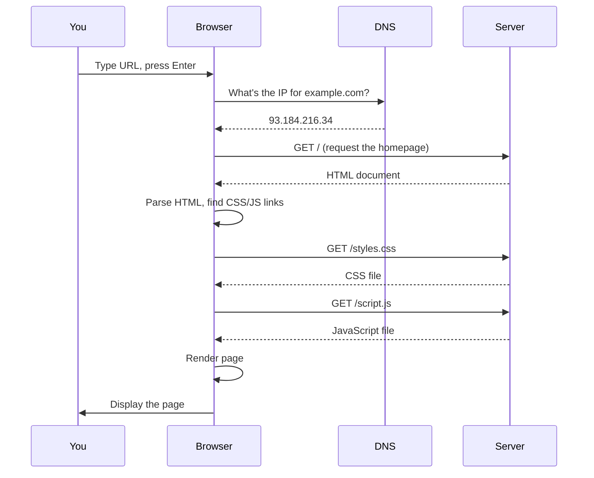
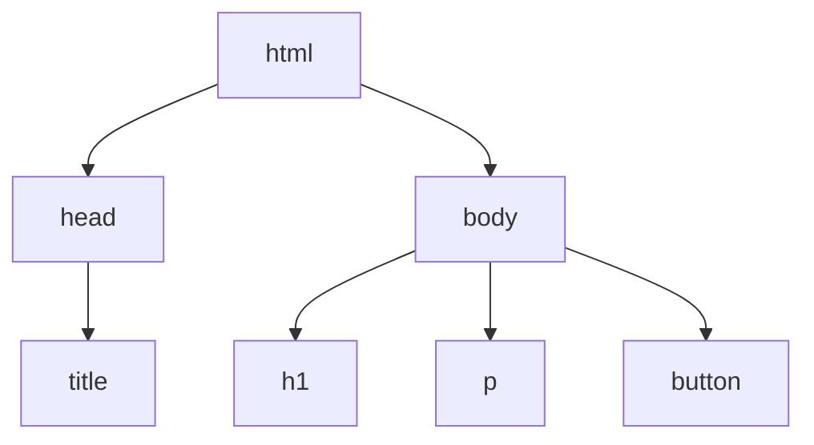

# Module 03: How the Web Works

**Understanding browsers, servers, and the technologies that connect them**

---

## Overview

You've built programs that run in the terminal. Now we're moving to the browser — the most ubiquitous platform for software. Before building web applications, you need to understand how the web actually works.

This module answers: When you type a URL and press Enter, what happens?

**Time to complete**: 2-3 hours

---

## Learning Objectives

By the end of this module, you will be able to:

- [ ] Explain the client-server model
- [ ] Describe what happens when a browser requests a page
- [ ] Understand the roles of HTML, CSS, and JavaScript
- [ ] Read and write basic HTML structure
- [ ] Explain how CSS styles HTML elements
- [ ] Describe how JavaScript adds interactivity
- [ ] Understand HTTP requests and responses

---

## Prerequisites

- Completed [Module 02: Anatomy of Projects](anatomy-of-projects)
- Basic understanding of files and folders
- A modern web browser (Chrome, Firefox, Safari, Edge)

---

## Part 1: The Client-Server Model

### Two Roles in Every Web Interaction



**Client**: The browser on your computer. It *requests* resources and *displays* them.

**Server**: A computer somewhere on the internet. It *receives* requests and *sends* responses.

This is the fundamental pattern of the web: **request → response**.

---

### What Happens When You Visit a Website

Let's trace `https://example.com`:



**Key steps**:

1. **DNS Lookup**: Convert domain name to IP address
2. **HTTP Request**: Ask for the page
3. **HTTP Response**: Receive HTML
4. **Parse & Fetch**: Browser reads HTML, requests linked files
5. **Render**: Browser displays the result

---

### Exercise 1: Observe a Page Load

Open your browser's developer tools (F12 or right-click → Inspect) and go to the **Network** tab.

1. Visit any website
2. Watch the requests appear
3. Click on the first request (usually the HTML document)

Answer:
- How many requests were made?
- What types of files were requested?
- How long did the page take to load?

<details>
<summary>What to look for</summary>

A typical page might make 20-100+ requests for:
- **document**: The HTML file
- **stylesheet**: CSS files
- **script**: JavaScript files
- **image**: PNG, JPG, SVG, etc.
- **font**: Custom fonts
- **fetch/xhr**: Data requests (APIs)

The waterfall view shows requests happening in sequence or parallel.

</details>

---

## Part 2: The Browser Triad (HTML, CSS, JavaScript)

Every web page is built from three technologies:

| Technology | Role | Analogy |
|------------|------|---------|
| **HTML** | Structure | The skeleton/bones |
| **CSS** | Presentation | The skin/clothes |
| **JavaScript** | Behavior | The muscles/brain |

They work together but have distinct responsibilities.

---

### HTML: The Structure

**HTML** (HyperText Markup Language) defines *what* is on the page.

```html
<!DOCTYPE html>
<html>
  <head>
    <title>Lemonade Stand</title>
  </head>
  <body>
    <h1>Welcome to the Lemonade Stand</h1>
    <p>Fresh lemonade, made daily!</p>
    <button>Order Now</button>
  </body>
</html>
```

**Key concepts**:

- **Elements**: Building blocks like `<h1>`, `<p>`, `<button>`
- **Tags**: Opening `<h1>` and closing `</h1>` tags wrap content
- **Attributes**: Extra info like `<button id="order">` or ``
- **Nesting**: Elements contain other elements (tree structure)

**The DOM (Document Object Model)**:



The browser parses HTML into this tree structure. JavaScript can read and modify this tree.

---

### CSS: The Presentation

**CSS** (Cascading Style Sheets) defines *how* things look.

```css
body {
  font-family: Arial, sans-serif;
  background-color: #fffde7;
}

h1 {
  color: #f57f17;
  text-align: center;
}

button {
  background-color: #ffeb3b;
  border: none;
  padding: 10px 20px;
  font-size: 16px;
  cursor: pointer;
}

button:hover {
  background-color: #fdd835;
}
```

**Key concepts**:

- **Selectors**: What to style (`h1`, `.class`, `#id`)
- **Properties**: What aspect to change (`color`, `font-size`)
- **Values**: What to change it to (`red`, `16px`)
- **Cascade**: Rules can override each other (later wins, more specific wins)

---

### JavaScript: The Behavior

**JavaScript** defines *what happens* when users interact.

```javascript
// Find the button in the DOM
const button = document.querySelector('button');

// Add behavior when clicked
button.addEventListener('click', function() {
  alert('Order placed!');
});
```

**Key concepts**:

- **DOM manipulation**: Finding and changing elements
- **Event handling**: Responding to user actions (click, type, scroll)
- **Dynamic updates**: Changing the page without reloading

---

### How They Work Together

```html
<!DOCTYPE html>
<html>
  <head>
    <title>Lemonade Stand</title>
    <link rel="stylesheet" href="styles.css">
  </head>
  <body>
    <h1>Welcome to the Lemonade Stand</h1>
    <button id="orderBtn">Order Now</button>

    <script src="script.js"></script>
  </body>
</html>
```

**Loading order matters**:

1. Browser parses HTML top to bottom
2. When it hits `<link>`, it fetches and applies CSS
3. When it hits `<script>`, it fetches and runs JavaScript
4. Scripts at the bottom can access elements above them

---

### Exercise 2: Build a Minimal Page

Create these three files:

**index.html**:
```html
<!DOCTYPE html>
<html>
  <head>
    <title>My First Page</title>
    <link rel="stylesheet" href="styles.css">
  </head>
  <body>
    <h1>Hello, Web!</h1>
    <p>This is my first web page.</p>
    <button id="greetBtn">Click me</button>

    <script src="script.js"></script>
  </body>
</html>
```

**styles.css**:
```css
body {
  font-family: sans-serif;
  text-align: center;
  padding: 50px;
}

button {
  padding: 10px 20px;
  font-size: 16px;
}
```

**script.js**:
```javascript
document.getElementById('greetBtn').addEventListener('click', function() {
  alert('Hello from JavaScript!');
});
```

Open `index.html` in your browser. Does the button work?

<details>
<summary>Troubleshooting</summary>

- **Button doesn't work?** Check browser console (F12 → Console) for errors
- **Styles not applied?** Make sure `styles.css` is in the same folder
- **Nothing shows?** Make sure file is saved as `.html`, not `.html.txt`

</details>

---

## Part 3: HTTP — The Protocol of the Web

### What is HTTP?

**HTTP** (HyperText Transfer Protocol) is the language browsers and servers speak.

Every HTTP interaction has:
- **Request**: What the client wants
- **Response**: What the server returns

---

### Anatomy of an HTTP Request

```
GET /menu HTTP/1.1
Host: lemonade-stand.com
User-Agent: Mozilla/5.0 (...)
Accept: text/html
```

**Parts**:
- **Method**: `GET` (fetch data), `POST` (send data), `PUT`, `DELETE`
- **Path**: `/menu` — what resource you want
- **Headers**: Metadata (who you are, what you accept)
- **Body**: (for POST/PUT) The data you're sending

---

### Anatomy of an HTTP Response

```
HTTP/1.1 200 OK
Content-Type: text/html
Content-Length: 1234

<!DOCTYPE html>
<html>...
```

**Parts**:
- **Status Code**: `200 OK`, `404 Not Found`, `500 Server Error`
- **Headers**: Metadata about the response
- **Body**: The actual content (HTML, JSON, image, etc.)

---

### Common Status Codes

| Code | Meaning | When You See It |
|------|---------|-----------------|
| 200 | OK | Everything worked |
| 301 | Moved Permanently | Page has a new URL |
| 400 | Bad Request | Client sent invalid data |
| 401 | Unauthorized | Need to log in |
| 403 | Forbidden | Not allowed |
| 404 | Not Found | Page doesn't exist |
| 500 | Server Error | Something broke on the server |

---

### Exercise 3: Inspect HTTP Traffic

Using browser dev tools (Network tab):

1. Visit a website
2. Click on any request
3. Find the **Headers** section

Answer:
- What was the request method?
- What was the status code?
- What Content-Type was returned?

<details>
<summary>Example findings</summary>

For the main HTML page:
- **Method**: GET
- **Status**: 200
- **Content-Type**: text/html

For a CSS file:
- **Method**: GET
- **Status**: 200
- **Content-Type**: text/css

</details>

---

## Part 4: Static vs Dynamic Websites

### Static Websites

**Static**: Server sends the same files every time.

```
Browser: GET /about.html
Server: Here's about.html (same file every time)
```

**Characteristics**:
- Fast (just serving files)
- Simple to host
- Content doesn't change based on user
- Examples: Blog, documentation, portfolio

---

### Dynamic Websites

**Dynamic**: Server generates content for each request.

```
Browser: GET /orders?user=123
Server: (queries database, builds HTML) Here's your orders page
```

**Characteristics**:
- Slower (processing required)
- Can personalize content
- Can interact with databases
- Examples: Social media, e-commerce, web apps

---

### Single Page Applications (SPAs)

**SPA**: One HTML file, JavaScript handles everything else.

```
Browser: GET /
Server: Here's index.html (with lots of JavaScript)
Browser: (JavaScript runs, fetches data, updates DOM)
```

**Characteristics**:
- Initial load fetches the app
- Navigation doesn't reload the page
- Data fetched via API calls
- Examples: Gmail, Twitter, modern React apps

---

### Where Our Lemonade Stand Fits

| Version | Type | Description |
|---------|------|-------------|
| CLI | N/A | Terminal program |
| Static Web | Static | HTML/CSS/JS files, no server needed |
| SPA | Dynamic (client) | React app, JavaScript drives everything |
| Fullstack | Dynamic (server) | Express backend, database |

We're about to build the **Static Web** version.

---

## Part 5: Development Tools

### Local Development

You don't need a "real" server to develop web pages:

**Option 1: Just open the file**
```
Double-click index.html → Opens in browser
```

Works for basic pages, but some features require a server.

**Option 2: Live Server (VS Code extension)**
```
Right-click index.html → "Open with Live Server"
```

Provides auto-reload when you save changes.

**Option 3: npx serve**
```bash
npx serve .
```

Starts a local server in the current directory.

---

### Browser Developer Tools

Every browser has built-in dev tools (F12):

| Tab | Purpose |
|-----|---------|
| **Elements** | Inspect and modify HTML/CSS live |
| **Console** | JavaScript errors and logging |
| **Network** | HTTP requests and responses |
| **Sources** | Debugger for JavaScript |
| **Application** | Storage (cookies, localStorage) |

---

### Exercise 4: Use Dev Tools

Open your page from Exercise 2 in the browser, then:

1. **Elements tab**: Change the `<h1>` text by double-clicking
2. **Console tab**: Type `document.title` and press Enter
3. **Console tab**: Type `document.body.style.background = 'lightblue'`

What happens? Are these changes permanent?

<details>
<summary>Answer</summary>

The changes appear immediately but are **not permanent**. Refreshing the page reverts to the original files.

Dev tools are for experimenting and debugging — to save changes, edit your actual files.

</details>

---

## Part 6: From CLI to Web

Let's map our lemonade-cli concepts to the web:

| CLI Concept | Web Equivalent |
|-------------|----------------|
| `process.argv` (command line input) | HTML forms, click events |
| `console.log()` (terminal output) | DOM updates (`innerHTML`, etc.) |
| `require()` / modules | `<script>` tags, ES modules |
| Running with `node` | Opening in browser |

The **business logic** (menu items, price calculation, discounts) can stay almost identical. Only the I/O changes.

---

### What Changes, What Stays

```
┌─────────────────────────────────────────────┐
│              STAYS THE SAME                 │
│  - Menu data structure                      │
│  - calculateTotal() function                │
│  - applyDiscount() function                 │
│  - Order creation logic                     │
└─────────────────────────────────────────────┘
                    │
                    ▼
┌─────────────────────────────────────────────┐
│                CHANGES                      │
│  - Input: Form fields instead of CLI args  │
│  - Output: DOM updates instead of console  │
│  - Event handling: Click instead of run    │
└─────────────────────────────────────────────┘
```

This is the power of **separation of concerns** — the modules we designed in the CLI version can largely be reused.

---

## Using AI Assistants

### Understanding Web Concepts

```
I'm learning how the web works in devfoundry Module 03.

I understand that browsers make HTTP requests to servers.

I don't understand:
- What's the difference between the request headers and the body?
- Why does my browser make so many requests for one page?

Can you explain with a simple example?
```

### Debugging Web Pages

```
I created an HTML page with a button, but clicking it doesn't work.

HTML:
[paste HTML]

JavaScript:
[paste JS]

I expected: An alert to show when I click
What happens: Nothing

No errors in the console. What's wrong?
```

---

## Common Questions

### "Why are there three separate languages?"

Historical reasons. HTML came first (1991), CSS added later (1996), JavaScript later still (1995). Each solved a different problem. Modern web development often uses frameworks that blur these lines, but understanding the fundamentals helps.

### "Can I just use JavaScript for everything?"

You could generate HTML with JavaScript (React does this), but you still need an initial HTML file to load the JavaScript. CSS can also be generated, but that adds complexity.

### "Is HTML a programming language?"

No. HTML is a *markup* language — it describes structure, not logic. You can't write conditionals or loops in HTML. JavaScript is the programming language of the web.

---

## Next Module

**Module 04: Developer Tools & Workflows**

You'll learn:
- Version control with Git
- Using npm for dependencies
- Code editors and extensions
- Debugging techniques

This prepares you for professional development practices.

👉 Module 04: Developer Tools *(Coming soon)*

---

## Further Reading

### Internal Resources

- [Glossary](/docs/glossary) — Web-specific terms
- [Diagram Standards](/docs/diagram-standards) — Creating Mermaid diagrams
- [Lemonade CLI Example](/docs/examples/lemonade-cli) — The CLI version we're adapting

### External Resources

- [MDN: How the Web Works](https://developer.mozilla.org/en-US/docs/Learn/Getting_started_with_the_web/How_the_Web_works)
- [MDN: HTML Basics](https://developer.mozilla.org/en-US/docs/Learn/HTML/Introduction_to_HTML)
- [MDN: CSS Basics](https://developer.mozilla.org/en-US/docs/Learn/CSS/First_steps)
- [MDN: JavaScript Basics](https://developer.mozilla.org/en-US/docs/Learn/JavaScript/First_steps)

---

## Reflection

Before moving on, ensure you can:

- [ ] Explain what happens when you type a URL and press Enter
- [ ] Describe the roles of HTML, CSS, and JavaScript
- [ ] Create a basic HTML page with linked CSS and JavaScript
- [ ] Use browser dev tools to inspect elements and network requests
- [ ] Explain the difference between static and dynamic websites
- [ ] Identify how CLI concepts (input, processing, output) map to web concepts

---

**You've completed Module 03!** You now understand how the web works — from HTTP requests to the browser triad. You're ready to build the web version of the lemonade stand.

Next: Put this knowledge into practice by building a real web page. 🌐
