# Module 01: What Software Is (and Isn't)

**Building an intuitive mental model of programs**

---

## Learning Objectives

By the end of this module, you will:

- Understand software as structured instructions
- Recognize the Input → Processing → Output pattern
- See programs as systems, not magic
- Build your first CLI program (lemonade stand)
- Gain vocabulary for describing software

**Time**: 2-3 hours (reading + examples + exercises)

---

## Introduction

**Software is not magic.** It's structured instructions that a computer follows, step by step.

This module demystifies software by starting with first principles:
- What is a program?
- How does it work?
- How do we think about it?

By the end, you'll build a simple **lemonade stand** program in the terminal — your first step toward building fullstack applications.

---

## What is Software?

### Definition

**Software** = Instructions that tell a computer what to do

Just like:
- A **recipe** tells you how to bake a cake
- A **blueprint** shows how to build a house
- **Sheet music** instructs how to play a song

Software instructs computers.

### Key Insight: Software is Predictable

Computers follow instructions **exactly**. They don't:
- Improvise
- Guess your intent
- Fill in gaps
- Interpret creatively

They do:
- Follow instructions precisely
- Repeat the same steps consistently
- Produce the same output for the same input

**This is both a strength and a limitation.**

---

## Programs as Recipes

Think of a program like a recipe:

### Recipe: Chocolate Chip Cookies

1. Preheat oven to 350°F
2. Mix butter and sugar
3. Add eggs and vanilla
4. Combine with flour mixture
5. Add chocolate chips
6. Bake for 12 minutes

### Program: Hello World

1. Define a function called `sayHello`
2. Inside it, print "Hello, World!"
3. Call the function

**Both are step-by-step instructions.**

---

## The I/O/P Model

Every program follows this pattern:

```
INPUT → PROCESSING → OUTPUT
```

### Example 1: Calculator

- **Input**: Two numbers (5 and 3)
- **Processing**: Add them together
- **Output**: Result (8)

### Example 2: Lemonade Stand

- **Input**: Customer order ("2 lemonades")
- **Processing**: Calculate total (2 × $2.50 = $5.00)
- **Output**: Display total ("Your total is $5.00")

### Diagram


**Every program, no matter how complex, follows this fundamental pattern.**

---

## Where Programs Live

Programs exist as **text files** (source code). To run them, you need:

1. **Source code** — The instructions (e.g., `hello.js`)
2. **Runtime or interpreter** — Software that reads and executes the code (e.g., Node.js for JavaScript)
3. **Execution environment** — Where it runs (terminal, browser, phone)

### Example: Running a JavaScript Program

```
Source Code: hello.js
     ↓
Runtime: Node.js (reads the file)
     ↓
Execution: Terminal (shows output)
```

---

## Types of Programs

Software comes in many forms. Here are the main categories:

| Type | Examples | Runs Where? |
|------|----------|-------------|
| **CLI** (Command-Line Interface) | Terminal scripts, utilities | Terminal/console |
| **Desktop Apps** | Word, Photoshop, Slack | Your computer |
| **Web Apps** | Gmail, Twitter, Figma | Browser |
| **Mobile Apps** | Instagram, Maps, Signal | Phone |
| **Backend Services** | APIs, databases | Servers (cloud) |

**This curriculum focuses on CLI → Web → Fullstack** because they demonstrate core concepts clearly.

---

## Why Things Break

If programs are predictable, why do they crash or produce errors?

### Common Causes

1. **Unexpected input**
   - Program expects a number, gets text
   - User clicks something in the wrong order

2. **Edge cases**
   - Dividing by zero
   - Empty lists
   - Missing files

3. **Assumptions**
   - "This variable will always exist"
   - "Users will always enter valid data"

4. **Complexity**
   - Many interconnected parts
   - State changes in unexpected ways

**Good software anticipates these problems and handles them gracefully.**

---

## Hands-On: Your First Program

Let's build a **lemonade stand** program. It will:
- Ask how many lemonades the customer wants
- Calculate the total price
- Display the result

### Step 1: Hello World

Before building the lemonade stand, start with the simplest program:

**Go to**: [Hello World Console Example](../../examples/hello-world-console)

Complete this first. It takes 15 minutes and teaches you:
- How to run a JavaScript program
- What functions are
- How `console.log` works

---

### Step 2: Lemonade Stand CLI

Once you've completed Hello World, you're ready for the next stage:

**Go to**: Lemonade CLI Example (coming soon)

This program demonstrates:
- Taking user input
- Processing that input (calculation)
- Producing output (displaying the total)

---

## Architectural Thinking

Even simple programs benefit from architectural thinking.

### Hello World Architecture

**Module View** (What files exist?):
```
hello.js
```

**Component-Connector View** (What happens when it runs?):


**Allocation View** (Where does it run?):
```
Terminal → Node.js → hello.js
```

**This is how professionals think about software** — even for simple programs.

---

## Key Concepts Summary

### 1. Software is Instructions

Programs are text files containing step-by-step instructions for computers.

### 2. I/O/P Pattern

Every program follows: **Input → Processing → Output**

### 3. Predictability

Computers follow instructions exactly. They don't improvise or guess.

### 4. Environments

Programs run in specific environments (terminal, browser, server).

### 5. Things Break

Edge cases, unexpected input, and complexity cause errors. Good design anticipates this.

---

## Vocabulary

New terms introduced in this module:

| Term | Definition |
|------|------------|
| **Program** | A set of instructions for a computer |
| **Source code** | The text of a program (before it runs) |
| **Runtime** | Software that executes code (e.g., Node.js) |
| **Function** | A named block of reusable code |
| **Input** | Data given to a program |
| **Output** | Data produced by a program |
| **Processing** | The logic that transforms input to output |
| **CLI** | Command-Line Interface (text-based programs) |
| **Console** | The terminal or command prompt |

See [Glossary](../../glossary) for full definitions.

---

## Exercises

### Exercise 1: Identify I/O/P

For each program, identify the input, processing, and output:

1. **Weather app**: Shows today's temperature
2. **Calculator**: Adds two numbers
3. **Search engine**: Finds web pages

<details>
<summary>Click to see answers</summary>

1. Weather app:
   - Input: Your location
   - Processing: Fetch weather data from API, parse temperature
   - Output: Display "72°F, sunny"

2. Calculator:
   - Input: Two numbers (5, 3) and operation (add)
   - Processing: 5 + 3 = 8
   - Output: Display "8"

3. Search engine:
   - Input: Search query ("chocolate chip cookies")
   - Processing: Search index, rank results by relevance
   - Output: List of web pages

</details>

---

### Exercise 2: Predict the Output

What will this program output?

```javascript
function greet(name) {
  console.log("Hello, " + name + "!");
}

greet("Alice");
greet("Bob");
```

<details>
<summary>Click to see answer</summary>

```
Hello, Alice!
Hello, Bob!
```

Explanation: The function is called twice with different inputs. Each time, it concatenates "Hello, " with the name and "!" then prints it.

</details>

---

### Exercise 3: Modify Hello World

Take the Hello World program and modify it to:
- Accept two names
- Print "Hello, [name1] and [name2]!"

<details>
<summary>Click to see solution</summary>

```javascript
function greetTwo(name1, name2) {
  console.log("Hello, " + name1 + " and " + name2 + "!");
}

greetTwo("Alice", "Bob");
// Output: Hello, Alice and Bob!
```

</details>

---

### Exercise 4: Design a Program

Design (don't code yet!) a program that:
- Takes a temperature in Celsius as input
- Converts it to Fahrenheit
- Outputs the result

<details>
<summary>Click to see design</summary>

**Input**: Temperature in Celsius (e.g., 25)

**Processing**: Formula: `F = (C × 9/5) + 32`

**Output**: Temperature in Fahrenheit (e.g., "25°C = 77°F")

**Flow**:

```mermaid
flowchart LR
    Input[/Celsius: 25/] --> Calculate[Multiply by 9/5, add 32]
    Calculate --> Output[\Display: 77°F\]
```


</details>

---

## Using AI Assistants for This Module

### Understanding Concepts

Use the getting started prompt template:

```
I'm learning about the I/O/P model in devfoundry Module 01.

I understand that:
- Input is data coming in
- Output is data going out

I don't understand:
- What exactly is "processing"?
- Can a program have multiple inputs?

Can you explain with examples from the lemonade stand?
```

---

### Exploring Code

Use the template to ask about Hello World:

```
I'm looking at the Hello World example (examples/hello-world-console).

Code:
function sayHello() {
  console.log("Hello, World!");
}

sayHello();

Questions:
1. Why do we define the function before calling it?
2. What would happen if we called sayHello() before defining it?
3. Can we call sayHello() more than once?
```

---

## Common Questions

### "Do I need to memorize syntax?"

No. Focus on understanding **what's happening**, not memorizing how to write it. Syntax can be looked up (or asked from an AI assistant). Concepts are what matter.

### "How complex can programs get?"

Arbitrarily complex. But all complexity is built from simple patterns like I/O/P. This curriculum teaches you to break down complexity into understandable pieces.

### "Why JavaScript?"

JavaScript runs in browsers (frontend) and servers (backend via Node.js). Learning one language that works everywhere reduces cognitive load. The concepts you learn transfer to any language.

### "Can I skip to web development?"

You could, but you'd miss the foundational mental model. CLI programs teach I/O/P most clearly. Stick with the progression — it's designed for maximum comprehension.

---

## Next Module

**Module 02: Anatomy of Modern Software Projects**

You'll learn:
- Programming language categories (compiled vs interpreted)
- Different types of architectures (desktop, web, mobile, cloud)
- How modern projects are structured
- Why tool chains exist

👉 [Module 02: Anatomy of Projects](anatomy-of-projects)

---

## Further Reading

### Internal Resources

- [Glossary](../../glossary) — Full vocabulary reference
- [Flow-Based Development](../../mental-models/flow-based-dev) — Core philosophy
- [Hello World Example](../../examples/hello-world-console) — Your first program

### External Resources

- [MDN: What is JavaScript?](https://developer.mozilla.org/en-US/docs/Learn/JavaScript/First_steps/What_is_JavaScript)
- [Node.js Getting Started](https://nodejs.org/en/learn/getting-started/introduction-to-nodejs)

---

## Reflection

Before moving on, ensure you can:

- [ ] Explain what a program is in simple terms
- [ ] Identify input, processing, and output in any program
- [ ] Run a JavaScript program with Node.js
- [ ] Modify and experiment with the Hello World example
- [ ] Draw a simple I/O/P flow diagram

If any are unclear, revisit the examples, try the exercises, or ask an AI assistant using the prompt templates.

---

**You've completed Module 01!** You now understand what software is at a fundamental level. Everything else is elaboration on these core ideas.
