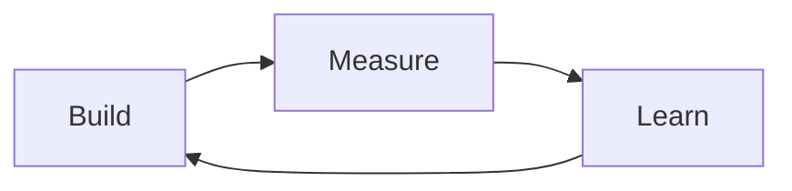

# Module 08: Development Methodologies

**How teams organize work — from waterfall to agile to shipping fast**

---

## Learning Objectives

By the end of this module, you will:

- Understand why development processes exist
- Know the difference between waterfall and agile approaches
- Apply iterative development to your own projects
- Define a Minimum Viable Product (MVP)
- Understand when and what to test
- Adapt team methodologies for solo development

**Time**: 2-3 hours (reading + exercises)

---

## Introduction

Process gets a bad reputation. Developers often see it as bureaucracy — meetings, tickets, standups, ceremonies — that slows down "real work."

But process exists for a reason: **coordination**.

When multiple people work on the same codebase, they need:
- Shared understanding of what to build
- Agreement on priorities
- Visibility into progress
- Ways to handle changes

Even solo developers need process — to coordinate with their future selves, manage scope, and avoid building the wrong thing.

This module covers how software gets built in the real world, and how to adapt those practices whether you're on a team or working alone.

---

## Part 1: Why Process Exists

### The Coordination Problem

Imagine building a house with no plan:
- Electricians wire rooms before walls are framed
- Plumbers install pipes that conflict with HVAC ducts
- The kitchen ends up where the garage was supposed to be

Software has the same problem:
- Developer A builds a feature that depends on Developer B's API
- Developer B changed the API last week
- Neither knew about the other's work

**Process is the solution to coordination, not the enemy of productivity.**

### What Good Process Provides

1. **Visibility** — Everyone knows what's being built
2. **Prioritization** — Agreement on what matters most
3. **Feedback loops** — Regular opportunities to course-correct
4. **Documentation** — Decisions are recorded, not forgotten
5. **Quality gates** — Standards are maintained consistently

### What Bad Process Looks Like

- Meetings that could be emails
- Documentation nobody reads
- Approval chains that block progress
- Metrics that measure activity, not outcomes
- Ceremonies performed without understanding why

**The goal isn't more process or less process — it's the right process for your context.**

---

## Part 2: Waterfall vs Agile

### The Waterfall Model

Traditional software development followed manufacturing:

```
Requirements → Design → Implementation → Testing → Deployment
     ↓            ↓           ↓            ↓           ↓
   (done)      (done)      (done)       (done)      (done)
```

Each phase completes before the next begins. Like water flowing downhill, you don't go back up.

**Waterfall assumptions:**
- Requirements can be fully known upfront
- Changes are expensive, so minimize them
- Each phase has different specialists
- Testing happens after building

**When waterfall works:**
- Building bridges (physics doesn't change mid-project)
- Regulatory environments (compliance requires documentation)
- Hardware (can't easily update after shipping)

**When waterfall fails:**
- Software products (requirements evolve)
- Startups (you're discovering what to build)
- Any project with uncertainty

### The Agile Manifesto

In 2001, developers frustrated with waterfall wrote:

> We are uncovering better ways of developing software by doing it and helping others do it. Through this work we have come to value:
>
> - **Individuals and interactions** over processes and tools
> - **Working software** over comprehensive documentation
> - **Customer collaboration** over contract negotiation
> - **Responding to change** over following a plan
>
> That is, while there is value in the items on the right, we value the items on the left more.

This wasn't anti-process — it was anti-**rigid** process.

### Agile in Practice

Agile development works in short cycles:

```
┌─────────────────────────────────────────────────────────────┐
│                    2-Week Sprint                            │
│                                                             │
│  Plan → Build → Test → Review → Retrospect → Plan → ...    │
│                                                             │
│  Working software at the end of each cycle                 │
└─────────────────────────────────────────────────────────────┘
```

Key practices:
- **Short iterations** (1-4 weeks)
- **Working software** at the end of each iteration
- **Regular feedback** from users/stakeholders
- **Adaptation** based on what you learn
- **Cross-functional teams** (not handoffs between departments)

### Common Agile Frameworks

**Scrum:**
- Sprints (fixed-length iterations)
- Daily standups
- Sprint planning, review, retrospective
- Product owner, scrum master, development team

**Kanban:**
- Continuous flow (no fixed iterations)
- Work-in-progress limits
- Visual board (To Do → Doing → Done)
- Pull-based (start new work when capacity allows)

**Extreme Programming (XP):**
- Pair programming
- Test-driven development
- Continuous integration
- Frequent releases

Most teams mix practices from multiple frameworks.

---

## Part 3: Iterative Development

### The Iteration Mindset

Instead of:
```
Think of everything → Build everything → Ship once
```

Do this:
```
Think of the smallest useful thing → Build it → Ship it → Learn → Repeat
```

### Why Iteration Works

1. **Faster feedback** — Learn if you're on track sooner
2. **Reduced risk** — Smaller bets, smaller losses
3. **Flexibility** — Easier to change direction
4. **Motivation** — Regular wins build momentum
5. **Quality** — Each iteration can be polished

### The Build-Measure-Learn Loop

From the Lean Startup methodology:



**Build**: Create the smallest thing that tests your hypothesis
**Measure**: Collect data on how it performs
**Learn**: Decide what to do next based on evidence

### Example: Chat App Iterations

**Iteration 1**: Can we send messages?
- Text input for message
- Send button
- Display message in list
- *Learning*: Do users understand the interface?

**Iteration 2**: Can we handle conversations?
- Multiple chat rooms or contacts
- Message timestamps
- *Learning*: How do users organize their chats?

**Iteration 3**: Can we persist data?
- Save messages to database
- Show message history
- *Learning*: Do we need search or filtering?

Each iteration is **shippable** and **teaches something**.

---

## Part 4: Minimum Viable Product (MVP)

### What MVP Actually Means

An MVP is **not**:
- A crappy version of your product
- A prototype or mockup
- The first phase of a waterfall plan

An MVP **is**:
- The smallest thing that delivers value to real users
- A tool for learning, not just shipping
- Viable = actually useful, not embarrassing

### The MVP Litmus Test

Ask yourself:
1. Can a real user accomplish a real task?
2. Will using it teach us something we don't know?
3. Is it small enough to build quickly?
4. Is it good enough that users won't immediately leave?

### MVP Examples

**Dropbox MVP**: A video showing how the product would work
- No actual product built
- Validated demand before writing code
- Thousands signed up for waitlist

**Zappos MVP**: Founder photographed shoes at stores, listed them online
- No inventory
- Bought shoes at retail when orders came in
- Validated that people would buy shoes online

**Buffer MVP**: Landing page with pricing
- No product behind it
- "Click to sign up" went to "we're not ready yet" page
- Validated pricing before building

### MVP for the Chat App

If building a chat messaging app, what's the MVP?

**Not MVP** (too big):
- Multiple chat rooms with admin controls
- User accounts and authentication
- File sharing and media
- Read receipts and typing indicators

**MVP** (small enough to learn from):
- Single chat room
- Text input and send button
- Messages display in a list

Ship this, watch real users, then decide what's next.

---

## Part 5: Testing Strategies

### Why Testing Matters

Tests aren't bureaucracy — they're **confidence**.

Without tests:
- Changes might break existing functionality
- You're afraid to refactor
- "It works on my machine" problems
- Manual verification doesn't scale

With tests:
- Make changes confidently
- Catch regressions automatically
- Documentation of expected behavior
- Faster debugging (tests isolate problems)

### The Testing Pyramid

```
           /\
          /  \
         / E2E \        Few, slow, expensive
        /──────\
       /  Inte- \
      /  gration \      Some, medium speed
     /────────────\
    /    Unit      \    Many, fast, cheap
   /________________\
```

**Unit tests**: Test individual functions/components in isolation
- Fast to run (milliseconds)
- Easy to write
- Test logic, not integration

**Integration tests**: Test how parts work together
- Slower (may involve database, APIs)
- Catch interface mismatches
- Test workflows, not just units

**End-to-end (E2E) tests**: Test the whole system like a user would
- Slowest (browser automation, full stack)
- Most confidence, most maintenance
- Test critical user paths

### What to Test

**High value to test:**
- Business logic (calculations, validation)
- Edge cases (empty inputs, boundaries)
- Critical paths (checkout, authentication)
- Bug fixes (prevent regression)

**Low value to test:**
- Simple getters/setters
- Framework code (React already tests itself)
- Implementation details that change often
- Visual appearance (hard to test, changes frequently)

### Testing in Practice

For a solo developer or small team:

1. **Start with critical paths** — What breaks if this doesn't work?
2. **Test after bugs** — Every bug fix gets a test
3. **Test complex logic** — If you had to think hard, test it
4. **Skip trivial code** — Don't test that 1+1=2

### Test-Driven Development (TDD)

TDD inverts the normal order:

```
Traditional:  Write code → Write tests
TDD:          Write test → Write code → Refactor
```

**The TDD cycle:**
1. **Red**: Write a failing test
2. **Green**: Write minimum code to pass
3. **Refactor**: Clean up while tests pass

**TDD benefits:**
- Forces you to think about interface first
- Ensures all code is tested
- Keeps code minimal (only write what's needed)

**TDD costs:**
- Slower initial development
- Requires discipline
- Not all code benefits equally

**Recommendation**: Use TDD for complex logic. Skip it for exploratory code you might throw away.

---

## Part 6: Solo Developer Adaptations

### You Don't Need Full Scrum

Solo developers don't need:
- Daily standups (with yourself?)
- Sprint planning meetings
- Scrum masters
- Burndown charts

Solo developers **do** need:
- Clear priorities (what's most important right now?)
- Time boundaries (when will you stop and ship?)
- Reflection (what's working? what's not?)
- Documentation (for future you)

### Adapted Practices

**Instead of sprints**: Weekly goals
- Every Monday: What will I accomplish this week?
- Every Friday: Did I? What did I learn?

**Instead of standups**: Daily intention
- Before starting: What's the one thing I'll finish today?
- Prevents scattered work

**Instead of retrospectives**: Weekly reflection
- What went well?
- What was frustrating?
- What will I do differently?

**Instead of user stories**: Problem statements
- "Users need to X so they can Y"
- Keeps focus on outcomes, not features

### Working with AI Assistants

AI assistants fit well into iterative development:

**Planning**: "Help me break this feature into iterations. What's the smallest useful first step?"

**Implementation**: "I'm building the MVP. Just the core functionality, no edge cases yet."

**Testing**: "What are the critical paths I should test for this feature?"

**Retrospective**: "I built X but it took longer than expected. What patterns do you notice that might explain why?"

---

## Exercise 1: Plan an Iteration

Take a feature you want to build (or use "add message reactions to the chat app").

Break it into 3 iterations, where each:
- Delivers something usable
- Is small enough to build in 1-2 days
- Teaches you something

<details>
<summary>Example: Message Reactions</summary>

**Iteration 1: Basic Reactions**
- Emoji button on each message
- Click to add/remove a reaction
- Reactions stored in memory (lost on refresh)
- *Learning*: Do users actually use reactions?

**Iteration 2: Persistent Reactions**
- Save reactions to database
- Survive page refresh
- Show reaction counts on messages
- *Learning*: Which reactions are most popular?

**Iteration 3: Reaction Picker**
- Multiple emoji options to choose from
- Quick access to frequently used reactions
- Maybe show who reacted
- *Learning*: Does this improve engagement?

</details>

---

## Exercise 2: Define an MVP

You're building an app to help people track their daily water intake.

Define the MVP by answering:
1. What is the core job-to-be-done?
2. What's the smallest feature set that accomplishes it?
3. What will you learn from shipping this?
4. What are you explicitly NOT including yet?

<details>
<summary>Example Solution</summary>

**Job-to-be-done**: Remember to drink water and feel good about progress

**Smallest feature set**:
- Button to log "I drank water"
- Counter showing glasses today
- Resets daily
- That's it

**What we'll learn**:
- Do people actually use it?
- How many times per day do they log?
- Do they want more detail (exact amounts)?

**NOT including yet**:
- Custom glass sizes
- Reminders/notifications
- History/trends
- Social features
- Gamification
- Integration with health apps

Those might all be valuable — but we don't know yet. Ship the MVP first.

</details>

---

## Exercise 3: Identify Tests

For the chat app, identify:
1. Three unit tests (test individual functions)
2. Two integration tests (test workflows)
3. One E2E test (test critical user path)

<details>
<summary>Example Solution</summary>

**Unit tests:**
1. `formatTimestamp` returns correct display format for messages
2. `formatTimestamp` handles edge cases (today, yesterday, older)
3. `truncateMessage` shortens long messages correctly for previews

**Integration tests:**
1. Sending a message updates message list and clears input
2. Receiving a message adds it to the correct conversation

**E2E test:**
1. User can open a conversation, type a message, send it, and see it appear in the chat

The E2E test covers the critical path. If that works, users can accomplish their goal.

</details>

---

## Exercise 4: Mini Retrospective

Think about a recent project (coding or otherwise).

Answer:
1. **What went well?** (Keep doing this)
2. **What was frustrating?** (Address this)
3. **What would you do differently?** (Try next time)
4. **What did you learn?** (Remember this)

No need to share — this is reflective practice for yourself.

---

## Key Takeaways

1. **Process is coordination** — Not bureaucracy, but shared understanding

2. **Waterfall assumes certainty** — Agile assumes learning

3. **Iterate in small cycles** — Ship, learn, repeat

4. **MVP = smallest useful thing** — Not a bad version, a focused one

5. **Test for confidence** — Focus on critical paths and complex logic

6. **Adapt for your context** — Solo developers need process too, just lighter

---

## What's Next

**[Module 09: Git and Collaboration](git-and-collaboration)**

You'll learn:
- Version control fundamentals
- Branching and merging strategies
- Pull requests and code review
- Collaborating without chaos

---

## Vocabulary

| Term | Definition |
|------|------------|
| **Waterfall** | Sequential development where each phase completes before the next |
| **Agile** | Iterative development emphasizing flexibility and feedback |
| **Sprint** | Fixed-length iteration (typically 1-4 weeks) |
| **MVP** | Minimum Viable Product — smallest thing that delivers value |
| **Iteration** | One cycle of build-measure-learn |
| **Unit test** | Test of an individual function or component |
| **Integration test** | Test of how multiple parts work together |
| **E2E test** | End-to-end test simulating real user behavior |
| **TDD** | Test-Driven Development — write tests before code |
| **Retrospective** | Reflection on what worked and what to improve |

---

## Further Reading

### Internal Resources

- [Architecture First](../../mental-models/architecture-first) — Design before implementation
- [Friction to Opportunity](../../mental-models/friction-to-opportunity) — Finding problems worth solving

### External Resources

- [Agile Manifesto](https://agilemanifesto.org/) — The original document
- [The Lean Startup](http://theleanstartup.com/) — Build-Measure-Learn methodology
- [Shape Up](https://basecamp.com/shapeup) — Basecamp's alternative to Scrum

---

## Reflection

Before moving on, ensure you can:

- [ ] Explain why process exists (coordination, not bureaucracy)
- [ ] Describe the difference between waterfall and agile
- [ ] Break a feature into small, shippable iterations
- [ ] Define an MVP for a given problem
- [ ] Identify what's worth testing vs. what's not
- [ ] Apply lightweight process to solo development

---

**You've completed Module 08!** You now understand that good process enables speed rather than hindering it. The goal isn't to move fast and break things — it's to move fast and learn things.
