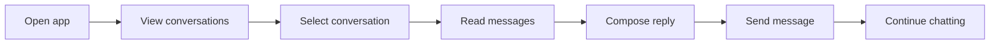
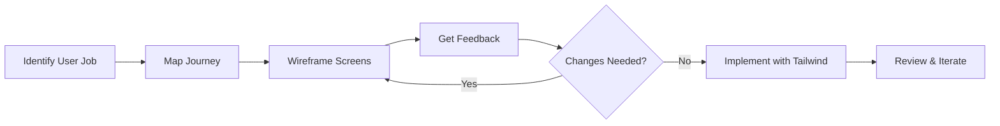

# Module 07: UX/UI Fundamentals

**Design before you code — understanding users, wireframes, and design systems**

---

## Learning Objectives

By the end of this module, you will:

- Understand why design thinking precedes coding
- Map user journeys using jobs-to-be-done
- Create wireframes as communication tools
- Recognize design systems and their value
- Use Tailwind CSS for consistent, rapid styling
- Integrate design thinking with AI-assisted development

**Time**: 3-4 hours (reading + exercises)

---

## Introduction

In Part I, you learned what software is and how web applications work. You built chat applications in the terminal and browser. But we skipped a critical question:

**How do you know what to build?**

The answer isn't "whatever seems cool" or "what the client asked for" (they often don't know what they need). The answer is **design thinking** — understanding users, their problems, and their workflows before writing code.

This module covers:
1. User journeys and jobs-to-be-done
2. Wireframes as thinking tools
3. Design systems for consistency
4. Tailwind CSS for implementation

---

## The Cost of Skipping Design

Here's what happens when developers skip design:

```
"Just start coding" approach:
┌────────────────────────────────────────────────────────────────┐
│ Day 1:  Build feature based on assumptions                    │
│ Day 3:  User testing reveals wrong mental model               │
│ Day 5:  Rewrite 60% of the code                               │
│ Day 8:  Another round of changes                              │
│ Day 12: Ship something nobody quite loves                     │
└────────────────────────────────────────────────────────────────┘

Design-first approach:
┌────────────────────────────────────────────────────────────────┐
│ Day 1:  Map user journey, identify core job-to-be-done        │
│ Day 2:  Wireframe key screens, get feedback                   │
│ Day 3:  Iterate on wireframes (cheap to change)               │
│ Day 4:  Start coding with clear target                        │
│ Day 8:  Ship something users actually want                    │
└────────────────────────────────────────────────────────────────┘
```

**Changing wireframes costs minutes. Changing code costs hours.**

---

## Part 1: User Journeys

### What is a User Journey?

A **user journey** maps the steps someone takes to accomplish a goal using your software. It's not about features — it's about **outcomes**.

### The Chat App User Journey

Let's map the user journey for our chat application:



Each step has:
- **Goals**: What does the user want?
- **Actions**: What do they do?
- **Pain points**: What could go wrong?
- **Opportunities**: How can we help?

### Jobs-to-be-Done Framework

Instead of asking "What features do users want?", ask:

> "What job is the user hiring this product to do?"

**Example**: A user of a chat app isn't "hiring" messages. They're hiring:
- A way to stay connected with friends and family
- Quick coordination for plans or tasks
- Asynchronous communication when a call isn't practical
- A record of conversations they can reference later

Understanding the **job** shapes the design:
- If it's about staying connected → show presence indicators and recent activity
- If it's quick coordination → make composing and sending fast
- If it's asynchronous → show clear timestamps and read receipts
- If it's for reference → provide search and conversation history

### Mapping a Journey: Template

For any feature you're building, map:

| Step | User Goal | User Action | Potential Pain Points | Design Opportunity |
|------|-----------|-------------|----------------------|-------------------|
| 1 | Find the right conversation | Browse conversations | Too many chats, unclear organization | Clear labels, recent activity sorting |
| 2 | Read context | View message history | Long threads, hard to scan | Message grouping, search functionality |
| 3 | Compose reply | Type message | Small keyboard, typos | Auto-correct, quick replies |
| 4 | Send message | Tap send | Uncertainty if sent | Clear send confirmation, delivery status |
| 5 | Know it was received | See delivery status | No feedback | Read receipts, typing indicators |

---

## Part 2: Wireframes

### What is a Wireframe?

A **wireframe** is a low-fidelity sketch of a user interface. It's intentionally rough.

**Wireframes are NOT:**
- Pretty mockups
- Final designs
- Art projects
- Pixel-perfect

**Wireframes ARE:**
- Thinking tools
- Communication devices
- Cheap experiments
- Conversation starters

### Why Low-Fidelity?

When wireframes look "finished," people:
- Hesitate to suggest changes
- Focus on colors and fonts instead of layout
- Assume the design is final

When wireframes look rough, people:
- Feel free to critique
- Focus on structure and flow
- Suggest improvements openly

### Wireframe Elements

Common wireframe notation:

```
┌─────────────────────────────────────────┐
│ [ Logo ]              [ Nav ] [ Cart ]  │  ← Header
├─────────────────────────────────────────┤
│                                         │
│  ┌─────────┐  ┌─────────┐  ┌─────────┐ │
│  │         │  │         │  │         │ │
│  │  Image  │  │  Image  │  │  Image  │ │  ← Content cards
│  │         │  │         │  │         │ │
│  ├─────────┤  ├─────────┤  ├─────────┤ │
│  │ Title   │  │ Title   │  │ Title   │ │
│  │ $2.50   │  │ $3.00   │  │ $2.00   │ │
│  │ [Add]   │  │ [Add]   │  │ [Add]   │ │
│  └─────────┘  └─────────┘  └─────────┘ │
│                                         │
├─────────────────────────────────────────┤
│ © Footer                    [ Links ]   │  ← Footer
└─────────────────────────────────────────┘
```

Common symbols:
- `[Button]` — Clickable button
- `[ Text input _____ ]` — Text field
- `( ) Option` — Radio button
- `[x] Checkbox` — Checkbox
- `───────────` — Divider
- `XXXXXXXXX` — Placeholder text

### Chat App Wireframes

**Screen 1: Conversations List**
```
┌─────────────────────────────────────────┐
│  Messages                      [ New ]  │
├─────────────────────────────────────────┤
│                                         │
│  RECENT                                 │
│  ─────────────────────────────────────  │
│  ┌──────┐                               │
│  │  AS  │  Alice Smith              2m  │
│  │      │  Sounds good! See you then    │
│  └──────┘  ──────────────────────────── │
│                                         │
│  ┌──────┐                               │
│  │  BJ  │  Bob Jones               15m  │
│  │      │  Can you send me the file?    │
│  └──────┘  ──────────────────────────── │
│                                         │
│  ┌──────┐                               │
│  │  TC  │  Team Chat                1h  │
│  │      │  Carol: Meeting moved to 3pm  │
│  └──────┘  ──────────────────────────── │
│                                         │
├─────────────────────────────────────────┤
│  [ Search conversations... ]            │
└─────────────────────────────────────────┘
```

**Screen 2: Conversation View**
```
┌─────────────────────────────────────────┐
│  ← Back           Alice Smith      [i]  │
├─────────────────────────────────────────┤
│                                         │
│         Hey! Are we still on for        │
│         coffee tomorrow?         10:30  │
│         ─────────────────────────────── │
│  Yes! How about 2pm at                  │
│  the usual place?               10:32   │
│  ─────────────────────────────────────  │
│         Sounds good! See you then       │
│                                  10:33  │
│                              ✓✓ Read    │
│                                         │
│                                         │
│                                         │
│                                         │
├─────────────────────────────────────────┤
│  [ Type a message...      ]    [Send]   │
└─────────────────────────────────────────┘
```

### Tools for Wireframing

**Paper and pencil** — Best for initial exploration
- Fastest to iterate
- No learning curve
- Take photos to share

**Digital tools** (when you need to share):
- Excalidraw (free, hand-drawn aesthetic)
- Figma (industry standard, free tier)
- Balsamiq (designed for wireframes)
- Even simple drawing tools work

**Key insight**: The tool matters less than the thinking. Start with paper.

---

## Part 3: Design Systems

### What is a Design System?

A **design system** is a collection of reusable components and guidelines that ensure visual and functional consistency.

Think of it like Lego bricks:
- Each brick (component) has defined properties
- Bricks combine in predictable ways
- Anyone can build with the same bricks
- Results look cohesive

### Why Design Systems Matter

Without a design system:
```
Button on Page A:  Blue, rounded, 14px font
Button on Page B:  Blue-ish, square, 16px font
Button on Page C:  Different blue, rounded, 14px, but taller
```

With a design system:
```
Button (Primary): Always the same blue, same radius, same padding
Button (Secondary): Consistently styled alternative
```

### Core Design System Elements

1. **Colors** — Primary, secondary, success, error, neutrals
2. **Typography** — Font families, sizes, weights, line heights
3. **Spacing** — Consistent padding/margin scale (4px, 8px, 16px, 24px, 32px...)
4. **Components** — Buttons, inputs, cards, modals, etc.
5. **Patterns** — How components combine (forms, navigation, etc.)

### Example: A Minimal Design System

```
COLORS
──────
Primary:    #2563EB (blue)
Secondary:  #64748B (gray)
Success:    #22C55E (green)
Error:      #EF4444 (red)
Background: #FFFFFF
Text:       #1E293B

TYPOGRAPHY
──────────
Font:       Inter (or system-ui fallback)
Sizes:      12px, 14px, 16px, 20px, 24px, 32px
Weights:    400 (normal), 500 (medium), 700 (bold)

SPACING
───────
Scale:      4px, 8px, 12px, 16px, 24px, 32px, 48px, 64px

COMPONENTS
──────────
Button (Primary):
  - Background: Primary color
  - Text: White
  - Padding: 12px 24px
  - Border radius: 6px
  - Font: 14px, medium weight
```

### Popular Design Systems

- **Material Design** (Google) — Android, web
- **Human Interface Guidelines** (Apple) — iOS, macOS
- **Ant Design** — Enterprise applications
- **Chakra UI** — React component library
- **shadcn/ui** — Tailwind-based, copy-paste components

For learning, studying these systems teaches you what professionals consider important.

---

## Part 4: Tailwind CSS

### What is Tailwind?

**Tailwind CSS** is a utility-first CSS framework. Instead of writing custom CSS, you apply small, single-purpose classes directly in your HTML.

### Traditional CSS vs Tailwind

**Traditional approach:**
```html
<button class="primary-button">Click me</button>
```
```css
.primary-button {
  background-color: #2563eb;
  color: white;
  padding: 12px 24px;
  border-radius: 6px;
  font-weight: 500;
}
```

**Tailwind approach:**
```html
<button class="bg-blue-600 text-white px-6 py-3 rounded-md font-medium">
  Click me
</button>
```

### Why Tailwind?

**Pros:**
- No context switching between HTML and CSS
- Consistent spacing/color scales built-in
- Responsive design is straightforward
- AI assistants generate Tailwind effectively
- No naming things (what do you call this button's container?)

**Cons:**
- HTML looks verbose initially
- Learning curve for utility names
- Some developers prefer traditional CSS

### Tailwind Basics

**Colors:**
```html
<div class="bg-blue-500">Blue background</div>
<div class="text-red-600">Red text</div>
<div class="border-gray-300">Gray border</div>
```

**Spacing:**
```html
<div class="p-4">Padding 16px (4 × 4px)</div>
<div class="m-8">Margin 32px (8 × 4px)</div>
<div class="px-6 py-2">Horizontal 24px, vertical 8px</div>
```

**Typography:**
```html
<h1 class="text-2xl font-bold">Large bold heading</h1>
<p class="text-sm text-gray-600">Small gray text</p>
```

**Layout:**
```html
<div class="flex items-center justify-between">
  <span>Left</span>
  <span>Right</span>
</div>

<div class="grid grid-cols-3 gap-4">
  <div>1</div>
  <div>2</div>
  <div>3</div>
</div>
```

**Responsive:**
```html
<!-- Stack on mobile, row on medium screens and up -->
<div class="flex flex-col md:flex-row">
  <div>Item 1</div>
  <div>Item 2</div>
</div>
```

Breakpoints: `sm:` (640px), `md:` (768px), `lg:` (1024px), `xl:` (1280px)

### Tailwind + React Example

```jsx
function MessageBubble({ message, isOwn }) {
  return (
    <div className={`flex ${isOwn ? 'justify-end' : 'justify-start'} mb-3`}>
      <div className={`max-w-xs px-4 py-2 rounded-lg ${
        isOwn
          ? 'bg-blue-600 text-white rounded-br-sm'
          : 'bg-gray-100 text-gray-900 rounded-bl-sm'
      }`}>
        <p className="text-sm">{message.text}</p>
        <div className={`text-xs mt-1 ${isOwn ? 'text-blue-200' : 'text-gray-500'}`}>
          {message.timestamp}
          {isOwn && message.read && ' · Read'}
        </div>
      </div>
    </div>
  );
}
```

### Setting Up Tailwind

With Vite (from Module 05):

```bash
npm install -D tailwindcss postcss autoprefixer
npx tailwindcss init -p
```

Configure `tailwind.config.js`:
```javascript
export default {
  content: [
    "./index.html",
    "./src/**/*.{js,ts,jsx,tsx}",
  ],
  theme: {
    extend: {},
  },
  plugins: [],
}
```

Add to your main CSS file:
```css
@tailwind base;
@tailwind components;
@tailwind utilities;
```

---

## Connecting Design to Development

### The Workflow



### Using AI for Design Implementation

With TUI tools, you can now say:

```
I have a wireframe for a message bubble (attached screenshot).

The bubble should:
- Show the message text and timestamp
- Differentiate between sent and received messages
- Use Tailwind CSS
- Match our design system (blue-600 for sent messages, rounded-lg corners)

Can you implement this as a React component?
```

AI assistants excel at:
- Translating wireframes to Tailwind
- Suggesting responsive adjustments
- Generating consistent component variants

AI assistants struggle with:
- Original visual design (they can implement, not design)
- Understanding your specific user journey
- Making UX decisions without context

**You provide the thinking. AI accelerates the implementation.**

---

## Exercise 1: Map a User Journey

Choose a simple app you use daily (notes app, todo list, weather app).

Map the journey for one core task:
1. What is the job-to-be-done?
2. List 4-6 steps the user takes
3. Identify one pain point
4. Propose one design improvement

<details>
<summary>Example: Notes App</summary>

**Job**: Capture a thought before I forget it

**Journey**:
1. Open app (Goal: Access quickly)
2. Create new note (Goal: Start writing immediately)
3. Type content (Goal: Get thoughts down)
4. Close/save (Goal: Know it's saved)
5. Find note later (Goal: Retrieve when needed)

**Pain point**: Step 2 requires tapping "New" then waiting for editor to load

**Improvement**: Open directly to a new note, or have a persistent quick-capture bar

</details>

---

## Exercise 2: Create a Wireframe

Wireframe a "new conversation" screen for the chat app.

Include:
- Contact search/selection
- Recent contacts or suggestions
- Compose message area
- Send action

Use paper or a simple digital tool. Spend no more than 10 minutes.

<details>
<summary>Example Solution</summary>

```
┌─────────────────────────────────────────┐
│  ← Cancel        New Message            │
├─────────────────────────────────────────┤
│                                         │
│  To: [ Search contacts...          ]    │
│  ─────────────────────────────────────  │
│                                         │
│  RECENT                                 │
│  ┌──────┐                               │
│  │  AS  │  Alice Smith                  │
│  └──────┘  ──────────────────────────── │
│  ┌──────┐                               │
│  │  BJ  │  Bob Jones                    │
│  └──────┘  ──────────────────────────── │
│  ┌──────┐                               │
│  │  TC  │  Team Chat                    │
│  └──────┘  ──────────────────────────── │
│                                         │
├─────────────────────────────────────────┤
│  [ Type a message...      ]    [Send]   │
└─────────────────────────────────────────┘
```

Key decisions made:
- Clear cancel action to return to conversation list
- Prominent search for finding contacts
- Recent contacts for quick access
- Compose area ready immediately
- Send button clearly visible

</details>

---

## Exercise 3: Analyze a Design System

Pick a website or app you use. Identify:

1. **Primary color** — What's the main brand color?
2. **Typography** — How many font sizes do you see?
3. **Spacing** — Is spacing consistent or random?
4. **Buttons** — How many button styles exist?
5. **Consistency** — Does the same element look the same everywhere?

<details>
<summary>Discussion</summary>

Well-designed apps typically have:
- 1-2 primary colors, 1-2 accent colors
- 4-6 distinct text sizes
- Consistent spacing (often based on 4px or 8px)
- 2-3 button variants (primary, secondary, text/link)
- High consistency across screens

Poorly designed apps often have:
- Colors that vary slightly between screens
- Many random font sizes
- Inconsistent padding/margins
- Buttons that look different for no reason
- Elements that are "almost the same" but not quite

</details>

---

## Exercise 4: Implement with Tailwind

Take the new conversation wireframe from Exercise 2 and implement it as a React component with Tailwind CSS.

Requirements:
- Match the wireframe structure
- Use Tailwind's color and spacing utilities
- Make it responsive (stack on mobile if needed)

<details>
<summary>Solution</summary>

```jsx
function NewConversation({ contacts, onSelectContact, onCancel }) {
  const [searchQuery, setSearchQuery] = useState('');

  const filteredContacts = contacts.filter(contact =>
    contact.name.toLowerCase().includes(searchQuery.toLowerCase())
  );

  return (
    <div className="max-w-md mx-auto flex flex-col h-screen">
      {/* Header */}
      <div className="flex items-center justify-between p-4 border-b">
        <button
          onClick={onCancel}
          className="text-blue-600 hover:text-blue-700"
        >
          Cancel
        </button>
        <h1 className="text-lg font-semibold">New Message</h1>
        <div className="w-12"></div> {/* Spacer for centering */}
      </div>

      {/* Search */}
      <div className="p-4 border-b">
        <input
          type="text"
          placeholder="Search contacts..."
          value={searchQuery}
          onChange={(e) => setSearchQuery(e.target.value)}
          className="w-full px-4 py-2 border rounded-lg focus:outline-none
                     focus:ring-2 focus:ring-blue-500"
        />
      </div>

      {/* Contact List */}
      <div className="flex-1 overflow-y-auto">
        <div className="px-4 py-2 text-sm text-gray-500 font-medium">RECENT</div>
        {filteredContacts.map(contact => (
          <button
            key={contact.id}
            onClick={() => onSelectContact(contact)}
            className="w-full flex items-center gap-3 p-4 hover:bg-gray-50
                       border-b transition-colors"
          >
            <div className="w-10 h-10 bg-blue-100 text-blue-600 rounded-full
                            flex items-center justify-center font-medium">
              {contact.initials}
            </div>
            <span className="text-gray-900">{contact.name}</span>
          </button>
        ))}
      </div>

      {/* Compose Area */}
      <div className="p-4 border-t flex gap-2">
        <input
          type="text"
          placeholder="Type a message..."
          className="flex-1 px-4 py-2 border rounded-lg focus:outline-none
                     focus:ring-2 focus:ring-blue-500"
        />
        <button className="bg-blue-600 text-white px-4 py-2 rounded-lg
                           hover:bg-blue-700 transition-colors">
          Send
        </button>
      </div>
    </div>
  );
}
```

</details>

---

## Using AI for UX/UI Work

### For User Journey Mapping

```
I'm building a chat messaging app.

The main job-to-be-done: Send a quick message to a friend while on the go.

Can you help me think through potential pain points in this journey?
Focus on mobile use cases.
```

### For Wireframe Feedback

```
Here's my wireframe for the menu screen (attached).

Looking for feedback on:
1. Is the information hierarchy clear?
2. Any obvious usability issues?
3. What am I missing?
```

### For Tailwind Implementation

```
I need to convert this wireframe to a React component with Tailwind.

Key requirements:
- Primary button: blue-600, rounded-lg
- Message bubbles: blue-600 for sent, gray-100 for received
- Text: gray-900 for messages, gray-500 for timestamps

Can you implement the MessageBubble component?
```

---

## Key Takeaways

1. **Design precedes code** — Understanding users saves rewriting time

2. **Jobs-to-be-done** — Ask what job users are hiring your product for

3. **Wireframes are cheap** — Rough sketches invite feedback; polish inhibits it

4. **Design systems ensure consistency** — Define once, reuse everywhere

5. **Tailwind accelerates implementation** — Utility classes match how AI thinks

6. **You think, AI implements** — User journeys require human insight; CSS doesn't

---

## What's Next

**[Module 08: Development Methodologies](development-methodologies)**

You'll learn:
- Agile and iterative development
- Why shipping fast beats planning perfectly
- Test-driven development (light intro)
- How process enables rather than constrains

---

## Vocabulary

| Term | Definition |
|------|------------|
| **User Journey** | The steps a user takes to accomplish a goal |
| **Jobs-to-be-Done** | Framework asking what job users hire a product for |
| **Wireframe** | Low-fidelity sketch of user interface |
| **Design System** | Collection of reusable components and guidelines |
| **Utility-first CSS** | Styling approach using small, single-purpose classes |
| **Tailwind CSS** | Popular utility-first CSS framework |
| **Responsive Design** | Design that adapts to different screen sizes |

---

## Further Reading

### Internal Resources

- [Friction to Opportunity](../../mental-models/friction-to-opportunity) — Noticing problems worth solving
- [Architecture First](../../mental-models/architecture-first) — Design before implementation
- [Diagram Standards](../../diagram-standards) — How we visualize systems

### External Resources

- [Jobs to be Done Framework](https://jtbd.info/) — Original thinking on JTBD
- [Refactoring UI](https://www.refactoringui.com/) — Practical design for developers
- [Tailwind CSS Documentation](https://tailwindcss.com/docs) — Official reference
- [Excalidraw](https://excalidraw.com/) — Free wireframing tool

---

## Reflection

Before moving on, ensure you can:

- [ ] Explain why design comes before coding
- [ ] Map a basic user journey for any feature
- [ ] Create a rough wireframe on paper
- [ ] Identify elements of a design system
- [ ] Write basic Tailwind classes for layout, color, and spacing
- [ ] Know when to use AI (implementation) vs. your judgment (design decisions)

---

**You've completed Module 07!** You now understand that good software starts with understanding users, not writing code. This thinking will make you a better collaborator, a clearer communicator, and a more effective AI prompter.
