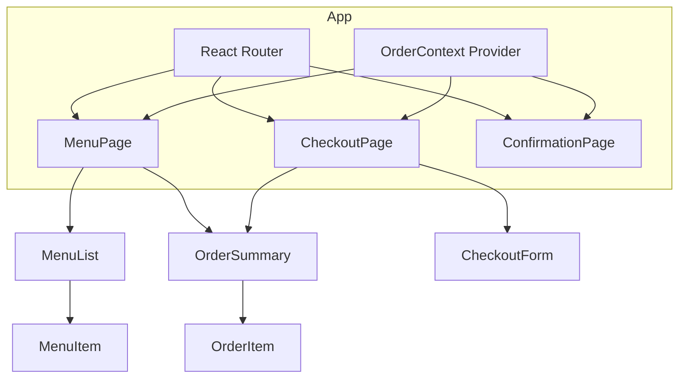

# Stage 3: React SPA

**Converting the Chat App to a modern React single-page application**

---

## Learning Objectives

By the end of this stage, you will:

- Set up a React project with Vite
- Convert vanilla JS patterns to React components
- Use useState and useEffect hooks
- Compose components with props
- Implement client-side routing
- Share state with Context

**Time**: 5-6 hours (reading + building)

---

## Introduction

In Stage 2, we discovered patterns:
- Centralized state with update functions
- Declarative rendering from state
- Component-like structure for each section

**React formalizes these patterns.**

Instead of managing DOM updates manually, React:
- Compares old and new UI descriptions
- Updates only what changed
- Provides hooks for state and side effects
- Enables component composition

This stage rebuilds the lemonade stand in React, showing how framework concepts map to what you already know.

---

## Project Setup

### Create with Vite

```bash
npm create vite@latest lemonade-react -- --template react
cd lemonade-react
npm install
npm run dev
```

You now have:
- React 18 with hot module replacement
- Fast development server
- Modern build pipeline

### Project Structure

```
lemonade-react/
├── public/
│   └── vite.svg
├── src/
│   ├── components/      # We'll add this
│   ├── context/         # We'll add this
│   ├── pages/           # We'll add this
│   ├── App.jsx
│   ├── App.css
│   ├── main.jsx
│   └── index.css
├── index.html
├── package.json
└── vite.config.js
```

### Install Dependencies

```bash
npm install react-router-dom
```

---

## Architectural Views

### Module View

```
src/
├── components/
│   ├── Header.jsx
│   ├── MenuItem.jsx
│   ├── MenuList.jsx
│   ├── OrderItem.jsx
│   ├── OrderSummary.jsx
│   ├── CheckoutForm.jsx
│   └── Notification.jsx
├── context/
│   └── OrderContext.jsx
├── pages/
│   ├── MenuPage.jsx
│   ├── CheckoutPage.jsx
│   └── ConfirmationPage.jsx
├── data/
│   └── menuItems.js
├── App.jsx
└── main.jsx
```

### Component-Connector View



---

## Part 1: Data and Context

### Menu Data

Create `src/data/menuItems.js`:

```javascript
export const menuItems = [
  {
    id: 'classic',
    name: 'Classic Lemonade',
    description: 'Fresh squeezed, ice cold',
    price: 2.50,
    emoji: '🍋'
  },
  {
    id: 'strawberry',
    name: 'Strawberry Lemonade',
    description: 'With fresh strawberries',
    price: 3.50,
    emoji: '🍓'
  },
  {
    id: 'mint',
    name: 'Mint Lemonade',
    description: 'Cool and refreshing',
    price: 3.00,
    emoji: '🌿'
  }
];
```

### Order Context

Create `src/context/OrderContext.jsx`:

```jsx
import { createContext, useContext, useState, useEffect } from 'react';
import { menuItems } from '../data/menuItems';

const OrderContext = createContext();

export function OrderProvider({ children }) {
  const [order, setOrder] = useState(() => {
    // Load from localStorage on init
    const saved = localStorage.getItem('lemonadeOrder');
    return saved ? JSON.parse(saved) : {
      items: [],
      customerName: '',
      customerEmail: ''
    };
  });

  const [notification, setNotification] = useState(null);

  // Save to localStorage when order changes
  useEffect(() => {
    localStorage.setItem('lemonadeOrder', JSON.stringify(order));
  }, [order]);

  // Auto-dismiss notification
  useEffect(() => {
    if (notification) {
      const timer = setTimeout(() => setNotification(null), 3000);
      return () => clearTimeout(timer);
    }
  }, [notification]);

  const addToOrder = (itemId) => {
    setOrder(prev => {
      const items = [...prev.items];
      const existing = items.find(item => item.itemId === itemId);

      if (existing) {
        existing.quantity++;
      } else {
        items.push({ itemId, quantity: 1 });
      }

      return { ...prev, items };
    });
    showNotification('success', 'Added to order!');
  };

  const updateQuantity = (itemId, delta) => {
    setOrder(prev => {
      const items = prev.items
        .map(item => item.itemId === itemId
          ? { ...item, quantity: item.quantity + delta }
          : item
        )
        .filter(item => item.quantity > 0);

      return { ...prev, items };
    });
  };

  const removeFromOrder = (itemId) => {
    setOrder(prev => ({
      ...prev,
      items: prev.items.filter(item => item.itemId !== itemId)
    }));
  };

  const clearOrder = () => {
    setOrder({
      items: [],
      customerName: '',
      customerEmail: ''
    });
    localStorage.removeItem('lemonadeOrder');
  };

  const setCustomerInfo = (name, email) => {
    setOrder(prev => ({
      ...prev,
      customerName: name,
      customerEmail: email
    }));
  };

  const showNotification = (type, message) => {
    setNotification({ type, message });
  };

  const getTotal = () => {
    return order.items.reduce((sum, orderItem) => {
      const menuItem = menuItems.find(m => m.id === orderItem.itemId);
      return sum + (menuItem?.price || 0) * orderItem.quantity;
    }, 0);
  };

  const value = {
    order,
    notification,
    addToOrder,
    updateQuantity,
    removeFromOrder,
    clearOrder,
    setCustomerInfo,
    showNotification,
    getTotal
  };

  return (
    <OrderContext.Provider value={value}>
      {children}
    </OrderContext.Provider>
  );
}

export function useOrder() {
  const context = useContext(OrderContext);
  if (!context) {
    throw new Error('useOrder must be used within OrderProvider');
  }
  return context;
}
```

### Why Context?

In Stage 2, we passed state through function calls. In React:

- **Props** pass data parent → child
- **Context** shares data across many components
- Avoids "prop drilling" (passing props through many layers)

---

## Part 2: Components

### Header Component

Create `src/components/Header.jsx`:

```jsx
import { Link } from 'react-router-dom';
import { useOrder } from '../context/OrderContext';

export default function Header() {
  const { order } = useOrder();
  const itemCount = order.items.reduce((sum, item) => sum + item.quantity, 0);

  return (
    <header className="header">
      <Link to="/" className="logo">
        <h1>🍋 Lemonade Stand</h1>
      </Link>
      <Link to="/checkout" className="cart-link">
        🛒 {itemCount > 0 && <span className="cart-count">{itemCount}</span>}
      </Link>
    </header>
  );
}
```

### MenuItem Component

Create `src/components/MenuItem.jsx`:

```jsx
import { useOrder } from '../context/OrderContext';

export default function MenuItem({ item }) {
  const { addToOrder } = useOrder();

  return (
    <div className="menu-item">
      <span className="item-emoji">{item.emoji}</span>
      <div className="item-info">
        <span className="item-name">{item.name}</span>
        <span className="item-description">{item.description}</span>
      </div>
      <span className="item-price">${item.price.toFixed(2)}</span>
      <button
        className="add-button"
        onClick={() => addToOrder(item.id)}
      >
        Add
      </button>
    </div>
  );
}
```

### MenuList Component

Create `src/components/MenuList.jsx`:

```jsx
import MenuItem from './MenuItem';
import { menuItems } from '../data/menuItems';

export default function MenuList() {
  return (
    <div className="menu-list">
      <h2>Menu</h2>
      {menuItems.map(item => (
        <MenuItem key={item.id} item={item} />
      ))}
    </div>
  );
}
```

### OrderItem Component

Create `src/components/OrderItem.jsx`:

```jsx
import { useOrder } from '../context/OrderContext';
import { menuItems } from '../data/menuItems';

export default function OrderItem({ orderItem }) {
  const { updateQuantity, removeFromOrder } = useOrder();
  const menuItem = menuItems.find(m => m.id === orderItem.itemId);

  if (!menuItem) return null;

  const subtotal = menuItem.price * orderItem.quantity;

  return (
    <div className="order-item">
      <div className="order-item-info">
        <span className="order-item-name">{menuItem.name}</span>
        <span className="order-item-subtotal">${subtotal.toFixed(2)}</span>
      </div>
      <div className="quantity-controls">
        <button
          className="qty-btn"
          onClick={() => updateQuantity(orderItem.itemId, -1)}
          aria-label="Decrease"
        >
          −
        </button>
        <span className="quantity">{orderItem.quantity}</span>
        <button
          className="qty-btn"
          onClick={() => updateQuantity(orderItem.itemId, 1)}
          aria-label="Increase"
        >
          +
        </button>
      </div>
      <button
        className="remove-btn"
        onClick={() => removeFromOrder(orderItem.itemId)}
        aria-label="Remove"
      >
        ×
      </button>
    </div>
  );
}
```

### OrderSummary Component

Create `src/components/OrderSummary.jsx`:

```jsx
import { useOrder } from '../context/OrderContext';
import OrderItem from './OrderItem';

export default function OrderSummary({ showCheckoutButton = true }) {
  const { order, getTotal, clearOrder } = useOrder();

  if (order.items.length === 0) {
    return (
      <div className="order-summary">
        <h2>Your Order</h2>
        <p className="empty-message">No items yet</p>
      </div>
    );
  }

  return (
    <div className="order-summary">
      <h2>Your Order</h2>
      <div className="order-items">
        {order.items.map(item => (
          <OrderItem key={item.itemId} orderItem={item} />
        ))}
      </div>
      <div className="order-total">
        <span>Total:</span>
        <span>${getTotal().toFixed(2)}</span>
      </div>
      {showCheckoutButton && (
        <div className="order-actions">
          <button className="secondary" onClick={clearOrder}>
            Clear Order
          </button>
        </div>
      )}
    </div>
  );
}
```

### Notification Component

Create `src/components/Notification.jsx`:

```jsx
import { useOrder } from '../context/OrderContext';

export default function Notification() {
  const { notification } = useOrder();

  if (!notification) return null;

  return (
    <div className={`notification ${notification.type}`}>
      {notification.message}
    </div>
  );
}
```

### CheckoutForm Component

Create `src/components/CheckoutForm.jsx`:

```jsx
import { useState } from 'react';
import { useNavigate } from 'react-router-dom';
import { useOrder } from '../context/OrderContext';

export default function CheckoutForm() {
  const navigate = useNavigate();
  const { order, setCustomerInfo, clearOrder, showNotification } = useOrder();

  const [formData, setFormData] = useState({
    name: order.customerName,
    email: order.customerEmail
  });
  const [errors, setErrors] = useState({});
  const [isSubmitting, setIsSubmitting] = useState(false);

  const validate = () => {
    const newErrors = {};

    if (!formData.name.trim()) {
      newErrors.name = 'Name is required';
    } else if (formData.name.length < 2) {
      newErrors.name = 'Name must be at least 2 characters';
    }

    const emailRegex = /^[^\s@]+@[^\s@]+\.[^\s@]+$/;
    if (!formData.email.trim()) {
      newErrors.email = 'Email is required';
    } else if (!emailRegex.test(formData.email)) {
      newErrors.email = 'Please enter a valid email';
    }

    setErrors(newErrors);
    return Object.keys(newErrors).length === 0;
  };

  const handleSubmit = async (e) => {
    e.preventDefault();

    if (!validate()) return;

    setIsSubmitting(true);
    setCustomerInfo(formData.name, formData.email);

    // Simulate API call
    await new Promise(resolve => setTimeout(resolve, 1500));

    setIsSubmitting(false);
    navigate('/confirmation');
  };

  const handleChange = (e) => {
    const { name, value } = e.target;
    setFormData(prev => ({ ...prev, [name]: value }));

    // Clear error when user types
    if (errors[name]) {
      setErrors(prev => ({ ...prev, [name]: '' }));
    }
  };

  return (
    <form className="checkout-form" onSubmit={handleSubmit}>
      <div className="form-group">
        <label htmlFor="name">Name</label>
        <input
          type="text"
          id="name"
          name="name"
          value={formData.name}
          onChange={handleChange}
          className={errors.name ? 'invalid' : ''}
          placeholder="Your name"
        />
        {errors.name && <span className="error-message">{errors.name}</span>}
      </div>

      <div className="form-group">
        <label htmlFor="email">Email</label>
        <input
          type="email"
          id="email"
          name="email"
          value={formData.email}
          onChange={handleChange}
          className={errors.email ? 'invalid' : ''}
          placeholder="your@email.com"
        />
        {errors.email && <span className="error-message">{errors.email}</span>}
      </div>

      <div className="form-actions">
        <button
          type="button"
          className="secondary"
          onClick={() => navigate('/')}
        >
          Back to Menu
        </button>
        <button
          type="submit"
          className="primary"
          disabled={isSubmitting}
        >
          {isSubmitting ? 'Processing...' : 'Complete Order'}
        </button>
      </div>
    </form>
  );
}
```

---

## Part 3: Pages and Routing

### MenuPage

Create `src/pages/MenuPage.jsx`:

```jsx
import MenuList from '../components/MenuList';
import OrderSummary from '../components/OrderSummary';
import { Link } from 'react-router-dom';
import { useOrder } from '../context/OrderContext';

export default function MenuPage() {
  const { order } = useOrder();

  return (
    <main className="menu-page">
      <MenuList />
      <div className="order-panel">
        <OrderSummary showCheckoutButton={false} />
        {order.items.length > 0 && (
          <Link to="/checkout" className="checkout-button primary">
            Proceed to Checkout
          </Link>
        )}
      </div>
    </main>
  );
}
```

### CheckoutPage

Create `src/pages/CheckoutPage.jsx`:

```jsx
import { Navigate } from 'react-router-dom';
import CheckoutForm from '../components/CheckoutForm';
import OrderSummary from '../components/OrderSummary';
import { useOrder } from '../context/OrderContext';

export default function CheckoutPage() {
  const { order } = useOrder();

  // Redirect if cart is empty
  if (order.items.length === 0) {
    return <Navigate to="/" replace />;
  }

  return (
    <main className="checkout-page">
      <section className="checkout-section">
        <h2>Checkout</h2>
        <CheckoutForm />
      </section>
      <OrderSummary showCheckoutButton={false} />
    </main>
  );
}
```

### ConfirmationPage

Create `src/pages/ConfirmationPage.jsx`:

```jsx
import { useEffect, useState } from 'react';
import { Link } from 'react-router-dom';
import { useOrder } from '../context/OrderContext';
import { menuItems } from '../data/menuItems';

export default function ConfirmationPage() {
  const { order, getTotal, clearOrder } = useOrder();
  const [orderNumber] = useState(() => Math.floor(Math.random() * 10000));

  // Store order details before clearing
  const [orderDetails] = useState(() => ({
    items: [...order.items],
    customerName: order.customerName,
    total: getTotal()
  }));

  useEffect(() => {
    // Clear the order after storing details
    clearOrder();
  }, []);

  return (
    <main className="confirmation-page">
      <div className="confirmation-content">
        <div className="success-icon">✓</div>
        <h1>Order Confirmed!</h1>
        <p>Thank you, {orderDetails.customerName}!</p>
        <p className="order-number">Order #{orderNumber}</p>

        <div className="order-summary-final">
          {orderDetails.items.map(orderItem => {
            const menuItem = menuItems.find(m => m.id === orderItem.itemId);
            return (
              <div key={orderItem.itemId} className="summary-item">
                {menuItem?.name} × {orderItem.quantity}
              </div>
            );
          })}
          <div className="summary-total">
            Total: ${orderDetails.total.toFixed(2)}
          </div>
        </div>

        <Link to="/" className="primary">Start New Order</Link>
      </div>
    </main>
  );
}
```

### App with Router

Update `src/App.jsx`:

```jsx
import { BrowserRouter, Routes, Route } from 'react-router-dom';
import { OrderProvider } from './context/OrderContext';
import Header from './components/Header';
import Notification from './components/Notification';
import MenuPage from './pages/MenuPage';
import CheckoutPage from './pages/CheckoutPage';
import ConfirmationPage from './pages/ConfirmationPage';
import './App.css';

export default function App() {
  return (
    <BrowserRouter>
      <OrderProvider>
        <div className="app">
          <Header />
          <Routes>
            <Route path="/" element={<MenuPage />} />
            <Route path="/checkout" element={<CheckoutPage />} />
            <Route path="/confirmation" element={<ConfirmationPage />} />
          </Routes>
          <Notification />
        </div>
      </OrderProvider>
    </BrowserRouter>
  );
}
```

---

## Part 4: Styling

Update `src/App.css` with your styles from Stage 2, adapted for React's class-based approach. The CSS remains largely the same.

---

## Part 5: Comparing Patterns

### Stage 2 vs React

| Stage 2 (Vanilla) | Stage 3 (React) |
|-------------------|-----------------|
| `let state = {}` | `useState()` |
| `updateState(path, value)` | `setState()` |
| `render()` function | Component return |
| `innerHTML = template` | JSX |
| Event delegation | Direct handlers |
| Manual DOM updates | Virtual DOM diffing |
| Global state object | Context |
| `showPanel()` | React Router |

### What React Gives You

1. **Automatic re-rendering** — No manual `render()` calls
2. **Component encapsulation** — State and UI together
3. **Efficient updates** — Only changed DOM nodes update
4. **Declarative** — Describe what you want, not how
5. **Ecosystem** — Router, testing, dev tools

### What React Costs

1. **Learning curve** — New concepts (hooks, JSX)
2. **Build step required** — Can't just open HTML file
3. **Abstraction** — Further from the metal
4. **Bundle size** — More JavaScript to send

---

## Exercise 1: Create a Custom Hook

Extract the notification logic into a custom hook:

```jsx
// src/hooks/useNotification.js
export function useNotification() {
  // Implement: state, show function, auto-dismiss
}
```

<details>
<summary>Solution</summary>

```jsx
import { useState, useEffect, useCallback } from 'react';

export function useNotification(duration = 3000) {
  const [notification, setNotification] = useState(null);

  useEffect(() => {
    if (notification) {
      const timer = setTimeout(() => setNotification(null), duration);
      return () => clearTimeout(timer);
    }
  }, [notification, duration]);

  const showNotification = useCallback((type, message) => {
    setNotification({ type, message });
  }, []);

  const hideNotification = useCallback(() => {
    setNotification(null);
  }, []);

  return { notification, showNotification, hideNotification };
}
```

</details>

---

## Exercise 2: Add a 404 Page

Create a NotFoundPage component and add it to the router:

1. Create `src/pages/NotFoundPage.jsx`
2. Add a catch-all route `path="*"`
3. Include a link back to home

---

## Exercise 3: Persist with useEffect

Currently, we load from localStorage in useState initializer. Improve this:

1. Move localStorage logic to useEffect
2. Handle the case where localStorage is unavailable
3. Add error handling

---

## Exercise 4: Extract a useLocalStorage Hook

Create a reusable hook for localStorage:

```jsx
function useLocalStorage(key, initialValue) {
  // Returns [value, setValue] like useState
  // Automatically syncs to localStorage
}
```

---

## Key Takeaways

1. **React formalizes patterns** — useState, components, props are patterns you already know

2. **Context shares state** — Avoids prop drilling for global data

3. **Hooks handle effects** — useEffect for side effects, custom hooks for reuse

4. **Router handles navigation** — SPA navigation without page reloads

5. **Components compose** — Small pieces combine into complex UIs

6. **DevTools help** — React DevTools show component tree and state

---

## What's Next

**[Stage 4: Fullstack App](fullstack-app)**

You'll learn:
- Building an Express API backend
- Connecting React to a REST API
- Database persistence with SQLite
- Client-server architecture

---

**You've completed Stage 3!** You now have a modern React SPA. But the data still lives in the browser. Stage 4 adds a real backend.
