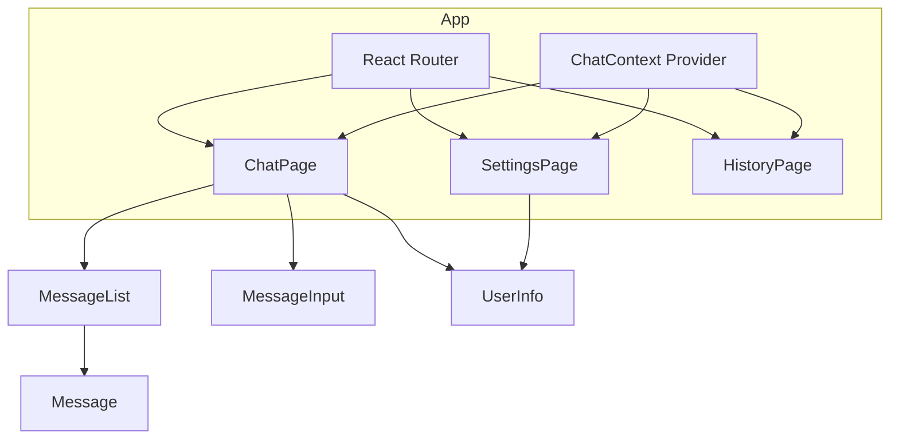

# Stage 3: React SPA

**Converting the Chat App to a modern React single-page application**

---

## Learning Objectives

By the end of this stage, you will:

- Set up a React project with Vite
- Convert vanilla JS patterns to React components
- Use useState and useEffect hooks
- Compose components with props
- Implement client-side routing
- Share state with Context

**Time**: 5-6 hours (reading + building)

---

## Introduction

In Stage 2, we discovered patterns:
- Centralized state with update functions
- Declarative rendering from state
- Component-like structure for each section

**React formalizes these patterns.**

Instead of managing DOM updates manually, React:
- Compares old and new UI descriptions
- Updates only what changed
- Provides hooks for state and side effects
- Enables component composition

This stage rebuilds the chat app in React, showing how framework concepts map to what you already know.

---

## Project Setup

### Create with Vite

```bash
npm create vite@latest chat-react -- --template react
cd chat-react
npm install
npm run dev
```

You now have:
- React 18 with hot module replacement
- Fast development server
- Modern build pipeline

### Project Structure

```
chat-react/
├── public/
│   └── vite.svg
├── src/
│   ├── components/      # We'll add this
│   ├── context/         # We'll add this
│   ├── pages/           # We'll add this
│   ├── App.jsx
│   ├── main.jsx
│   └── index.css        # Tailwind imports
├── index.html
├── package.json
└── vite.config.js
```

:::note CSS to Tailwind Transition
In Stages 1-2, you learned CSS fundamentals — the building blocks that all styling ultimately relies on. From Stage 3 onwards, we use **Tailwind CSS**, a utility-first framework that applies those same CSS concepts through class names like `flex`, `p-4`, and `text-blue-500`. This is the approach used in the example projects and reflects modern React development practices.
:::

### Install Dependencies

```bash
npm install react-router-dom
```

---

## Architectural Views

### Module View

```
src/
├── components/
│   ├── Header.jsx
│   ├── Message.jsx
│   ├── MessageList.jsx
│   ├── MessageInput.jsx
│   ├── UserInfo.jsx
│   └── Notification.jsx
├── context/
│   └── ChatContext.jsx
├── pages/
│   ├── ChatPage.jsx
│   ├── SettingsPage.jsx
│   └── HistoryPage.jsx
├── utils/
│   └── formatTime.js
├── App.jsx
└── main.jsx
```

### Component-Connector View



---

## Part 1: Data and Context

### Time Formatting Utility

Create `src/utils/formatTime.js`:

```javascript
export function formatTime(timestamp) {
  const date = new Date(timestamp);
  return date.toLocaleTimeString('en-US', {
    hour: 'numeric',
    minute: '2-digit',
    hour12: true
  });
}

export function formatDate(timestamp) {
  const date = new Date(timestamp);
  const today = new Date();
  const yesterday = new Date(today);
  yesterday.setDate(yesterday.getDate() - 1);

  if (date.toDateString() === today.toDateString()) {
    return 'Today';
  } else if (date.toDateString() === yesterday.toDateString()) {
    return 'Yesterday';
  } else {
    return date.toLocaleDateString('en-US', {
      month: 'short',
      day: 'numeric'
    });
  }
}
```

### Chat Context

Create `src/context/ChatContext.jsx`:

```jsx
import { createContext, useContext, useState, useEffect } from 'react';
import { formatTime } from '../utils/formatTime';

const ChatContext = createContext();

export function ChatProvider({ children }) {
  const [chat, setChat] = useState(() => {
    // Load from localStorage on init
    const saved = localStorage.getItem('chatMessages');
    return saved ? JSON.parse(saved) : {
      messages: [],
      username: '',
      userId: crypto.randomUUID()
    };
  });

  const [notification, setNotification] = useState(null);

  // Save to localStorage when chat changes
  useEffect(() => {
    localStorage.setItem('chatMessages', JSON.stringify(chat));
  }, [chat]);

  // Auto-dismiss notification
  useEffect(() => {
    if (notification) {
      const timer = setTimeout(() => setNotification(null), 3000);
      return () => clearTimeout(timer);
    }
  }, [notification]);

  const sendMessage = (text) => {
    if (!text.trim()) return;

    const newMessage = {
      id: crypto.randomUUID(),
      text: text.trim(),
      sender: chat.username || 'Anonymous',
      senderId: chat.userId,
      timestamp: Date.now()
    };

    setChat(prev => ({
      ...prev,
      messages: [...prev.messages, newMessage]
    }));
    showNotification('success', 'Message sent!');
  };

  const deleteMessage = (messageId) => {
    setChat(prev => ({
      ...prev,
      messages: prev.messages.filter(msg => msg.id !== messageId)
    }));
  };

  const editMessage = (messageId, newText) => {
    setChat(prev => ({
      ...prev,
      messages: prev.messages.map(msg =>
        msg.id === messageId
          ? { ...msg, text: newText, edited: true }
          : msg
      )
    }));
  };

  const clearMessages = () => {
    setChat(prev => ({
      ...prev,
      messages: []
    }));
    localStorage.removeItem('chatMessages');
  };

  const setUsername = (name) => {
    setChat(prev => ({
      ...prev,
      username: name
    }));
  };

  const showNotification = (type, message) => {
    setNotification({ type, message });
  };

  const getMessageCount = () => chat.messages.length;

  const value = {
    chat,
    notification,
    sendMessage,
    deleteMessage,
    editMessage,
    clearMessages,
    setUsername,
    showNotification,
    getMessageCount
  };

  return (
    <ChatContext.Provider value={value}>
      {children}
    </ChatContext.Provider>
  );
}

export function useChat() {
  const context = useContext(ChatContext);
  if (!context) {
    throw new Error('useChat must be used within ChatProvider');
  }
  return context;
}
```

### Why Context?

In Stage 2, we passed state through function calls. In React:

- **Props** pass data parent to child
- **Context** shares data across many components
- Avoids "prop drilling" (passing props through many layers)

---

## Part 2: Components

### Header Component

Create `src/components/Header.jsx`:

```jsx
import { Link } from 'react-router-dom';
import { useChat } from '../context/ChatContext';

export default function Header() {
  const { chat, getMessageCount } = useChat();
  const messageCount = getMessageCount();

  return (
    <header className="flex items-center justify-between p-4 bg-blue-500 text-white">
      <Link to="/" className="text-xl font-bold hover:opacity-80">
        <h1>Chat App</h1>
      </Link>
      <nav className="flex gap-4">
        <Link to="/" className="hover:underline">
          Chat {messageCount > 0 && <span className="ml-1 px-2 py-0.5 bg-white/20 rounded-full text-sm">{messageCount}</span>}
        </Link>
        <Link to="/settings" className="hover:underline">Settings</Link>
        <Link to="/history" className="hover:underline">History</Link>
      </nav>
    </header>
  );
}
```

### Message Component

Create `src/components/Message.jsx`:

```jsx
import { useChat } from '../context/ChatContext';
import { formatTime } from '../utils/formatTime';

export default function Message({ message, isOwn }) {
  const { deleteMessage } = useChat();

  return (
    <div className={`max-w-[80%] p-3 rounded-lg mb-2 ${isOwn ? 'bg-blue-500 text-white ml-auto' : 'bg-gray-200'}`}>
      <div className="flex justify-between items-center mb-1">
        <span className="font-semibold text-sm">{message.sender}</span>
        <span className={`text-xs ${isOwn ? 'text-blue-100' : 'text-gray-500'}`}>{formatTime(message.timestamp)}</span>
      </div>
      <div>
        <p>{message.text}</p>
        {message.edited && <span className="text-xs italic opacity-70">(edited)</span>}
      </div>
      {isOwn && (
        <button
          className="mt-1 text-xs opacity-70 hover:opacity-100"
          onClick={() => deleteMessage(message.id)}
          aria-label="Delete message"
        >
          ✕ Delete
        </button>
      )}
    </div>
  );
}
```

### MessageList Component

Create `src/components/MessageList.jsx`:

```jsx
import { useRef, useEffect } from 'react';
import Message from './Message';
import { useChat } from '../context/ChatContext';

export default function MessageList() {
  const { chat } = useChat();
  const messagesEndRef = useRef(null);

  // Auto-scroll to bottom when new messages arrive
  useEffect(() => {
    messagesEndRef.current?.scrollIntoView({ behavior: 'smooth' });
  }, [chat.messages]);

  if (chat.messages.length === 0) {
    return (
      <div className="flex-1 overflow-y-auto p-4">
        <p className="text-center text-gray-500 italic py-8">No messages yet. Start the conversation!</p>
      </div>
    );
  }

  return (
    <div className="flex-1 overflow-y-auto p-4">
      {chat.messages.map(message => (
        <Message
          key={message.id}
          message={message}
          isOwn={message.senderId === chat.userId}
        />
      ))}
      <div ref={messagesEndRef} />
    </div>
  );
}
```

### MessageInput Component

Create `src/components/MessageInput.jsx`:

```jsx
import { useState } from 'react';
import { useChat } from '../context/ChatContext';

export default function MessageInput() {
  const { sendMessage } = useChat();
  const [text, setText] = useState('');

  const handleSubmit = (e) => {
    e.preventDefault();
    if (text.trim()) {
      sendMessage(text);
      setText('');
    }
  };

  const handleKeyDown = (e) => {
    if (e.key === 'Enter' && !e.shiftKey) {
      e.preventDefault();
      handleSubmit(e);
    }
  };

  return (
    <form className="flex gap-2 p-4 border-t border-gray-200" onSubmit={handleSubmit}>
      <textarea
        className="flex-1 p-3 border border-gray-300 rounded-lg resize-none focus:outline-none focus:ring-2 focus:ring-blue-500"
        value={text}
        onChange={(e) => setText(e.target.value)}
        onKeyDown={handleKeyDown}
        placeholder="Type a message..."
        rows={2}
      />
      <button
        type="submit"
        className="px-6 py-2 bg-blue-500 text-white rounded-lg font-semibold hover:bg-blue-600 disabled:bg-gray-400 disabled:cursor-not-allowed transition-colors"
        disabled={!text.trim()}
      >
        Send
      </button>
    </form>
  );
}
```

### UserInfo Component

Create `src/components/UserInfo.jsx`:

```jsx
import { useChat } from '../context/ChatContext';

export default function UserInfo() {
  const { chat } = useChat();

  return (
    <div className="flex items-center gap-2">
      <span className="w-8 h-8 bg-blue-600 rounded-full flex items-center justify-center text-white font-semibold">
        {(chat.username || 'A')[0].toUpperCase()}
      </span>
      <span className="text-sm">{chat.username || 'Anonymous'}</span>
    </div>
  );
}
```

### Notification Component

Create `src/components/Notification.jsx`:

```jsx
import { useChat } from '../context/ChatContext';

export default function Notification() {
  const { notification } = useChat();

  if (!notification) return null;

  const typeStyles = {
    success: 'bg-green-500',
    error: 'bg-red-500',
  };

  return (
    <div className={`fixed bottom-4 right-4 px-4 py-3 rounded-lg text-white font-medium shadow-lg ${typeStyles[notification.type]}`}>
      {notification.message}
    </div>
  );
}
```

### SettingsForm Component

Create `src/components/SettingsForm.jsx`:

```jsx
import { useState } from 'react';
import { useNavigate } from 'react-router-dom';
import { useChat } from '../context/ChatContext';

export default function SettingsForm() {
  const navigate = useNavigate();
  const { chat, setUsername, clearMessages, showNotification } = useChat();

  const [formData, setFormData] = useState({
    username: chat.username
  });
  const [errors, setErrors] = useState({});

  const validate = () => {
    const newErrors = {};

    if (!formData.username.trim()) {
      newErrors.username = 'Username is required';
    } else if (formData.username.length < 2) {
      newErrors.username = 'Username must be at least 2 characters';
    } else if (formData.username.length > 20) {
      newErrors.username = 'Username must be 20 characters or less';
    }

    setErrors(newErrors);
    return Object.keys(newErrors).length === 0;
  };

  const handleSubmit = (e) => {
    e.preventDefault();

    if (!validate()) return;

    setUsername(formData.username);
    showNotification('success', 'Settings saved!');
    navigate('/');
  };

  const handleChange = (e) => {
    const { name, value } = e.target;
    setFormData(prev => ({ ...prev, [name]: value }));

    // Clear error when user types
    if (errors[name]) {
      setErrors(prev => ({ ...prev, [name]: '' }));
    }
  };

  const handleClearHistory = () => {
    if (window.confirm('Are you sure you want to clear all messages?')) {
      clearMessages();
      showNotification('success', 'Chat history cleared');
    }
  };

  return (
    <form className="space-y-6" onSubmit={handleSubmit}>
      <div className="space-y-2">
        <label htmlFor="username" className="block font-medium text-gray-700">Username</label>
        <input
          type="text"
          id="username"
          name="username"
          value={formData.username}
          onChange={handleChange}
          className={`w-full p-3 border rounded-lg focus:outline-none focus:ring-2 focus:ring-blue-500 ${errors.username ? 'border-red-500 bg-red-50' : 'border-gray-300'}`}
          placeholder="Enter your username"
        />
        {errors.username && <span className="text-sm text-red-500">{errors.username}</span>}
      </div>

      <div className="flex justify-between pt-4">
        <button
          type="button"
          className="px-4 py-2 text-red-600 hover:text-red-800 hover:bg-red-50 rounded-lg transition-colors"
          onClick={handleClearHistory}
        >
          Clear Chat History
        </button>
        <button
          type="submit"
          className="px-6 py-2 bg-blue-500 text-white rounded-lg font-semibold hover:bg-blue-600 transition-colors"
        >
          Save Settings
        </button>
      </div>
    </form>
  );
}
```

---

## Part 3: Pages and Routing

### ChatPage

Create `src/pages/ChatPage.jsx`:

```jsx
import MessageList from '../components/MessageList';
import MessageInput from '../components/MessageInput';
import UserInfo from '../components/UserInfo';
import { useChat } from '../context/ChatContext';

export default function ChatPage() {
  const { chat } = useChat();

  return (
    <main className="flex-1 flex flex-col bg-gray-50">
      <div className="flex-1 flex flex-col max-w-3xl w-full mx-auto bg-white shadow-sm">
        <div className="flex items-center justify-between p-4 border-b border-gray-200">
          <h2 className="text-lg font-semibold">Chat Room</h2>
          <UserInfo />
        </div>
        <MessageList />
        <MessageInput />
      </div>
    </main>
  );
}
```

### SettingsPage

Create `src/pages/SettingsPage.jsx`:

```jsx
import SettingsForm from '../components/SettingsForm';
import UserInfo from '../components/UserInfo';

export default function SettingsPage() {
  return (
    <main className="flex-1 bg-gray-50 p-6">
      <section className="max-w-md mx-auto bg-white rounded-lg shadow-sm p-6">
        <h2 className="text-xl font-semibold mb-6">Settings</h2>
        <SettingsForm />
      </section>
    </main>
  );
}
```

### HistoryPage

Create `src/pages/HistoryPage.jsx`:

```jsx
import { useChat } from '../context/ChatContext';
import { formatTime, formatDate } from '../utils/formatTime';

export default function HistoryPage() {
  const { chat, getMessageCount } = useChat();

  // Group messages by date
  const groupedMessages = chat.messages.reduce((groups, message) => {
    const dateKey = formatDate(message.timestamp);
    if (!groups[dateKey]) {
      groups[dateKey] = [];
    }
    groups[dateKey].push(message);
    return groups;
  }, {});

  return (
    <main className="flex-1 bg-gray-50 p-6">
      <div className="max-w-2xl mx-auto">
        <h2 className="text-xl font-semibold mb-2">Chat History</h2>
        <p className="text-gray-500 mb-6">{getMessageCount()} messages total</p>

        {Object.keys(groupedMessages).length === 0 ? (
          <p className="text-center text-gray-500 italic py-8">No message history yet.</p>
        ) : (
          Object.entries(groupedMessages).map(([date, messages]) => (
            <div key={date} className="mb-6">
              <h3 className="text-sm font-semibold text-gray-600 mb-2 border-b pb-1">{date}</h3>
              <div className="space-y-2">
                {messages.map(message => (
                  <div key={message.id} className="flex gap-3 text-sm">
                    <span className="text-gray-400 w-16 shrink-0">{formatTime(message.timestamp)}</span>
                    <span className="font-medium text-gray-700">{message.sender}:</span>
                    <span className="text-gray-600">{message.text}</span>
                  </div>
                ))}
              </div>
            </div>
          ))
        )}
      </div>
    </main>
  );
}
```

### App with Router

Update `src/App.jsx`:

```jsx
import { BrowserRouter, Routes, Route } from 'react-router-dom';
import { ChatProvider } from './context/ChatContext';
import Header from './components/Header';
import Notification from './components/Notification';
import ChatPage from './pages/ChatPage';
import SettingsPage from './pages/SettingsPage';
import HistoryPage from './pages/HistoryPage';

export default function App() {
  return (
    <BrowserRouter>
      <ChatProvider>
        <div className="min-h-screen flex flex-col bg-gray-100">
          <Header />
          <Routes>
            <Route path="/" element={<ChatPage />} />
            <Route path="/settings" element={<SettingsPage />} />
            <Route path="/history" element={<HistoryPage />} />
          </Routes>
          <Notification />
        </div>
      </ChatProvider>
    </BrowserRouter>
  );
}
```

---

## Part 4: Styling with Tailwind

Update `src/index.css` to import Tailwind:

```css
@import "tailwindcss";
```

With Tailwind, styles are applied directly in JSX via utility classes (as shown in the components above). This eliminates the need for separate CSS files per component.

---

## Part 5: Comparing Patterns

### Stage 2 vs React

| Stage 2 (Vanilla) | Stage 3 (React) |
|-------------------|-----------------|
| `let state = {}` | `useState()` |
| `updateState(path, value)` | `setState()` |
| `render()` function | Component return |
| `innerHTML = template` | JSX |
| Event delegation | Direct handlers |
| Manual DOM updates | Virtual DOM diffing |
| Global state object | Context |
| `showPanel()` | React Router |

### What React Gives You

1. **Automatic re-rendering** — No manual `render()` calls
2. **Component encapsulation** — State and UI together
3. **Efficient updates** — Only changed DOM nodes update
4. **Declarative** — Describe what you want, not how
5. **Ecosystem** — Router, testing, dev tools

### What React Costs

1. **Learning curve** — New concepts (hooks, JSX)
2. **Build step required** — Can't just open HTML file
3. **Abstraction** — Further from the metal
4. **Bundle size** — More JavaScript to send

---

## Exercise 1: Create a Custom Hook

Extract the notification logic into a custom hook:

```jsx
// src/hooks/useNotification.js
export function useNotification() {
  // Implement: state, show function, auto-dismiss
}
```

<details>
<summary>Solution</summary>

```jsx
import { useState, useEffect, useCallback } from 'react';

export function useNotification(duration = 3000) {
  const [notification, setNotification] = useState(null);

  useEffect(() => {
    if (notification) {
      const timer = setTimeout(() => setNotification(null), duration);
      return () => clearTimeout(timer);
    }
  }, [notification, duration]);

  const showNotification = useCallback((type, message) => {
    setNotification({ type, message });
  }, []);

  const hideNotification = useCallback(() => {
    setNotification(null);
  }, []);

  return { notification, showNotification, hideNotification };
}
```

</details>

---

## Exercise 2: Add a 404 Page

Create a NotFoundPage component and add it to the router:

1. Create `src/pages/NotFoundPage.jsx`
2. Add a catch-all route `path="*"`
3. Include a link back to home

---

## Exercise 3: Persist with useEffect

Currently, we load from localStorage in useState initializer. Improve this:

1. Move localStorage logic to useEffect
2. Handle the case where localStorage is unavailable
3. Add error handling

---

## Exercise 4: Extract a useLocalStorage Hook

Create a reusable hook for localStorage:

```jsx
function useLocalStorage(key, initialValue) {
  // Returns [value, setValue] like useState
  // Automatically syncs to localStorage
}
```

---

## Exercise 5: Add Message Editing

Implement the ability to edit messages:

1. Add an "Edit" button to the Message component (only for own messages)
2. Create an EditMessageForm component
3. Use the existing `editMessage` function from the ChatContext
4. Show the "(edited)" label after a message is edited

---

## Key Takeaways

1. **React formalizes patterns** — useState, components, props are patterns you already know

2. **Context shares state** — Avoids prop drilling for global data

3. **Hooks handle effects** — useEffect for side effects, custom hooks for reuse

4. **Router handles navigation** — SPA navigation without page reloads

5. **Components compose** — Small pieces combine into complex UIs

6. **DevTools help** — React DevTools show component tree and state

---

## What's Next

**[Stage 4: Fullstack App](fullstack-app)**

You'll learn:
- Building an Express API backend
- Connecting React to a REST API
- Database persistence with SQLite
- Client-server architecture

---

**You've completed Stage 3!** You now have a modern React chat SPA. But the data still lives in the browser. Stage 4 adds a real backend with persistent storage and multi-user support.
