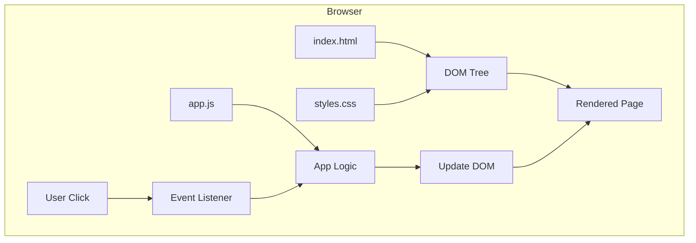
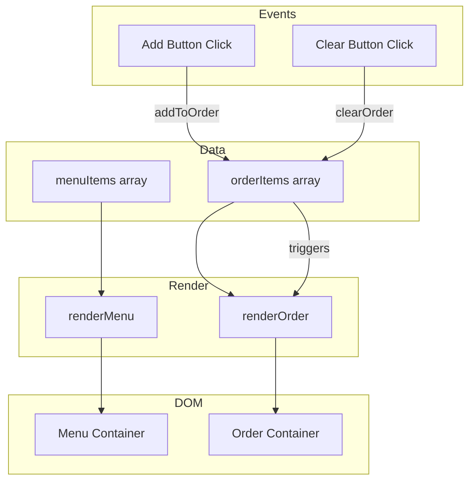

# Stage 1: Static Website

**Building the Lemonade Stand with HTML, CSS, and vanilla JavaScript**

---

## Learning Objectives

By the end of this stage, you will:

- Build a functional web page from scratch
- Understand HTML structure and semantic elements
- Apply CSS for layout and styling
- Use JavaScript for DOM manipulation
- Handle user events (clicks, form submissions)
- See the three architectural views in practice

**Time**: 4-6 hours (reading + building)

---

## Introduction

This is where the lemonade stand comes to life in a browser.

In Part I, you learned what software is and how the web works conceptually. Now you'll build something real — a web page that displays a menu, lets users add items to an order, and calculates totals.

**No frameworks. No build tools. Just the fundamentals.**

Understanding vanilla HTML/CSS/JS is essential because:
1. Frameworks are built on top of these primitives
2. Debugging often requires understanding what's "really" happening
3. Simple projects don't need framework complexity
4. AI assistants work better when you understand the foundations

---

## What We're Building

A single-page lemonade stand that:

```
┌─────────────────────────────────────────────────────────────┐
│  🍋 Lemonade Stand                                          │
├─────────────────────────────────────────────────────────────┤
│                                                             │
│  MENU                                                       │
│  ┌─────────────────────────────────────────────────────┐   │
│  │ 🍋 Classic Lemonade              $2.50    [Add]     │   │
│  │ 🍓 Strawberry Lemonade           $3.50    [Add]     │   │
│  │ 🌿 Mint Lemonade                 $3.00    [Add]     │   │
│  └─────────────────────────────────────────────────────┘   │
│                                                             │
│  YOUR ORDER                                                 │
│  ┌─────────────────────────────────────────────────────┐   │
│  │ Classic Lemonade x2              $5.00              │   │
│  │ Mint Lemonade x1                 $3.00              │   │
│  ├─────────────────────────────────────────────────────┤   │
│  │ Total:                           $8.00              │   │
│  └─────────────────────────────────────────────────────┘   │
│                                                             │
│                    [Clear Order]                            │
│                                                             │
└─────────────────────────────────────────────────────────────┘
```

---

## Architectural Views

Before coding, let's see the architecture.

### Module View (What files exist?)

```
lemonade-static/
├── index.html      # Structure
├── styles.css      # Presentation
└── app.js          # Behavior
```

Three files, clear separation of concerns.

### Component-Connector View (What happens at runtime?)



### Allocation View (Where does it run?)

```
┌─────────────────────────────────────────────────────────────┐
│  User's Browser                                             │
│  ┌─────────────────────────────────────────────────────┐   │
│  │  HTML Parser → DOM                                   │   │
│  │  CSS Parser → Styles                                 │   │
│  │  JavaScript Engine → Logic                           │   │
│  └─────────────────────────────────────────────────────┘   │
└─────────────────────────────────────────────────────────────┘
        ↑
        │ HTTP (file:// or localhost)
        │
┌─────────────────────────────────────────────────────────────┐
│  Files (local or web server)                               │
│  index.html, styles.css, app.js                            │
└─────────────────────────────────────────────────────────────┘
```

Everything runs in the browser. No server-side processing (yet).

---

## Part 1: HTML Structure

### The Foundation

HTML provides **structure** — what elements exist and how they relate.

```html
<!DOCTYPE html>
<html lang="en">
<head>
    <meta charset="UTF-8">
    <meta name="viewport" content="width=device-width, initial-scale=1.0">
    <title>Lemonade Stand</title>
    <link rel="stylesheet" href="styles.css">
</head>
<body>
    <header>
        <h1>🍋 Lemonade Stand</h1>
    </header>

    <main>
        <section id="menu">
            <h2>Menu</h2>
            <div id="menu-items">
                <!-- Items will be here -->
            </div>
        </section>

        <section id="order">
            <h2>Your Order</h2>
            <div id="order-items">
                <p class="empty-message">No items yet</p>
            </div>
            <div id="order-total">
                <span>Total:</span>
                <span id="total-amount">$0.00</span>
            </div>
            <button id="clear-order" disabled>Clear Order</button>
        </section>
    </main>

    <script src="app.js"></script>
</body>
</html>
```

### Semantic Elements

Note the use of semantic HTML:
- `<header>` — Site header
- `<main>` — Primary content
- `<section>` — Distinct content areas
- `<h1>`, `<h2>` — Heading hierarchy

**Why semantics matter:**
- Accessibility (screen readers understand structure)
- SEO (search engines understand content)
- Maintainability (developers understand intent)

### The Menu Item Template

Each menu item follows this structure:

```html
<div class="menu-item" data-id="classic" data-price="2.50">
    <span class="item-emoji">🍋</span>
    <div class="item-info">
        <span class="item-name">Classic Lemonade</span>
        <span class="item-description">Fresh squeezed, ice cold</span>
    </div>
    <span class="item-price">$2.50</span>
    <button class="add-button">Add</button>
</div>
```

Note the `data-*` attributes — these store data for JavaScript to use.

---

## Part 2: CSS Styling

### Basic Layout

```css
/* Reset and base styles */
* {
    margin: 0;
    padding: 0;
    box-sizing: border-box;
}

body {
    font-family: system-ui, -apple-system, sans-serif;
    background-color: #fef9c3;  /* Light yellow */
    color: #1e293b;
    line-height: 1.6;
}

/* Header */
header {
    background-color: #facc15;  /* Yellow */
    padding: 1rem 2rem;
    text-align: center;
}

header h1 {
    font-size: 2rem;
}

/* Main content */
main {
    max-width: 800px;
    margin: 0 auto;
    padding: 2rem;
    display: grid;
    grid-template-columns: 1fr 1fr;
    gap: 2rem;
}

/* Sections */
section {
    background: white;
    border-radius: 8px;
    padding: 1.5rem;
    box-shadow: 0 2px 4px rgba(0, 0, 0, 0.1);
}

section h2 {
    margin-bottom: 1rem;
    padding-bottom: 0.5rem;
    border-bottom: 2px solid #facc15;
}
```

### Menu Item Styles

```css
/* Menu items */
.menu-item {
    display: flex;
    align-items: center;
    gap: 1rem;
    padding: 1rem;
    border: 1px solid #e2e8f0;
    border-radius: 8px;
    margin-bottom: 0.75rem;
    transition: background-color 0.2s;
}

.menu-item:hover {
    background-color: #fef9c3;
}

.item-emoji {
    font-size: 2rem;
}

.item-info {
    flex: 1;
}

.item-name {
    display: block;
    font-weight: 600;
}

.item-description {
    display: block;
    font-size: 0.875rem;
    color: #64748b;
}

.item-price {
    font-weight: 700;
    font-size: 1.125rem;
}

.add-button {
    background-color: #facc15;
    border: none;
    padding: 0.5rem 1rem;
    border-radius: 4px;
    cursor: pointer;
    font-weight: 600;
    transition: background-color 0.2s;
}

.add-button:hover {
    background-color: #eab308;
}
```

### Order Section Styles

```css
/* Order items */
.order-item {
    display: flex;
    justify-content: space-between;
    padding: 0.5rem 0;
    border-bottom: 1px solid #e2e8f0;
}

.empty-message {
    color: #64748b;
    font-style: italic;
    text-align: center;
    padding: 1rem;
}

/* Order total */
#order-total {
    display: flex;
    justify-content: space-between;
    padding: 1rem 0;
    margin-top: 1rem;
    border-top: 2px solid #1e293b;
    font-weight: 700;
    font-size: 1.25rem;
}

/* Clear button */
#clear-order {
    width: 100%;
    padding: 0.75rem;
    margin-top: 1rem;
    background-color: #ef4444;
    color: white;
    border: none;
    border-radius: 4px;
    cursor: pointer;
    font-weight: 600;
}

#clear-order:hover:not(:disabled) {
    background-color: #dc2626;
}

#clear-order:disabled {
    background-color: #94a3b8;
    cursor: not-allowed;
}
```

### Responsive Design

```css
/* Mobile layout */
@media (max-width: 640px) {
    main {
        grid-template-columns: 1fr;
        padding: 1rem;
    }

    header h1 {
        font-size: 1.5rem;
    }
}
```

---

## Part 3: JavaScript Behavior

### Data Structure

First, define the menu data:

```javascript
// Menu data
const menuItems = [
    {
        id: 'classic',
        name: 'Classic Lemonade',
        description: 'Fresh squeezed, ice cold',
        price: 2.50,
        emoji: '🍋'
    },
    {
        id: 'strawberry',
        name: 'Strawberry Lemonade',
        description: 'With fresh strawberries',
        price: 3.50,
        emoji: '🍓'
    },
    {
        id: 'mint',
        name: 'Mint Lemonade',
        description: 'Cool and refreshing',
        price: 3.00,
        emoji: '🌿'
    }
];

// Order state
let orderItems = [];
```

### Rendering the Menu

```javascript
// Render menu items to the DOM
function renderMenu() {
    const container = document.getElementById('menu-items');

    container.innerHTML = menuItems.map(item => `
        <div class="menu-item" data-id="${item.id}">
            <span class="item-emoji">${item.emoji}</span>
            <div class="item-info">
                <span class="item-name">${item.name}</span>
                <span class="item-description">${item.description}</span>
            </div>
            <span class="item-price">$${item.price.toFixed(2)}</span>
            <button class="add-button">Add</button>
        </div>
    `).join('');
}
```

### Rendering the Order

```javascript
// Render current order to the DOM
function renderOrder() {
    const container = document.getElementById('order-items');
    const totalElement = document.getElementById('total-amount');
    const clearButton = document.getElementById('clear-order');

    if (orderItems.length === 0) {
        container.innerHTML = '<p class="empty-message">No items yet</p>';
        totalElement.textContent = '$0.00';
        clearButton.disabled = true;
        return;
    }

    // Group items by id and count quantities
    const grouped = orderItems.reduce((acc, item) => {
        if (!acc[item.id]) {
            acc[item.id] = { ...item, quantity: 0 };
        }
        acc[item.id].quantity++;
        return acc;
    }, {});

    // Render grouped items
    container.innerHTML = Object.values(grouped).map(item => `
        <div class="order-item">
            <span>${item.name} x${item.quantity}</span>
            <span>$${(item.price * item.quantity).toFixed(2)}</span>
        </div>
    `).join('');

    // Calculate and display total
    const total = orderItems.reduce((sum, item) => sum + item.price, 0);
    totalElement.textContent = `$${total.toFixed(2)}`;
    clearButton.disabled = false;
}
```

### Event Handling

```javascript
// Add item to order
function addToOrder(itemId) {
    const item = menuItems.find(i => i.id === itemId);
    if (item) {
        orderItems.push({ ...item });
        renderOrder();
    }
}

// Clear the order
function clearOrder() {
    orderItems = [];
    renderOrder();
}

// Set up event listeners
function setupEventListeners() {
    // Event delegation for menu items
    const menuContainer = document.getElementById('menu-items');
    menuContainer.addEventListener('click', (event) => {
        if (event.target.classList.contains('add-button')) {
            const menuItem = event.target.closest('.menu-item');
            const itemId = menuItem.dataset.id;
            addToOrder(itemId);
        }
    });

    // Clear button
    const clearButton = document.getElementById('clear-order');
    clearButton.addEventListener('click', clearOrder);
}

// Initialize the app
function init() {
    renderMenu();
    renderOrder();
    setupEventListeners();
}

// Run when DOM is ready
document.addEventListener('DOMContentLoaded', init);
```

---

## Part 4: Understanding the Flow

### Data Flow Diagram



### Event Flow

When user clicks "Add":

1. Click event fires on button
2. Event delegation catches it on menu container
3. `addToOrder()` finds the item and adds to `orderItems`
4. `renderOrder()` updates the DOM
5. User sees the new item in their order

This is the **unidirectional data flow** pattern:
```
User Action → Update State → Re-render UI
```

---

## Part 5: Running the App

### Option 1: Open Directly

Simply open `index.html` in a browser. Works for basic cases.

### Option 2: Local Server

Some features (like ES modules) require a server:

```bash
# Python
python -m http.server 8000

# Node.js (if npx available)
npx serve

# Then open http://localhost:8000
```

### Developer Tools

Press F12 to open DevTools:

- **Elements**: Inspect and modify the DOM
- **Console**: See JavaScript errors and logs
- **Network**: Watch file loading
- **Sources**: Debug JavaScript

**Add console.log statements while learning:**

```javascript
function addToOrder(itemId) {
    console.log('Adding item:', itemId);
    const item = menuItems.find(i => i.id === itemId);
    console.log('Found item:', item);
    // ...
}
```

---

## Part 6: Common Patterns

### Template Literals for HTML

```javascript
// Clean way to generate HTML strings
const html = `
    <div class="item">
        <span>${item.name}</span>
        <span>$${item.price.toFixed(2)}</span>
    </div>
`;
```

### Event Delegation

Instead of adding listeners to each button:

```javascript
// ❌ Adding listener to each button
buttons.forEach(btn => btn.addEventListener('click', handler));

// ✅ Single listener on container
container.addEventListener('click', (e) => {
    if (e.target.matches('.add-button')) {
        // handle click
    }
});
```

Event delegation is more efficient and handles dynamically added elements.

### Data Attributes

Store data in HTML for JavaScript to read:

```html
<div data-id="classic" data-price="2.50">...</div>
```

```javascript
const id = element.dataset.id;      // "classic"
const price = element.dataset.price; // "2.50" (string!)
```

---

## Exercise 1: Build the HTML

Create the HTML structure from scratch:

1. Create `index.html`
2. Add the basic document structure
3. Add header with title
4. Add menu section (empty for now)
5. Add order section with empty message and total

Verify: Open in browser, see the structure (unstyled).

<details>
<summary>Solution</summary>

```html
<!DOCTYPE html>
<html lang="en">
<head>
    <meta charset="UTF-8">
    <meta name="viewport" content="width=device-width, initial-scale=1.0">
    <title>Lemonade Stand</title>
    <link rel="stylesheet" href="styles.css">
</head>
<body>
    <header>
        <h1>🍋 Lemonade Stand</h1>
    </header>

    <main>
        <section id="menu">
            <h2>Menu</h2>
            <div id="menu-items"></div>
        </section>

        <section id="order">
            <h2>Your Order</h2>
            <div id="order-items">
                <p class="empty-message">No items yet</p>
            </div>
            <div id="order-total">
                <span>Total:</span>
                <span id="total-amount">$0.00</span>
            </div>
            <button id="clear-order" disabled>Clear Order</button>
        </section>
    </main>

    <script src="app.js"></script>
</body>
</html>
```

</details>

---

## Exercise 2: Style the Layout

Create the CSS for layout:

1. Create `styles.css`
2. Add base styles (reset, body, fonts)
3. Style the header
4. Create two-column layout for menu and order
5. Style the sections

Verify: Page has yellow header, two-column layout, styled sections.

---

## Exercise 3: Add Interactivity

Complete the JavaScript:

1. Create `app.js`
2. Add the menu data
3. Implement `renderMenu()`
4. Implement `renderOrder()`
5. Implement `addToOrder()` and `clearOrder()`
6. Set up event listeners

Verify: Can add items to order, see total update, clear order.

---

## Exercise 4: Debug and Extend

Debug and add a feature:

1. Open DevTools, find any console errors
2. Add a console.log to track when items are added
3. **Extension**: Add a "remove one" button for each order item

<details>
<summary>Hint for Remove Button</summary>

```javascript
// In renderOrder, add a remove button:
container.innerHTML = Object.values(grouped).map(item => `
    <div class="order-item" data-id="${item.id}">
        <span>${item.name} x${item.quantity}</span>
        <span>$${(item.price * item.quantity).toFixed(2)}</span>
        <button class="remove-button">−</button>
    </div>
`).join('');

// Add event delegation for remove buttons:
const orderContainer = document.getElementById('order-items');
orderContainer.addEventListener('click', (e) => {
    if (e.target.classList.contains('remove-button')) {
        const itemId = e.target.closest('.order-item').dataset.id;
        removeFromOrder(itemId);
    }
});

// Implement removeFromOrder:
function removeFromOrder(itemId) {
    const index = orderItems.findIndex(item => item.id === itemId);
    if (index !== -1) {
        orderItems.splice(index, 1);
        renderOrder();
    }
}
```

</details>

---

## Using AI Effectively

### For HTML Structure

```
I'm building a lemonade stand menu page.

I need a menu section that displays items with:
- emoji icon
- name and description
- price
- add button

Can you write the HTML structure using semantic elements?
```

### For CSS Layout

```
I have a menu section and order section side by side.

I want:
- Two columns on desktop
- Single column on mobile
- Cards with subtle shadows

Can you write CSS using Grid and media queries?
```

### For JavaScript Logic

```
I'm implementing addToOrder for a lemonade stand.

Current state:
- menuItems array with id, name, price
- orderItems array that holds added items

When user clicks Add:
1. Find the item by id
2. Add a copy to orderItems
3. Re-render the order display

Can you implement this function?
```

---

## Key Takeaways

1. **HTML provides structure** — Semantic elements communicate intent

2. **CSS provides presentation** — Separate from structure for maintainability

3. **JavaScript provides behavior** — DOM manipulation and event handling

4. **Data drives rendering** — Update state, then re-render

5. **Event delegation scales** — One listener handles many elements

6. **DevTools are essential** — Use them constantly while developing

---

## What's Next

**[Stage 2: Interactive UI](interactive-ui)**

You'll learn:
- Managing more complex state
- Form handling and validation
- Animation and transitions
- Preparing for framework concepts

---

## Files Created

By the end of this stage, you have:

```
lemonade-static/
├── index.html    (~60 lines)
├── styles.css    (~120 lines)
└── app.js        (~80 lines)
```

A complete, working lemonade stand in about 260 lines of code.

---

**You've completed Stage 1!** You've built a functional web application using only HTML, CSS, and JavaScript. This foundation will make framework concepts much clearer in Stage 3.
