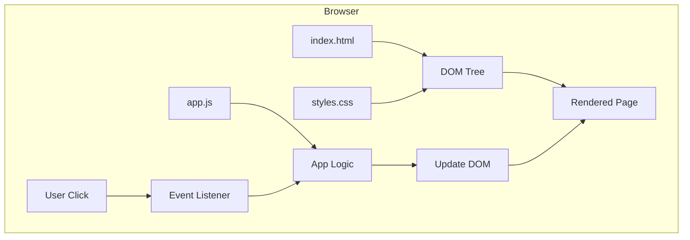
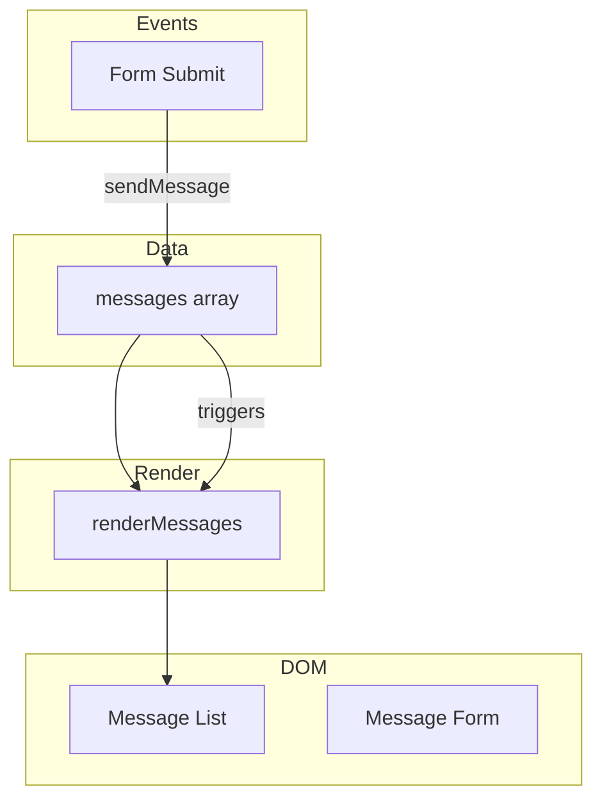

# Stage 1: Static Website

**Building the Chat App with HTML, CSS, and vanilla JavaScript**

---

## Learning Objectives

By the end of this stage, you will:

- Build a functional web page from scratch
- Understand HTML structure and semantic elements
- Apply CSS for layout and styling
- Use JavaScript for DOM manipulation
- Handle user events (clicks, form submissions)
- See the three architectural views in practice

**Time**: 4-6 hours (reading + building)

---

## Introduction

This is where the chat app comes to life in a browser.

In Part I, you learned what software is and how the web works conceptually. Now you'll build something real — a web page that displays messages, lets users compose new messages, and persists chat history.

**No frameworks. No build tools. Just the fundamentals.**

Understanding vanilla HTML/CSS/JS is essential because:
1. Frameworks are built on top of these primitives
2. Debugging often requires understanding what's "really" happening
3. Simple projects don't need framework complexity
4. AI assistants work better when you understand the foundations

---

## What We're Building

A single-page chat interface that:

```
┌─────────────────────────────────────────────────────────────┐
│  💬 Chat App                                                │
├─────────────────────────────────────────────────────────────┤
│                                                             │
│  MESSAGES                                                   │
│  ┌─────────────────────────────────────────────────────┐   │
│  │ Alice (10:30 AM)                                    │   │
│  │ Hey, how's it going?                                │   │
│  ├─────────────────────────────────────────────────────┤   │
│  │ You (10:31 AM)                                      │   │
│  │ Pretty good! Working on the DevFoundry curriculum.  │   │
│  ├─────────────────────────────────────────────────────┤   │
│  │ Alice (10:32 AM)                                    │   │
│  │ Nice! Let me know if you need any help.            │   │
│  └─────────────────────────────────────────────────────┘   │
│                                                             │
│  ┌─────────────────────────────────────────────────────┐   │
│  │ Type a message...                          [Send]   │   │
│  └─────────────────────────────────────────────────────┘   │
│                                                             │
└─────────────────────────────────────────────────────────────┘
```

---

## Architectural Views

Before coding, let's see the architecture.

### Module View (What files exist?)

```
chat-static/
├── index.html      # Structure
├── styles.css      # Presentation
└── app.js          # Behavior
```

Three files, clear separation of concerns.

### Component-Connector View (What happens at runtime?)



### Allocation View (Where does it run?)

```
┌─────────────────────────────────────────────────────────────┐
│  User's Browser                                             │
│  ┌─────────────────────────────────────────────────────┐   │
│  │  HTML Parser → DOM                                   │   │
│  │  CSS Parser → Styles                                 │   │
│  │  JavaScript Engine → Logic                           │   │
│  └─────────────────────────────────────────────────────┘   │
└─────────────────────────────────────────────────────────────┘
        ↑
        │ HTTP (file:// or localhost)
        │
┌─────────────────────────────────────────────────────────────┐
│  Files (local or web server)                               │
│  index.html, styles.css, app.js                            │
└─────────────────────────────────────────────────────────────┘
```

Everything runs in the browser. No server-side processing (yet).

---

## Part 1: HTML Structure

### The Foundation

HTML provides **structure** — what elements exist and how they relate.

```html
<!DOCTYPE html>
<html lang="en">
<head>
    <meta charset="UTF-8">
    <meta name="viewport" content="width=device-width, initial-scale=1.0">
    <title>Chat App</title>
    <link rel="stylesheet" href="styles.css">
</head>
<body>
    <header>
        <h1>Chat App</h1>
    </header>

    <main>
        <section id="messages">
            <h2>Messages</h2>
            <div id="message-list">
                <!-- Messages will be here -->
            </div>
        </section>

        <section id="compose">
            <h2>New Message</h2>
            <form id="message-form">
                <input type="text" id="message-input"
                       placeholder="Type a message..." required>
                <button type="submit" id="send-button">Send</button>
            </form>
        </section>
    </main>

    <script src="app.js"></script>
</body>
</html>
```

### Semantic Elements

Note the use of semantic HTML:
- `<header>` — Site header
- `<main>` — Primary content
- `<section>` — Distinct content areas
- `<h1>`, `<h2>` — Heading hierarchy
- `<form>` — Groups form controls

**Why semantics matter:**
- Accessibility (screen readers understand structure)
- SEO (search engines understand content)
- Maintainability (developers understand intent)

### The Message Template

Each message follows this structure:

```html
<div class="message-bubble" data-id="1" data-sender="alice">
    <div class="message-header">
        <span class="sender-name">Alice</span>
        <span class="timestamp">10:30 AM</span>
    </div>
    <p class="message-content">Hey, how's it going?</p>
</div>
```

Note the `data-*` attributes — these store data for JavaScript to use.

---

## Part 2: CSS Styling

### Basic Layout

```css
/* Reset and base styles */
* {
    margin: 0;
    padding: 0;
    box-sizing: border-box;
}

body {
    font-family: system-ui, -apple-system, sans-serif;
    background-color: #f1f5f9;  /* Light gray */
    color: #1e293b;
    line-height: 1.6;
}

/* Header */
header {
    background-color: #3b82f6;  /* Blue */
    color: white;
    padding: 1rem 2rem;
    text-align: center;
}

header h1 {
    font-size: 2rem;
}

/* Main content */
main {
    max-width: 600px;
    margin: 0 auto;
    padding: 2rem;
    display: flex;
    flex-direction: column;
    gap: 1rem;
    height: calc(100vh - 80px);
}

/* Sections */
section {
    background: white;
    border-radius: 8px;
    padding: 1.5rem;
    box-shadow: 0 2px 4px rgba(0, 0, 0, 0.1);
}

section h2 {
    margin-bottom: 1rem;
    padding-bottom: 0.5rem;
    border-bottom: 2px solid #3b82f6;
}
```

### Message Styles

```css
/* Message list container */
#message-list {
    max-height: 400px;
    overflow-y: auto;
    padding: 0.5rem;
}

/* Message bubbles */
.message-bubble {
    padding: 0.75rem 1rem;
    margin-bottom: 0.75rem;
    border-radius: 12px;
    background-color: #e2e8f0;
    max-width: 80%;
}

.message-bubble.own-message {
    background-color: #3b82f6;
    color: white;
    margin-left: auto;
}

.message-header {
    display: flex;
    justify-content: space-between;
    align-items: center;
    margin-bottom: 0.25rem;
}

.sender-name {
    font-weight: 600;
    font-size: 0.875rem;
}

.timestamp {
    font-size: 0.75rem;
    color: #64748b;
}

.message-bubble.own-message .timestamp {
    color: #bfdbfe;
}

.message-content {
    margin: 0;
}

.empty-message {
    color: #64748b;
    font-style: italic;
    text-align: center;
    padding: 2rem;
}
```

### Compose Section Styles

```css
/* Compose form */
#message-form {
    display: flex;
    gap: 0.5rem;
}

#message-input {
    flex: 1;
    padding: 0.75rem 1rem;
    border: 1px solid #e2e8f0;
    border-radius: 24px;
    font-size: 1rem;
    outline: none;
}

#message-input:focus {
    border-color: #3b82f6;
    box-shadow: 0 0 0 2px rgba(59, 130, 246, 0.2);
}

/* Send button */
#send-button {
    padding: 0.75rem 1.5rem;
    background-color: #3b82f6;
    color: white;
    border: none;
    border-radius: 24px;
    cursor: pointer;
    font-weight: 600;
    transition: background-color 0.2s;
}

#send-button:hover {
    background-color: #2563eb;
}

#send-button:disabled {
    background-color: #94a3b8;
    cursor: not-allowed;
}
```

### Responsive Design

```css
/* Mobile layout */
@media (max-width: 640px) {
    main {
        padding: 1rem;
        height: calc(100vh - 60px);
    }

    header h1 {
        font-size: 1.5rem;
    }

    .message-bubble {
        max-width: 90%;
    }
}
```

---

## Part 3: JavaScript Behavior

### Data Structure

First, define the initial messages and current user:

```javascript
// Current user (you)
const currentUser = 'You';

// Message state - start with some sample messages
let messages = [
    {
        id: 1,
        sender: 'Alice',
        content: "Hey, how's it going?",
        timestamp: new Date('2024-01-15T10:30:00')
    },
    {
        id: 2,
        sender: 'You',
        content: 'Pretty good! Working on the DevFoundry curriculum.',
        timestamp: new Date('2024-01-15T10:31:00')
    },
    {
        id: 3,
        sender: 'Alice',
        content: 'Nice! Let me know if you need any help.',
        timestamp: new Date('2024-01-15T10:32:00')
    }
];

// Counter for generating unique message IDs
let nextMessageId = 4;
```

### Formatting Timestamps

```javascript
// Format a Date object to a readable time string
function formatTimestamp(date) {
    return date.toLocaleTimeString('en-US', {
        hour: 'numeric',
        minute: '2-digit',
        hour12: true
    });
}
```

### Rendering Messages

```javascript
// Render all messages to the DOM
function renderMessages() {
    const container = document.getElementById('message-list');

    if (messages.length === 0) {
        container.innerHTML = '<p class="empty-message">No messages yet. Start the conversation!</p>';
        return;
    }

    container.innerHTML = messages.map(message => {
        const isOwnMessage = message.sender === currentUser;
        return `
            <div class="message-bubble ${isOwnMessage ? 'own-message' : ''}"
                 data-id="${message.id}">
                <div class="message-header">
                    <span class="sender-name">${message.sender}</span>
                    <span class="timestamp">${formatTimestamp(message.timestamp)}</span>
                </div>
                <p class="message-content">${message.content}</p>
            </div>
        `;
    }).join('');

    // Scroll to the bottom to show latest message
    container.scrollTop = container.scrollHeight;
}
```

### Event Handling

```javascript
// Send a new message
function sendMessage(content) {
    // Create the new message object
    const newMessage = {
        id: nextMessageId++,
        sender: currentUser,
        content: content,
        timestamp: new Date()
    };

    // Add to messages array
    messages.push(newMessage);

    // Re-render the messages
    renderMessages();
}

// Handle form submission
function handleSubmit(event) {
    // Prevent the default form submission (page reload)
    event.preventDefault();

    // Get the input element and its value
    const input = document.getElementById('message-input');
    const content = input.value.trim();

    // Only send if there's actual content
    if (content) {
        sendMessage(content);
        input.value = '';  // Clear the input
        input.focus();     // Keep focus on input
    }
}

// Set up event listeners
function setupEventListeners() {
    // Form submission
    const form = document.getElementById('message-form');
    form.addEventListener('submit', handleSubmit);
}

// Initialize the app
function init() {
    renderMessages();
    setupEventListeners();
}

// Run when DOM is ready
document.addEventListener('DOMContentLoaded', init);
```

---

## Part 4: Understanding the Flow

### Data Flow Diagram



### Event Flow

When user submits a message:

1. Submit event fires on form
2. `handleSubmit()` prevents default page reload
3. `sendMessage()` creates message object and adds to `messages`
4. `renderMessages()` updates the DOM
5. User sees their new message in the list

This is the **unidirectional data flow** pattern:
```
User Action → Update State → Re-render UI
```

---

## Part 5: Running the App

### Option 1: Open Directly

Simply open `index.html` in a browser. Works for basic cases.

### Option 2: Local Server

Some features (like ES modules) require a server:

```bash
# Python
python -m http.server 8000

# Node.js (if npx available)
npx serve

# Then open http://localhost:8000
```

### Developer Tools

Press F12 to open DevTools:

- **Elements**: Inspect and modify the DOM
- **Console**: See JavaScript errors and logs
- **Network**: Watch file loading
- **Sources**: Debug JavaScript

**Add console.log statements while learning:**

```javascript
function sendMessage(content) {
    console.log('Sending message:', content);
    const newMessage = {
        id: nextMessageId++,
        sender: currentUser,
        content: content,
        timestamp: new Date()
    };
    console.log('Created message:', newMessage);
    // ...
}
```

---

## Part 6: Common Patterns

### Template Literals for HTML

```javascript
// Clean way to generate HTML strings
const html = `
    <div class="message-bubble">
        <span class="sender-name">${message.sender}</span>
        <p class="message-content">${message.content}</p>
    </div>
`;
```

### Event Delegation

Instead of adding listeners to each element:

```javascript
// ❌ Adding listener to each message
messages.forEach(msg => msg.addEventListener('click', handler));

// ✅ Single listener on container
container.addEventListener('click', (e) => {
    if (e.target.matches('.message-bubble')) {
        // handle click
    }
});
```

Event delegation is more efficient and handles dynamically added elements.

### Data Attributes

Store data in HTML for JavaScript to read:

```html
<div data-id="1" data-sender="alice">...</div>
```

```javascript
const id = element.dataset.id;        // "1" (string!)
const sender = element.dataset.sender; // "alice"
```

---

## Exercise 1: Build the HTML

Create the HTML structure from scratch:

1. Create `index.html`
2. Add the basic document structure
3. Add header with title
4. Add messages section (empty for now)
5. Add compose section with input and send button

Verify: Open in browser, see the structure (unstyled).

<details>
<summary>Solution</summary>

```html
<!DOCTYPE html>
<html lang="en">
<head>
    <meta charset="UTF-8">
    <meta name="viewport" content="width=device-width, initial-scale=1.0">
    <title>Chat App</title>
    <link rel="stylesheet" href="styles.css">
</head>
<body>
    <header>
        <h1>Chat App</h1>
    </header>

    <main>
        <section id="messages">
            <h2>Messages</h2>
            <div id="message-list"></div>
        </section>

        <section id="compose">
            <h2>New Message</h2>
            <form id="message-form">
                <input type="text" id="message-input"
                       placeholder="Type a message..." required>
                <button type="submit" id="send-button">Send</button>
            </form>
        </section>
    </main>

    <script src="app.js"></script>
</body>
</html>
```

</details>

---

## Exercise 2: Style the Layout

Create the CSS for layout:

1. Create `styles.css`
2. Add base styles (reset, body, fonts)
3. Style the header
4. Create single-column layout for messages and compose
5. Style the message bubbles and form

Verify: Page has blue header, stacked layout, styled message bubbles.

---

## Exercise 3: Add Interactivity

Complete the JavaScript:

1. Create `app.js`
2. Add the initial messages data
3. Implement `formatTimestamp()`
4. Implement `renderMessages()`
5. Implement `sendMessage()` and `handleSubmit()`
6. Set up event listeners

Verify: Can send messages, see them appear with timestamps.

---

## Exercise 4: Debug and Extend

Debug and add a feature:

1. Open DevTools, find any console errors
2. Add a console.log to track when messages are sent
3. **Extension**: Add a "delete" button for each message

<details>
<summary>Hint for Delete Button</summary>

```javascript
// In renderMessages, add a delete button:
container.innerHTML = messages.map(message => {
    const isOwnMessage = message.sender === currentUser;
    return `
        <div class="message-bubble ${isOwnMessage ? 'own-message' : ''}"
             data-id="${message.id}">
            <div class="message-header">
                <span class="sender-name">${message.sender}</span>
                <span class="timestamp">${formatTimestamp(message.timestamp)}</span>
                ${isOwnMessage ? '<button class="delete-button">x</button>' : ''}
            </div>
            <p class="message-content">${message.content}</p>
        </div>
    `;
}).join('');

// Add event delegation for delete buttons:
const messageContainer = document.getElementById('message-list');
messageContainer.addEventListener('click', (e) => {
    if (e.target.classList.contains('delete-button')) {
        const messageId = parseInt(e.target.closest('.message-bubble').dataset.id);
        deleteMessage(messageId);
    }
});

// Implement deleteMessage:
function deleteMessage(messageId) {
    const index = messages.findIndex(msg => msg.id === messageId);
    if (index !== -1) {
        messages.splice(index, 1);
        renderMessages();
    }
}
```

</details>

---

## Using AI Effectively

### For HTML Structure

```
I'm building a chat messaging interface.

I need a messages section that displays:
- sender name
- timestamp
- message content
- different styling for own messages

Can you write the HTML structure using semantic elements?
```

### For CSS Layout

```
I have a messages section and compose form.

I want:
- Single column layout
- Messages scrollable with max height
- Chat bubbles with different colors for own vs other messages
- Input with rounded send button

Can you write CSS with flexbox?
```

### For JavaScript Logic

```
I'm implementing sendMessage for a chat app.

Current state:
- messages array with id, sender, content, timestamp
- currentUser string identifying the user

When user submits form:
1. Create a new message object with current timestamp
2. Add to messages array
3. Re-render the message list
4. Clear the input

Can you implement this function?
```

---

## Key Takeaways

1. **HTML provides structure** — Semantic elements communicate intent

2. **CSS provides presentation** — Separate from structure for maintainability

3. **JavaScript provides behavior** — DOM manipulation and event handling

4. **Data drives rendering** — Update state, then re-render

5. **Event delegation scales** — One listener handles many elements

6. **DevTools are essential** — Use them constantly while developing

---

## What's Next

**[Stage 2: Interactive UI](interactive-ui)**

You'll learn:
- Managing more complex state
- Form handling and validation
- Animation and transitions
- Preparing for framework concepts

---

## Files Created

By the end of this stage, you have:

```
chat-static/
├── index.html    (~40 lines)
├── styles.css    (~130 lines)
└── app.js        (~80 lines)
```

A complete, working chat interface in about 250 lines of code.

---

**You've completed Stage 1!** You've built a functional web application using only HTML, CSS, and JavaScript. This foundation will make framework concepts much clearer in Stage 3.
