# Diagram Standards

**Consistent notation and conventions for architectural diagrams in devfoundry**

---

## Philosophy

Diagrams in this repository follow these principles:

1. **Clarity over decoration** — Every element serves a purpose
2. **Consistency** — Same notation throughout all examples
3. **Accessibility** — Readable in both light and dark modes
4. **Simplicity** — Minimal visual complexity
5. **Pedagogical focus** — Support learning, not comprehensive system modeling

We use **Mermaid** syntax exclusively because it:
- Renders on GitHub automatically
- Lives in markdown (version controlled, diffable)
- Is human-readable without rendering
- Works with AI assistants (they can generate and modify it)

---

## Mermaid Basics

All diagrams are written in Mermaid syntax within markdown code blocks:

````markdown
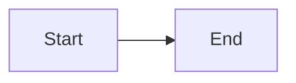
````

### Supported diagram types in this repo:

| Type | Use Case | Typical View |
|------|----------|--------------|
| `graph` | General flow, relationships | All views |
| `flowchart` | Step-by-step processes | Component-Connector |
| `sequenceDiagram` | Interactions over time | Component-Connector |
| `classDiagram` | Object relationships | Module View (advanced) |
| `erDiagram` | Data models | Module View (database) |

---

## Standard Legend

Every diagram in this repo uses consistent notation:

### Node Shapes

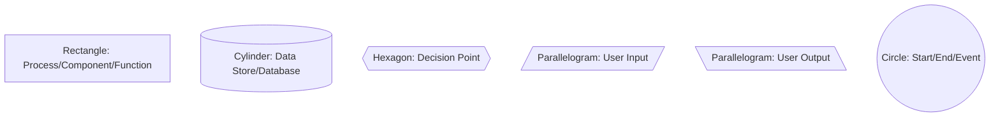

**When to use each**:

| Shape | Meaning | Examples |
|-------|---------|----------|
| `[Rectangle]` | Processing, logic, components | Functions, React components, services |
| `[(Cylinder)]` | Data storage | Database, localStorage, files |
| `{{Hexagon}}` | Decision/condition | if/else, routing, switches |
| `[/Input/]` | Data coming in | User input, API requests |
| `[\Output\]` | Data going out | Rendered UI, API responses |
| `((Circle))` | Events or endpoints | User clicks, app start, completion |

### Connector Styles

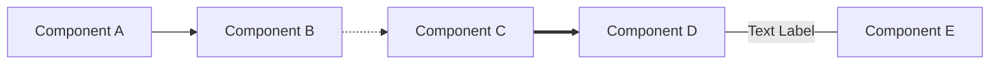

**Connector meanings**:

| Style | Code | Meaning | Use Case |
|-------|------|---------|----------|
| Solid arrow | `-->` | Primary flow, synchronous | Function calls, direct data flow |
| Dotted arrow | `-.->` | Optional, secondary, async | Optional features, fallbacks |
| Thick arrow | `==>` | Emphasized flow | Critical path, main user journey |
| Labeled | `---\|Label\|---` | Annotated connection | Clarify what's being passed |

---

## Color Usage Guidelines

:::warning[Important]
We use color **sparingly and deliberately** to support accessibility and light/dark mode compatibility.
:::

### Default: No Color

Most diagrams use default Mermaid styling with no explicit colors. This ensures:
- Automatic light/dark mode support
- Maximum readability
- No visual clutter

### When to Use Color

Use color only when it:
- Distinguishes categories meaningfully
- Persists across multiple diagrams
- Improves comprehension significantly

### Approved Color Palette

These colors work in both light and dark modes:

| Color | Use Case | Light Mode | Dark Mode |
|-------|----------|------------|-----------|
| **None** (default) | General elements | ✓ Clear | ✓ Clear |
| **Accent** | Emphasize key nodes | Use sparingly | Use sparingly |

**Recommendation**: Start with no colors. Add only if necessary for pedagogical clarity.

### Color Syntax (When Needed)

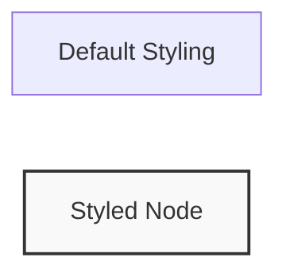

**Safe styling pattern**:
```
style NodeID fill:#f9f9f9,stroke:#333,stroke-width:2px
```

- `fill:#f9f9f9` — Very light gray (neutral)
- `stroke:#333` — Dark gray border
- `stroke-width:2px` — Visible but not heavy

---

## Typography in Diagrams

### Node Labels

**Do**:
- Use concise labels (1-4 words)
- Use sentence case (`Calculate total`, not `Calculate Total`)
- Be specific (`orderItems` not `data`)

**Don't**:
- Use full sentences
- Use all caps (except acronyms like `API`, `DOM`)
- Use code syntax in labels (save for code comments)

### Examples:

:::tip[Good]
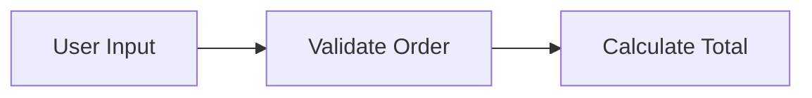
:::

:::danger[Bad]
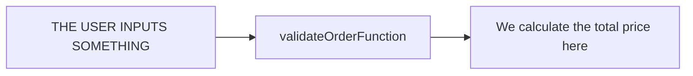
:::

---

## Diagram Types and Views

We use **three architectural views** consistently throughout this repo. See [Architectural Views](architectural-views) for detailed explanations.

### 1. Module View (Static Structure)

**Purpose**: Show files, folders, and dependencies

**Typical diagram type**: `graph`

**Example**:

```mermaid
graph TB
    index[index.html]
    script[script.js]
    style[style.css]

    index --> script
    index --> style
```

**What to include**:
- Files and their relationships
- Import/require statements
- Folder organization (when relevant)

**What to exclude**:
- Runtime behavior
- Data flow
- User interactions

---

### 2. Component-Connector View (Runtime Behavior)

**Purpose**: Show how data flows and components interact

**Typical diagram types**: `graph`, `flowchart`, `sequenceDiagram`

**Example (flowchart)**:

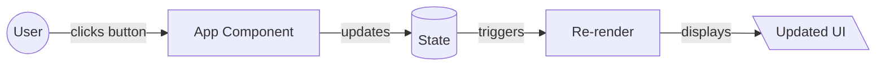

**Example (sequence)**:

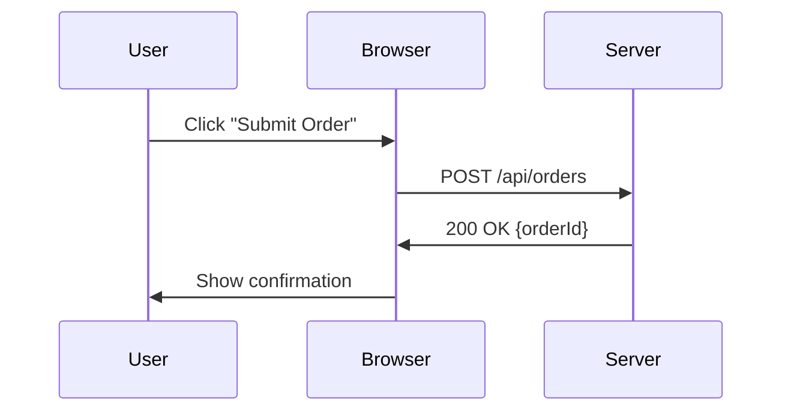

**What to include**:
- User actions
- Component interactions
- Data transformations
- API calls
- State changes

**What to exclude**:
- File structure
- Deployment details

---

### 3. Allocation View (Deployment)

**Purpose**: Show where code runs (browser vs server, services, infrastructure)

**Typical diagram type**: `graph`

**Example**:

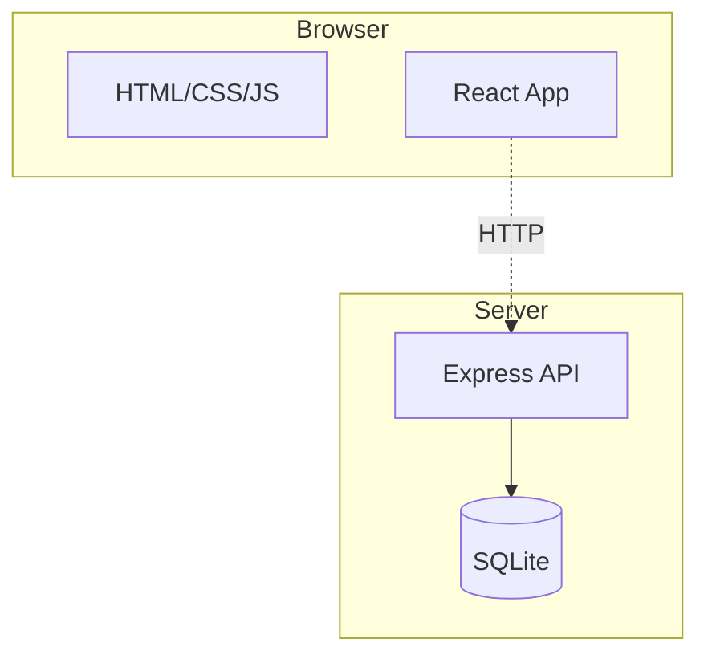

**What to include**:
- Execution environments (browser, server, mobile)
- Network boundaries
- External services
- Storage locations

**What to exclude**:
- Implementation details
- Runtime behavior

---

## Subgraphs for Grouping

Use `subgraph` to show boundaries (environments, modules, layers):

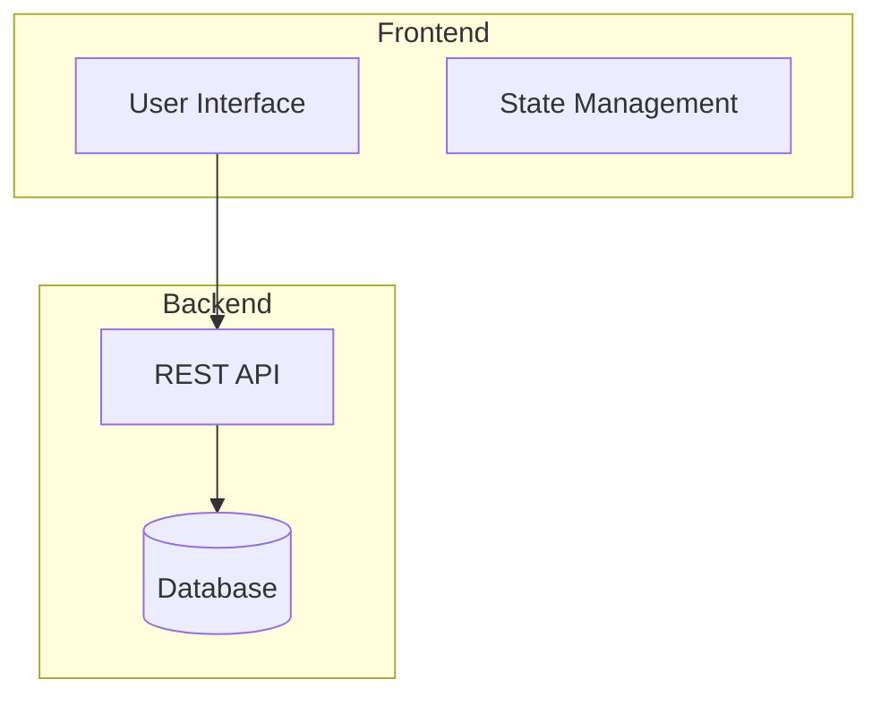

**Guidelines**:
- Use for logical or physical boundaries
- Label clearly (`Frontend`, `Backend`, `Browser`, `Server`)
- Don't nest more than 2 levels deep

---

## Complexity Guidelines

### Keep diagrams simple

**Target**: 5-12 nodes per diagram
**Maximum**: 15-20 nodes

If a diagram is too complex:
1. Split into multiple diagrams (different views or zooms)
2. Abstract details (combine related nodes)
3. Focus on the learning objective

### Better: Split into layers

**Diagram 1: High-level**
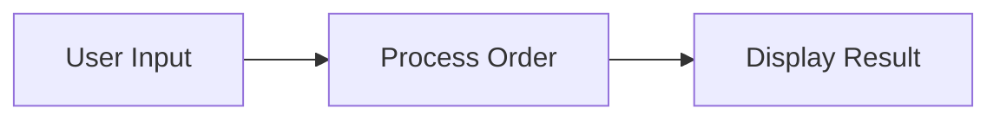

**Diagram 2: Detail of "Process Order"**
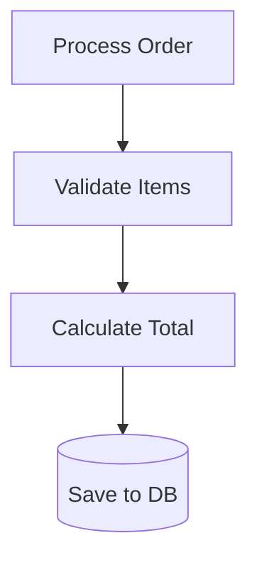

---

## Common Patterns

### Pattern: User Interaction Flow

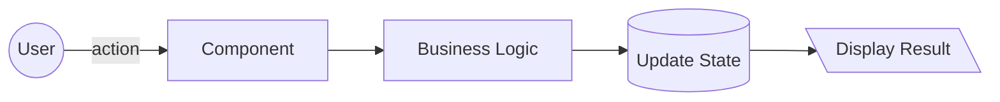

### Pattern: Client-Server Communication

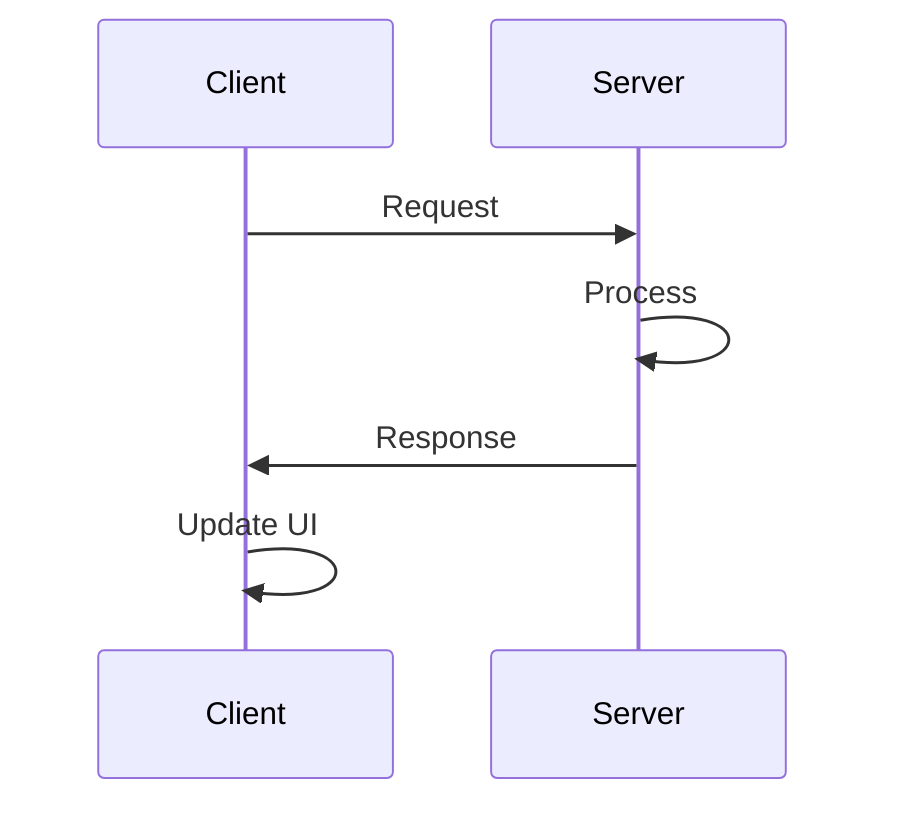

### Pattern: Module Dependencies

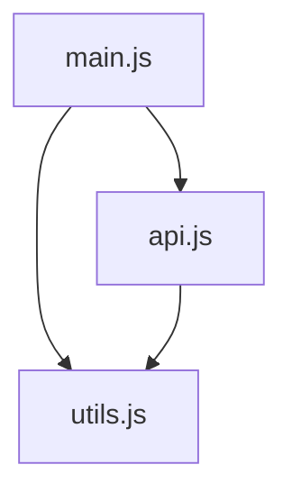

---

## Accessibility Checklist

Before finalizing a diagram:

- [ ] Labels are concise and clear
- [ ] No reliance on color alone to convey meaning
- [ ] Works in both light and dark mode (test by switching)
- [ ] Arrows indicate direction clearly
- [ ] Complexity is appropriate for learning level
- [ ] Follows one of the three view types (Module/Component/Allocation)

---

## Tools and Workflow

### Creating Diagrams

1. Write Mermaid syntax in markdown
2. Preview locally using:
   - VS Code extension: "Markdown Preview Mermaid Support"
   - Online: [mermaid.live](https://mermaid.live)
3. Test in GitHub (push to a branch, view rendered markdown)
4. Verify both light and dark modes

### Editing Diagrams

- Diagrams are text — easy to version control
- Use git diff to see changes
- AI assistants can modify Mermaid syntax

### Sharing with LLMs

When asking an AI to create a diagram:

```
Create a Mermaid diagram following the devfoundry diagram standards:
- Use the Component-Connector view
- Show how user input flows through the lemonade stand app
- Use standard node shapes (rectangles for processes, cylinders for data)
- Keep it simple (5-10 nodes)
- No colors unless necessary
- Use clear, concise labels
```

---

## Quick Reference

| I want to show... | View Type | Diagram Type | Key Elements |
|-------------------|-----------|--------------|--------------|
| Files and imports | Module | `graph` | Files, folders, arrows for imports |
| User flow | Component-Connector | `flowchart` | User, components, data flow |
| API calls | Component-Connector | `sequenceDiagram` | Client, server, requests/responses |
| Client vs server | Allocation | `graph` with `subgraph` | Browser, server, boundaries |
| Database schema | Module | `erDiagram` | Tables, relationships |
| State changes | Component-Connector | `flowchart` | State, triggers, updates |

---

## Related Documentation

- [Architectural Views](architectural-views) — When to use each view type
- [ADR: Diagram Conventions](adr/0003-diagram-conventions) — Why these conventions
- [Mermaid Documentation](https://mermaid.js.org/) — Official syntax reference
