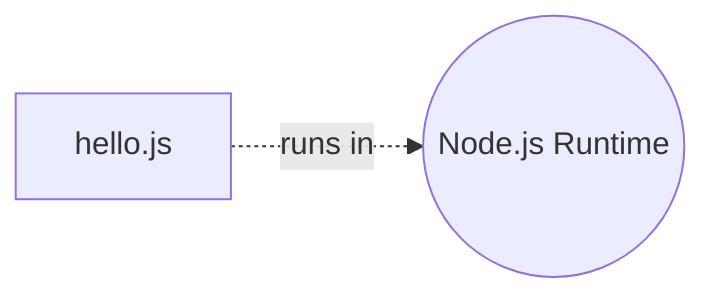
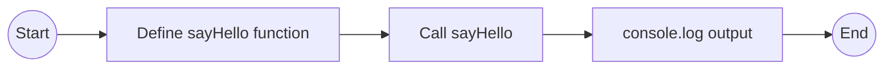
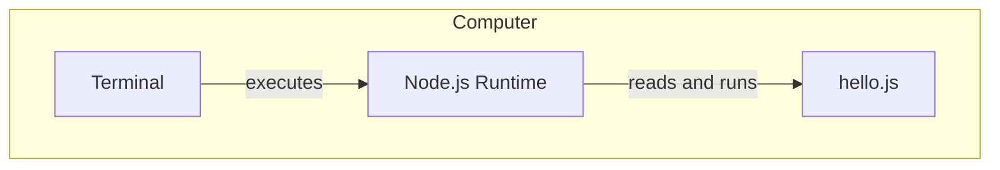

# Hello World (Console)

**The simplest possible program**

---

## Overview

This is your first program. It does one thing: prints "Hello, World!" to the console.

**Why start here?**
- Demonstrates what a program is (instructions that execute)
- Shows input → processing → output at the simplest level
- Introduces running code from the command line
- No abstractions, no frameworks — just pure fundamentals

**Time to complete**: 10-15 minutes

---

## What You'll Learn

- What a program is and how it runs
- How to execute JavaScript with Node.js
- Basic syntax: functions, strings, console output
- The concept of an entry point

---

## Prerequisites

- Node.js installed (check with `node --version`)
- A terminal or command prompt
- A text editor (VS Code recommended)

---

## The Code

**File**: `hello.js`

```javascript
// This is a comment — it doesn't run, just explains code

// Define a function that prints a greeting
function sayHello() {
  console.log("Hello, World!");
}

// Call the function (this makes it run)
sayHello();
```

**That's it.** 6 lines of actual code.

---

## How to Run

1. **Open a terminal**
2. **Navigate to this directory**:
   ```bash
   cd examples/00-hello-world-console
   ```
3. **Run the program**:
   ```bash
   node hello.js
   ```
4. **You should see**:
   ```
   Hello, World!
   ```

---

## Understanding the Code

### Line by Line

```javascript
// This is a comment
```
Comments are notes for humans. The computer ignores them.

```javascript
function sayHello() {
```
This **defines** a function named `sayHello`. Think of it as creating a recipe.

```javascript
  console.log("Hello, World!");
```
This is the **body** of the function. `console.log()` prints text to the terminal.

```javascript
}
```
This closes the function definition.

```javascript
sayHello();
```
This **calls** the function. Without this line, nothing would happen (the recipe exists, but you haven't cooked it).

---

## Key Concepts

### 1. Programs are Instructions

A program is a series of instructions the computer follows, step by step.

### 2. Functions are Reusable Recipes

A function is a named block of code you can run multiple times.

**Example**:
```javascript
function sayHello() {
  console.log("Hello, World!");
}

sayHello();  // Prints: Hello, World!
sayHello();  // Prints: Hello, World!
sayHello();  // Prints: Hello, World!
```

### 3. Entry Point

When you run `node hello.js`, Node.js starts at the top of the file and executes each line in order.

---

## Architectural Views

Even this tiny program can be viewed architecturally!

### Module View (Static Structure)



**What this shows**: A single file, executed by Node.js.

---

### Component-Connector View (Runtime Behavior)



**What this shows**: The flow of execution from start to finish.

---

### Allocation View (Deployment)



**What this shows**: Everything happens on your local computer in the terminal.

---

## Exercises

### Exercise 1: Modify the Message

Change `"Hello, World!"` to `"Hello, [YourName]!"` and run again.

**Expected output**:
```
Hello, Alice!
```

---

### Exercise 2: Add Another Function

Create a new function `sayGoodbye()` that prints "Goodbye, World!" and call it after `sayHello()`.

**Expected output**:
```
Hello, World!
Goodbye, World!
```

---

### Exercise 3: Add Parameters

Modify `sayHello` to accept a name:

```javascript
function sayHello(name) {
  console.log("Hello, " + name + "!");
}

sayHello("Alice");
sayHello("Bob");
```

**Expected output**:
```
Hello, Alice!
Hello, Bob!
```

---

### Exercise 4: Input → Processing → Output

Modify the program to show all three phases:

```javascript
// INPUT
const name = "Alice";

// PROCESSING
const greeting = "Hello, " + name + "!";

// OUTPUT
console.log(greeting);
```

---

## Common Issues

### "node: command not found"

**Problem**: Node.js is not installed or not in your PATH.

**Solution**: Install Node.js from [nodejs.org](https://nodejs.org/)

---

### "Cannot find module"

**Problem**: You're in the wrong directory.

**Solution**: Use `cd` to navigate to the directory containing `hello.js`.

---

### Nothing prints

**Problem**: You forgot to call `sayHello()`.

**Solution**: Add `sayHello();` at the bottom of the file.

---

## Next Steps

You've created your first program! Now you understand:
- What a program is
- How to run JavaScript with Node.js
- Functions and how to call them
- The I/O/P model (input, processing, output)

**Next**: Lemonade CLI — Build a slightly more complex CLI app that takes user input.

---

## Using This Example with AI Assistants

### Prompt Template: Understanding Code

```
I'm learning programming with the devfoundry curriculum.
I'm looking at the "Hello World" example (examples/00-hello-world-console).

Here's the code:
[paste hello.js]

Questions:
1. What happens when I run `node hello.js`?
2. What does `console.log()` do?
3. Why do we need the parentheses in `sayHello()`?
4. What would happen if I removed the `sayHello();` line at the bottom?

Please explain in beginner-friendly terms.
```

---

### Prompt Template: Modifying the Example

```
I'm working on the "Hello World" example from devfoundry.

Current code:
[paste hello.js]

I want to modify it to:
- Accept a name as input (not hard-coded)
- Print a personalized greeting

Please show me how to modify hello.js to do this.
Explain what changes you made and why.
```

---

## Reflection

**Before moving on**, make sure you can answer:

1. What is a function?
2. What does it mean to "call" a function?
3. What is the role of Node.js in running this program?
4. Can you draw the flow of execution (start → define → call → output)?

If any of these are unclear, experiment with the code, try the exercises, or ask an AI assistant using the prompt templates above.

---

**You've taken the first step. Everything builds from here.**
