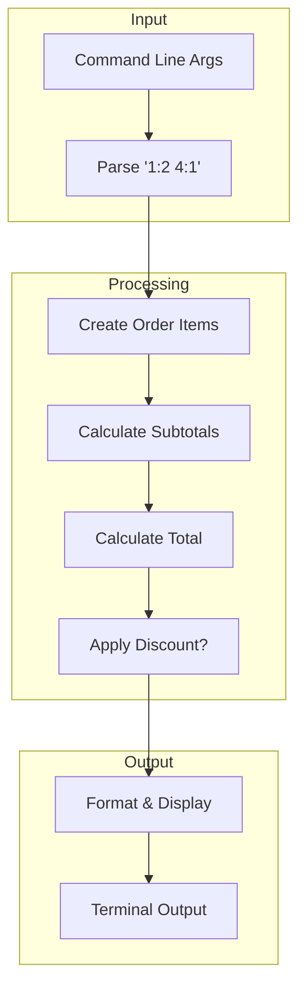
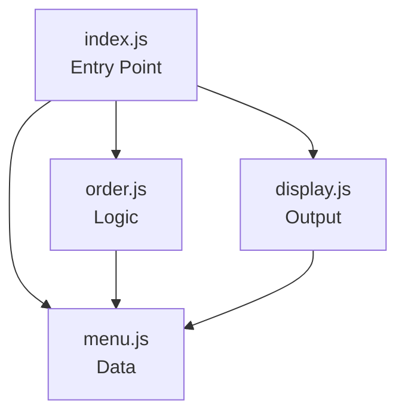
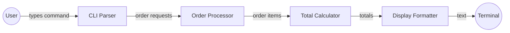

# Lemonade Stand CLI

**Your first real application: a command-line ordering system**

---

## Overview

This is your first multi-file application. It's a lemonade stand that takes orders from the command line, calculates totals, and applies discounts.

**Why this example?**
- Demonstrates real Input → Processing → Output flow
- Shows how to organize code into multiple files (modules)
- Introduces data structures (arrays, objects)
- Shows separation of concerns (data, logic, display)
- Still runs from the command line — no web complexity yet

**Time to complete**: 30-45 minutes

---

## What You'll Learn

- How to structure code across multiple files
- Using `require()` and `module.exports` for modules
- Working with arrays and objects
- Processing command-line arguments
- Functions that take parameters and return values
- Basic error handling
- The reduce pattern for calculating totals

---

## Prerequisites

- Completed [Hello World Console](/docs/examples/hello-world-console)
- Node.js installed (check with `node --version`)
- Understanding of functions and basic JavaScript

---

## How to Run

### View the menu (no order)

```bash
cd examples/01-lemonade-cli
node src/index.js
```

### Place an order

Format: `node src/index.js [item:quantity] [item:quantity] ...`

```bash
# Order 2 Lemonades and 1 Cookie
node src/index.js 1:2 4:1
```

### Try the discount

Orders $10 or more get 10% off:

```bash
# Order 3 Lemonades, 2 Pink Lemonades, and 2 Cookies
node src/index.js 1:3 2:2 4:2
```

---

## Project Structure

```
01-lemonade-cli/
├── README.md          # You're reading it
└── src/
    ├── index.js       # Entry point — orchestrates everything
    ├── menu.js        # Data — what items are available
    ├── order.js       # Logic — processing orders
    └── display.js     # Output — showing results
```

### Why Multiple Files?

Each file has **one job**:

| File | Responsibility | Changes When... |
|------|---------------|-----------------|
| `menu.js` | What's for sale | You add/remove items or change prices |
| `order.js` | How orders work | You change calculation logic or discounts |
| `display.js` | How it looks | You change formatting or messages |
| `index.js` | Tie it together | You change the overall flow |

This is called **separation of concerns**. It makes code easier to understand and modify.

---

## Understanding the Code

### The Entry Point: `index.js`

```javascript
// Get command line arguments (skip 'node' and 'index.js')
const args = process.argv.slice(2);
```

`process.argv` is an array containing:
- `[0]`: Path to Node.js
- `[1]`: Path to your script
- `[2+]`: Your actual arguments

So `slice(2)` gives us just the arguments.

---

### The Data: `menu.js`

```javascript
const menu = [
  { id: 1, name: "Lemonade", price: 2.50, description: "Classic fresh-squeezed" },
  // ...
];
```

This is an **array of objects**. Each object represents a menu item with:
- `id`: Unique number for ordering
- `name`: What to display
- `price`: Cost in dollars
- `description`: Additional info

---

### The Logic: `order.js`

```javascript
function calculateTotal(orderItems) {
  return orderItems.reduce((sum, item) => sum + item.subtotal, 0);
}
```

The `reduce` pattern:
1. Start with an initial value (`0`)
2. For each item, add its subtotal to the running sum
3. Return the final sum

This is the **processing** step of I/O/P.

---

### The Display: `display.js`

```javascript
function showOrderSummary(orderItems, totals) {
  console.log("\n=== YOUR ORDER ===\n");
  // ...
}
```

All output goes through this module. If you want to change how things look, you only need to modify this file.

---

## Input → Processing → Output

Here's the complete flow:



### Data Flow

1. **Input**: `"1:2 4:1"` → `[{itemId: 1, quantity: 2}, {itemId: 4, quantity: 1}]`
2. **Processing**: Look up items → Calculate subtotals → Sum total → Check discount
3. **Output**: Format receipt → Print to terminal

---

## Key Concepts

### Modules (require/exports)

```javascript
// In menu.js — export what others can use
module.exports = { findItem, getAllItems };

// In order.js — import what you need
const { findItem } = require('./menu');
```

Modules let you:
- Split code into focused files
- Share code between files
- Control what's public vs private

---

### Objects and Arrays

```javascript
// Object: key-value pairs
const item = { name: "Lemonade", price: 2.50 };
console.log(item.name);  // "Lemonade"

// Array: ordered list
const items = [item1, item2, item3];
console.log(items[0]);   // First item
console.log(items.length); // 3
```

---

### Array Methods

```javascript
// find: get first matching item
menu.find(item => item.id === 1);

// map: transform each item
args.map(arg => arg.split(':'));

// reduce: combine into single value
items.reduce((sum, item) => sum + item.price, 0);

// forEach: do something with each item
items.forEach(item => console.log(item.name));
```

---

## Exercises

### Exercise 1: Add a New Menu Item

Add "Frozen Lemonade" to the menu for $4.00.

<details>
<summary>Solution</summary>

In `src/menu.js`, add to the `menu` array:

```javascript
{ id: 5, name: "Frozen Lemonade", price: 4.00, description: "Blended with ice" },
```

Test: `node src/index.js 5:1`

</details>

---

### Exercise 2: Change the Discount Threshold

Change the discount to 15% off orders $15 or more.

<details>
<summary>Solution</summary>

In `src/index.js`, change the `applyDiscount` call:

```javascript
const { discount, finalTotal, applied } = applyDiscount(subtotal, 15, 15);
```

And update the message in `src/display.js`:

```javascript
console.log(`  Discount: -$${totals.discount.toFixed(2)} (15% off orders $15+)`);
```

</details>

---

### Exercise 3: Add Input Validation

Currently, non-existent items are silently skipped. Show which items failed.

<details>
<summary>Solution</summary>

The code already shows errors via `showError()`. Test with an invalid item:

```bash
node src/index.js 99:1 1:2
```

To improve the error message, modify `src/index.js`:

```javascript
if (item === null) {
  showError(`Item #${request.itemId} doesn't exist or quantity ${request.quantity} is invalid`);
  continue;
}
```

</details>

---

### Exercise 4: Add Order Numbering

Display "Order #X" at the top of the receipt, incrementing each time.

<details>
<summary>Hint</summary>

You'd need to store the order number somewhere that persists. For a CLI app, options include:
- A file that stores the last order number
- A timestamp-based order number
- A random order ID

For now, try using `Date.now()` to generate a unique order number.

</details>

<details>
<summary>Solution</summary>

In `src/display.js`, modify `showOrderSummary`:

```javascript
function showOrderSummary(orderItems, totals) {
  const orderNumber = Date.now().toString().slice(-6);
  console.log(`\n=== ORDER #${orderNumber} ===\n`);
  // ... rest of function
}
```

</details>

---

## Architectural Views

### Module View



**What this shows**: Which files depend on which. The entry point orchestrates, logic depends on data, display can access data for formatting.

---

### Component-Connector View



**What this shows**: How data flows through the system at runtime.

---

### Allocation View

```
┌─────────────────────────────────────────┐
│              Your Computer              │
│                                         │
│  ┌─────────────┐     ┌───────────────┐  │
│  │   Node.js   │────▶│   Terminal    │  │
│  │  (runtime)  │     │   (output)    │  │
│  └─────────────┘     └───────────────┘  │
│                                         │
│  ┌─────────────────────────────────────┐│
│  │          Lemonade CLI Files         ││
│  │  index.js | menu.js | order.js...   ││
│  └─────────────────────────────────────┘│
└─────────────────────────────────────────┘
```

**What this shows**: Everything runs locally on your computer. No network, no database, no external services.

---

## Using AI Assistants

### Understanding the Code

```
I'm studying the lemonade-cli example from devfoundry.

Code from src/order.js:
[paste the calculateTotal function]

Questions:
1. What does .reduce() do step by step?
2. What does the 0 at the end mean?
3. What would happen if orderItems was empty?
```

### Extending the Code

```
I'm working on the lemonade-cli example.

Current structure:
- menu.js: Item data
- order.js: Order processing
- display.js: Terminal output
- index.js: Entry point

I want to add: Tax calculation (8% after discount)

Where should I put this logic?
What functions need to change?
```

---

## Comparison: Hello World → Lemonade CLI

| Aspect | Hello World | Lemonade CLI |
|--------|-------------|--------------|
| Files | 1 | 4 |
| Input | None | Command line args |
| Processing | None | Calculate totals, discounts |
| Output | One line | Formatted receipt |
| Data structures | None | Arrays, objects |
| Functions | 1 | 10+ |
| Concepts | Basic syntax | Modules, data flow |

This progression shows how real applications grow from simple foundations.

---

## Reflection

Before moving on, ensure you can:

- [ ] Run the lemonade stand with different orders
- [ ] Explain what each file is responsible for
- [ ] Trace how data flows from input to output
- [ ] Add a new menu item
- [ ] Modify the discount logic
- [ ] Explain what `require()` and `module.exports` do

---

## What's Next

**Example 02: Lemonade Stand (Static Web)**

You'll rebuild this same application for the browser:
- HTML for structure
- CSS for styling
- JavaScript for interactivity
- No more terminal — a real user interface!

The logic stays the same. Only the input (forms) and output (DOM) change.

👉 *Coming soon*

---

**You've completed your first multi-file application!** You now understand how to organize code into modules and build something that feels like a real program. 🍋
