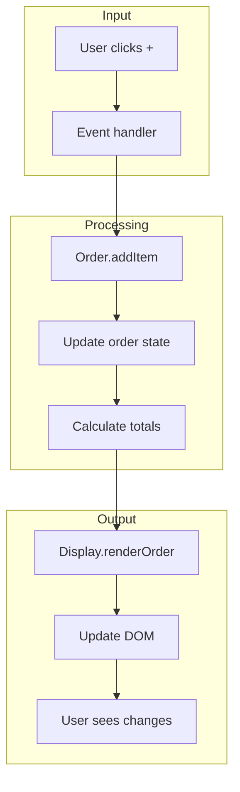
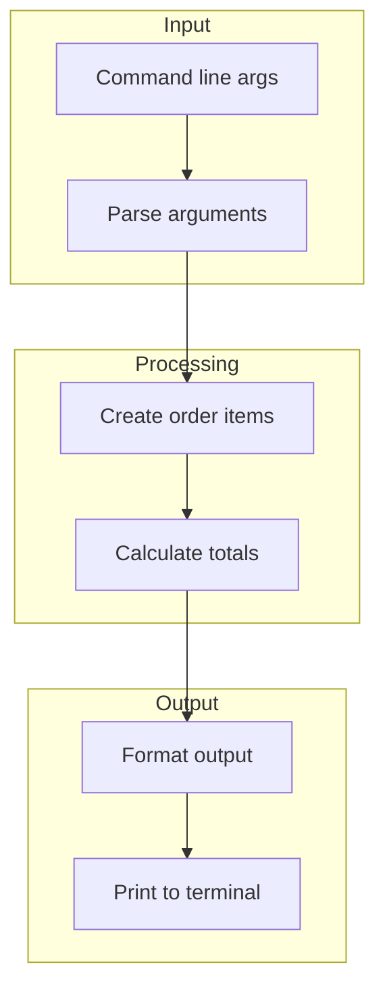
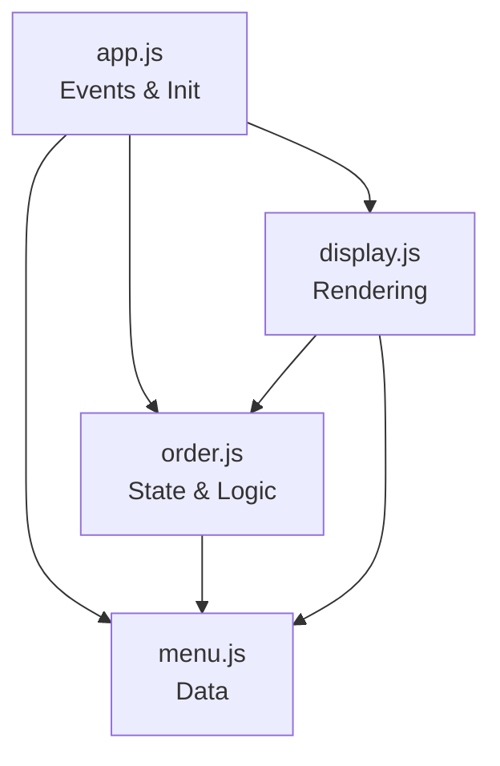

# Lemonade Stand (Static Web)

**Your first web application: the same ordering system, now in the browser**

---

## Overview

This is the browser version of the lemonade stand. It has the same functionality as the CLI version, but with a visual interface instead of terminal output.

**Why this example?**
- Shows how CLI concepts translate to the web
- Demonstrates HTML, CSS, and JavaScript working together
- Introduces DOM manipulation and event handling
- Same business logic, different I/O layer
- No build tools, frameworks, or servers — just files

**Time to complete**: 45-60 minutes

---

## What You'll Learn

- HTML structure for a web application
- CSS styling for layout and visual design
- JavaScript DOM manipulation
- Event handling (clicks, form interactions)
- The module pattern for organizing browser JavaScript
- How separation of concerns applies to web development

---

## Prerequisites

- Completed [Lemonade CLI](/docs/examples/lemonade-cli)
- Completed [Module 03: How the Web Works](/docs/curriculum/part-1-foundations/how-the-web-works)
- A modern web browser

---

## How to Run

### Option 1: Just open the file

Double-click `index.html` or drag it into your browser.

### Option 2: Use a local server

```bash
cd examples/02-lemonade-static-web
npx serve .
```

Then visit `http://localhost:3000`

### Option 3: VS Code Live Server

Right-click `index.html` → "Open with Live Server"

---

## Project Structure

```
02-lemonade-static-web/
├── README.md          # Documentation
├── index.html         # Page structure
├── styles.css         # Visual styling
└── js/
    ├── menu.js        # Menu data
    ├── order.js       # Order state and calculations
    ├── display.js     # DOM rendering
    └── app.js         # Event handling and initialization
```

### File Responsibilities

| File | Responsibility | CLI Equivalent |
|------|---------------|----------------|
| `index.html` | Page structure | N/A (terminal) |
| `styles.css` | Visual appearance | N/A (no styling) |
| `js/menu.js` | Menu data | `src/menu.js` |
| `js/order.js` | Order logic | `src/order.js` |
| `js/display.js` | Render to DOM | `src/display.js` |
| `js/app.js` | Initialize, events | `src/index.js` |

---

## CLI → Web Translation

### What Changed

| CLI Concept | Web Equivalent |
|-------------|----------------|
| `process.argv` | Button clicks |
| `console.log()` | DOM updates (`innerHTML`) |
| `require()`/`module.exports` | IIFE module pattern |
| Terminal output | Visual UI |
| Run once, exit | Persistent in browser |

### What Stayed the Same

```
┌─────────────────────────────────────────────┐
│              SAME LOGIC                     │
│  - Menu data structure                      │
│  - calculateTotal() algorithm               │
│  - Discount logic (10% off $10+)            │
│  - Order item structure                     │
└─────────────────────────────────────────────┘
                    │
                    ▼
┌─────────────────────────────────────────────┐
│              DIFFERENT I/O                  │
│  - Input: Clicks instead of args            │
│  - Output: DOM instead of console           │
│  - State: Persists instead of one-shot      │
│  - Display: Visual instead of text          │
└─────────────────────────────────────────────┘
```

---

## Understanding the Code

### HTML Structure (`index.html`)

```html
<main>
  <section id="menu">
    <h2>Menu</h2>
    <div id="menu-items"><!-- Filled by JavaScript --></div>
  </section>

  <section id="order">
    <h2>Your Order</h2>
    <div id="order-items"><!-- Filled by JavaScript --></div>
    <div id="order-summary"><!-- Totals go here --></div>
    <div id="order-actions"><!-- Buttons go here --></div>
  </section>
</main>
```

The HTML provides empty containers that JavaScript fills with content.

---

### The Module Pattern (`js/menu.js`)

```javascript
const Menu = (function() {
  // Private data
  const items = [...];

  // Private function
  function findItem(id) { ... }

  // Public API
  return {
    findItem,
    getAllItems
  };
})();
```

This pattern:
- Creates a private scope with `(function() { ... })()`
- Exposes only what's needed via `return { ... }`
- Avoids polluting the global namespace
- Mimics `module.exports` from Node.js

---

### Event Handling (`js/app.js`)

```javascript
menuContainer.addEventListener('click', function(event) {
  if (event.target.classList.contains('add-to-order')) {
    const itemId = parseInt(event.target.dataset.id, 10);
    Order.addItem(itemId);
    Display.renderOrder();
  }
});
```

This pattern:
- Uses **event delegation** (one listener on container, not each button)
- Checks what was clicked with `event.target`
- Gets data from `data-*` attributes
- Updates state, then re-renders

---

### DOM Rendering (`js/display.js`)

```javascript
function renderMenu() {
  const container = document.getElementById('menu-items');
  container.innerHTML = items.map(item => `
    <div class="menu-item" data-id="${item.id}">
      <h3>${item.name}</h3>
      <p>$${item.price.toFixed(2)}</p>
      <button data-id="${item.id}">+</button>
    </div>
  `).join('');
}
```

This pattern:
- Finds the container element
- Uses template literals to build HTML
- Uses `map()` to transform data to HTML
- Replaces entire contents with `innerHTML`

---

## Data Flow



Compare to CLI:



The middle (Processing) is almost identical. Only Input and Output change.

---

## Exercises

### Exercise 1: Add a Remove All Button

Add a button that removes an item completely from the order (not just -1).

<details>
<summary>Hint</summary>

Add a new button in `display.js` with a different class (e.g., `remove-item`), then handle it in `app.js`.

You'll need to add a `removeAllOfItem(itemId)` function to `order.js`.

</details>

<details>
<summary>Solution</summary>

In `js/order.js`, add:

```javascript
function removeAllOfItem(itemId) {
  const index = orderItems.findIndex(item => item.id === itemId);
  if (index !== -1) {
    orderItems.splice(index, 1);
    return true;
  }
  return false;
}
```

Add to return statement: `removeAllOfItem,`

In `js/display.js`, update the order item template:

```javascript
<button class="remove-item" data-id="${item.id}">×</button>
```

In `js/app.js`, add to the order listener:

```javascript
if (target.classList.contains('remove-item')) {
  const itemId = parseInt(target.dataset.id, 10);
  Order.removeAllOfItem(itemId);
  Display.renderOrder();
}
```

</details>

---

### Exercise 2: Persist Order in LocalStorage

Make the order survive page refresh using `localStorage`.

<details>
<summary>Hint</summary>

- `localStorage.setItem('key', JSON.stringify(data))` to save
- `JSON.parse(localStorage.getItem('key'))` to load
- Save after every change, load on init

</details>

<details>
<summary>Solution</summary>

In `js/order.js`, add these functions:

```javascript
function save() {
  localStorage.setItem('lemonadeOrder', JSON.stringify(orderItems));
}

function load() {
  const saved = localStorage.getItem('lemonadeOrder');
  if (saved) {
    orderItems = JSON.parse(saved);
  }
}
```

Call `save()` at the end of `addItem`, `removeItem`, and `clear`.

Call `load()` at the beginning of the module or expose it publicly and call from `app.js` init.

</details>

---

### Exercise 3: Add Animations

Add a "bounce" animation when items are added.

<details>
<summary>Hint</summary>

CSS can handle this! Add a keyframe animation and apply it to new elements.

The challenge: the animation plays when elements are created, but re-rendering replaces all elements.

</details>

<details>
<summary>Solution</summary>

The CSS already has a `fadeIn` animation on `.order-item`. To add a bounce:

```css
@keyframes bounce {
  0%, 100% { transform: scale(1); }
  50% { transform: scale(1.05); }
}

.order-item.just-added {
  animation: bounce 0.3s ease-out;
}
```

The tricky part is tracking which item was just added. One approach: track the last added ID and add a class, then remove it after animation.

</details>

---

### Exercise 4: Add Keyboard Navigation

Make the menu navigable with arrow keys and Enter.

<details>
<summary>Hint</summary>

- Use `tabindex` to make elements focusable
- Listen for `keydown` events
- Track which item is "selected"

</details>

---

## Comparison: CLI → Web

| Aspect | CLI Version | Web Version |
|--------|-------------|-------------|
| Files | 4 JS files | 4 JS files + HTML + CSS |
| Input | Command line args | Button clicks |
| Output | Terminal text | Visual DOM |
| State | One-shot | Persistent |
| User experience | Technical | Visual |
| Requires | Node.js | Browser |
| Accessibility | Screen reader friendly | Needs ARIA work |

---

## Architectural Views

### Module View



Same as CLI! The dependency structure is preserved.

---

### Deployment View

```
┌─────────────────────────────────────────────────────────┐
│                      Browser                            │
│                                                         │
│  ┌────────────┐    ┌────────────┐    ┌───────────────┐  │
│  │   HTML     │───▶│   CSS      │───▶│   JavaScript  │  │
│  │  (structure)    │  (styling)      │   (behavior)  │  │
│  └────────────┘    └────────────┘    └───────────────┘  │
│                                                         │
│                    ┌────────────┐                       │
│                    │    DOM     │                       │
│                    │  (state)   │                       │
│                    └────────────┘                       │
│                                                         │
│  No server required — files can be opened directly      │
│                                                         │
└─────────────────────────────────────────────────────────┘
```

---

## Using AI Assistants

### Understanding Web Concepts

```
I'm studying the lemonade-static-web example from devfoundry.

I understand the CLI version well. In the web version, I'm confused by:

Code from js/app.js:
[paste the setupMenuListeners function]

Questions:
1. Why use event.target instead of putting a listener on each button?
2. What is event delegation and why use it?
3. What does parseInt(target.dataset.id, 10) do?
```

### Extending the Example

```
I'm working on the lemonade-static-web example.

Current files:
- index.html (structure)
- styles.css (styling)
- js/menu.js, order.js, display.js, app.js

I want to add: A "specials" section that shows discounted items

Questions:
1. Where should the specials data go?
2. How should I update the HTML?
3. What new functions do I need?
```

---

## Reflection

Before moving on, ensure you can:

- [ ] Run the lemonade stand in your browser
- [ ] Add items to an order and see totals update
- [ ] Explain how the module pattern works
- [ ] Trace an event from click to DOM update
- [ ] Identify what's the same as the CLI version
- [ ] Add a new menu item (same as CLI!)
- [ ] Modify the discount logic (same as CLI!)

---

## What's Next

**Example 03: Lemonade Stand (React SPA)**

You'll rebuild this same application using React:
- Component-based architecture
- JSX instead of innerHTML
- State management with hooks
- Build tools (Vite or Create React App)

The business logic stays the same. The architecture changes.

👉 *Coming soon*

---

**You've built your first web application!** You now understand how JavaScript interacts with HTML through the DOM, and how the same logic can work in both terminal and browser.
