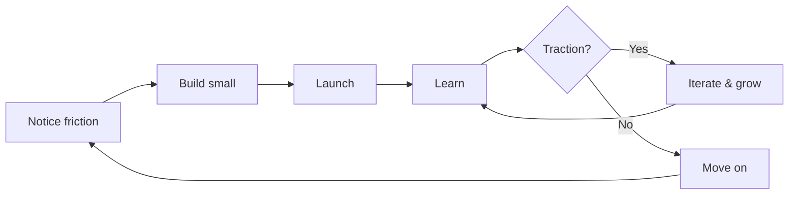

# The Portfolio Strategy

**Serial Solopreneurship: Building Toward Financial Independence**

---

## The Goal

Let's be explicit about what "software as leverage" actually enables:

**Financial independence** — enough passive or semi-passive income to cover your living expenses, freeing you from dependence on traditional employment.

This isn't about building the next unicorn. It's about building a **portfolio of small, sustainable income streams** that collectively provide financial stability and freedom.

---

## The Math

Traditional thinking: "I need to build one big thing that makes $100k/year."

Portfolio thinking: "I need 5-10 small things that each make $1k-2k/month."

| Approach | Risk | Effort | Timeline |
|----------|------|--------|----------|
| One big bet | High (all eggs in one basket) | Massive upfront | Years to validate |
| Portfolio of small bets | Low (diversified) | Incremental | Months per product |

**Example portfolio**:
- Tool A: $800/month (50 users × $16/month)
- Tool B: $1,200/month (100 users × $12/month)
- Template/course: $600/month (passive, occasional sales)
- Tool C: $1,500/month (30 users × $50/month)
- Consulting from reputation: $2,000/month (10 hrs × $200/hr)

**Total**: $6,100/month — potentially enough to cover living expenses in many places.

None of these is a "successful startup." All of them together? **Financial independence.**

---

## What Is a Lifestyle Business?

A **lifestyle business** is one designed to sustain your life, not to scale infinitely or attract venture capital.

Characteristics:
- **Profitable from early on** — Not burning money chasing growth
- **Low overhead** — Minimal or no employees, infrastructure costs
- **Sustainable workload** — Can be maintained alongside other projects
- **Serves a real need** — People pay because it solves their problem
- **Doesn't require your constant attention** — Some degree of passive income

### Examples

**Micro-SaaS**: Small software tools serving niche needs
- Email template manager for recruiters
- Invoice generator for freelancers
- Scheduling tool for specific industry

**Info products**: Courses, templates, guides
- "How to [X] for [specific audience]"
- Template packs for specific workflows
- Video courses on specialized skills

**Productized services**: Standardized offerings at fixed prices
- Website audits
- Code reviews
- Design feedback

**Tools you built for yourself**: Scratch your own itch, then sell it
- The tool you wished existed
- The automation you built for your workflow
- The dashboard you created for your data

---

## Serial Solopreneurship

**Serial solopreneurship** means building multiple small products over time, rather than betting everything on one.

### The Process

**Key insight**: Not everything you build will succeed. That's fine. Each attempt:
- Teaches you something
- Might generate some revenue
- Builds your skills and reputation
- Might become a portfolio piece

The goal isn't 100% hit rate. It's **building enough things that some of them work**.

### Why This Works

1. **Low risk per attempt** — Each product is small; failure doesn't devastate
2. **Fast feedback** — You learn quickly what works and what doesn't
3. **Compounding skills** — Each build makes the next one easier
4. **Diversification** — Multiple income streams are more stable than one
5. **Optionality** — Some small things grow into big things unexpectedly

### The Anti-Pattern: One Big Bet

Traditional advice says: "Focus on one thing."

For venture-backed startups, this makes sense. For individuals seeking financial independence, it's often wrong.

**Problems with one big bet**:
- High risk of total failure
- Long timeline before knowing if it works
- Opportunity cost of not exploring other ideas
- Emotional investment makes pivoting hard
- All-or-nothing outcome

**The portfolio approach instead**:
- Ship something small
- See if it gets traction
- If yes: nurture it, grow it
- If no: learn from it, move on
- Repeat

---

## Building the Portfolio

### Phase 1: First Dollar

Before worrying about a portfolio, focus on earning your **first dollar from software**.

This is a psychological milestone. It proves:
- You can build something people want
- You can charge for it
- The system works

It doesn't matter if it's $5 or $500. The first dollar changes your mindset.

### Phase 2: First Sustainable Product

A product is "sustainable" when it:
- Generates recurring revenue (subscription or repeat purchases)
- Requires minimal ongoing maintenance
- Has some growth without constant marketing

This might be $200/month or $2,000/month. The key is: **it runs without you pushing it constantly**.

### Phase 3: Portfolio Building

Once you have one sustainable product, you have two choices:
1. **Double down** — Grow it further
2. **Diversify** — Build another product

Often the right answer is: **do both, but allocate time intentionally**.

Example allocation:
- 60% on existing products (maintenance + growth)
- 40% on new experiments

### Phase 4: Financial Independence

When your portfolio generates enough to cover living expenses, you've achieved **baseline financial independence**.

This doesn't mean you stop building. It means you now build from a position of **freedom rather than necessity**.

You can:
- Take bigger risks
- Work on passion projects
- Say no to things you don't want
- Take breaks without financial stress

---

## What Makes a Good Portfolio Product?

When evaluating what to build, consider:

### Revenue Potential

- Can this charge money? (Not everything can)
- Subscription or one-time? (Subscription is better for stability)
- What would people pay? ($10/month vs $100/month changes everything)
- How many potential customers exist?

### Maintenance Burden

- How much ongoing work does this require?
- What breaks? How often?
- Can it run while you sleep?
- Does it require customer support?

### Sustainable Advantage

- Why would customers choose you over alternatives?
- What's your unique insight or advantage?
- Do you provide genuine value that keeps customers coming back?
- Are you building trust through openness, quality, and reliability?

:::note
Focus on being genuinely valuable, not on trapping customers. The best retention comes from products people love, not switching costs.
:::

### Fit with Portfolio

- Does this complement existing products?
- Does it share audience/distribution?
- Does it use skills you already have?

### The Ideal Portfolio Product

- Solves a real, painful problem
- For a reachable, paying audience
- With recurring revenue
- And low maintenance burden
- Where you have some unique insight or advantage

---

## Solo vs Team

This is called "solopreneurship" but it doesn't have to be solo.

### Truly Solo

- You build, market, support everything
- Maximum control, maximum burden
- Works for very small products

### Solo + Tools

- You leverage AI, automation, and services
- One person doing the work of a small team
- This is increasingly viable with modern tools

### Small Partnership

- 2-3 people with complementary skills
- Split equity and responsibility
- Can build larger things, but adds coordination cost

### Collective / Community

- Multiple people building separate products
- Shared knowledge, support, and sometimes distribution
- The DevFoundry community model

**The key**: Don't scale team size prematurely. Solo or small is a feature, not a bug.

---

## Common Mistakes

### Mistake 1: Building Before Validating

The excitement of building can override the discipline of checking if anyone wants what you're building.

**Fix**: Talk to potential customers first. Pre-sell if possible. Build the smallest thing that tests the core assumption.

### Mistake 2: Pricing Too Low

Underpricing is epidemic among technical builders. You think "$5/month is fair." Customers think "$5/month means it's not serious."

**Fix**: Charge more than feels comfortable. You can always lower prices; raising them is harder.

### Mistake 3: Ignoring Distribution

"Build it and they will come" is a myth. How will people find your product?

**Fix**: Think about distribution before building. Where does your audience hang out? How will you reach them?

### Mistake 4: Giving Up Too Early

Most products don't take off immediately. There's often a long slog before traction.

**Fix**: Set clear criteria for success/failure before launching. Give it enough time. But also know when to move on.

### Mistake 5: Not Moving On

The flip side: continuing to invest in something that clearly isn't working.

**Fix**: Set time-boxed experiments. If it's not working after [X months / Y attempts], move to the next thing.

### Mistake 6: Neglecting Existing Products

The excitement of new ideas can lead to abandoning products that are actually working.

**Fix**: Allocate explicit time for maintenance. Don't let working products rot.

---

## The DevFoundry Connection

DevFoundry's curriculum directly supports this strategy:

**Foundations** teach you:
- How software works (so you can build)
- Architectural thinking (so you build well)
- AI-assisted development (so you build fast)

**Mental models** teach you:
- Protocol thinking (see opportunities)
- Friction to opportunity (find what to build)
- Portfolio strategy (build sustainably)

**Community** provides:
- Problems to solve (curated friction)
- Support and feedback
- Shared learning
- Potential collaborators

**The path**:
1. Learn the foundations
2. Notice friction (yours or others')
3. Build something small
4. Launch and learn
5. Repeat until portfolio sustains you

---

## Getting Started

If you're new to this:

1. **Don't quit your job** — Build on the side first
2. **Start tiny** — Your first product should take weeks, not months
3. **Charge money** — Free products don't validate willingness to pay
4. **Ship publicly** — Announce what you're doing, build in the open
5. **Connect with others** — Join communities of people doing the same

If you already have income from software:

1. **Document what's working** — Understand your current products
2. **Identify maintenance burden** — What takes time? Can it be reduced?
3. **Look for adjacent opportunities** — What else does your audience need?
4. **Allocate time for experiments** — Protect time for new things

---

## Summary

**The portfolio strategy** means:

1. **Goal is financial independence** — Not a unicorn, not a big exit
2. **Build small, sustainable products** — $1-2k/month each
3. **Diversify across multiple products** — Don't bet everything on one
4. **Iterate based on learning** — Some things work, some don't
5. **Compound over time** — Skills, products, and income all grow

**Why this works**:
- Software has near-zero marginal cost
- AI tools accelerate building
- Distribution is global and instant
- Small can be profitable

**The result**:
- Multiple income streams
- Reduced dependence on employment
- Freedom to work on what matters
- Sustainable, compounding wealth

---

## Related

- [The DevFoundry Thesis](../thesis) — Why software is accessible leverage
- [Friction to Opportunity](friction-to-opportunity) — Finding what to build
- [Protocol Thinking](protocol-thinking) — Seeing systems and opportunities
- [Community Projects](../community/projects/index) — What others are building
