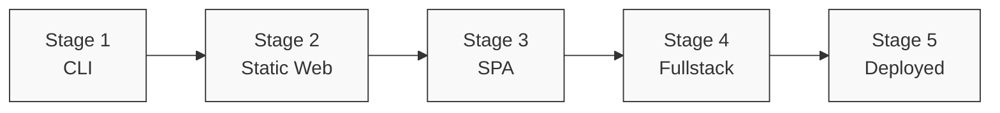

# Curriculum Overview

**devfoundry: From First Principles to LLM-Accelerated Software Creation**

---

## The Vision

Software is the most accessible form of leverage ever created. With modern AI tools, any individual can build software solutions — the barrier isn't capital or connections, it's **understanding**.

This curriculum exists to provide that understanding: not just how to write code, but how to think about software, see protocols everywhere, and turn noticed friction into working solutions.

> *Read the full [DevFoundry Thesis](thesis)*

---

## Curriculum Philosophy

This curriculum teaches software development by building **mental models** and **architectural intuition** first, then introducing implementation details. The goal is not to memorize syntax, but to understand:

- How software systems are structured
- Why architectural decisions matter
- How to communicate with teams and AI assistants
- How to think in terms of components, flows, and constraints
- How to see protocols and friction everywhere
- How to turn problems into solutions

### Why This Approach Works

Traditional "learn to code" paths often teach:
1. Variables and loops
2. Functions and classes
3. "Now build something!"

This curriculum inverts that:
1. What is software? (conceptual model)
2. How do systems flow? (architectural thinking)
3. How do I express this? (implementation)

**Result**: You can work effectively with AI assistants because you can describe *what you want* architecturally, and let the AI handle implementation details.

---

## Learning Objectives

By the end of this curriculum, you will:

- Understand software as **systems of collaborating components**
- Read and create **architectural diagrams** (module, runtime, deployment views)
- Make and document **architecture decisions** using ADRs
- Build progressively complex applications (CLI → web → SPA → fullstack → deployed)
- Use **AI assistants effectively** through architecture-first prompting
- Navigate **real-world developer workflows** (git, testing, deployment)
- Speak the **vocabulary** of professional software teams
- See **protocols everywhere** and understand why things break
- Turn **friction into opportunity** — noticing problems and building solutions
- Have the foundation to **build your own products** from scratch

---

## Curriculum Structure

### Part I: Foundations of Software Systems (Weeks 1-4)

**Goal**: Build mental models for understanding what software is and how it works.

| Module | Topic | Key Concepts | Milestone |
|--------|-------|--------------|-----------|
| 01 | What Software Is (and Isn't) | Programs as recipes, I/O/P model, lemonade stand CLI | Run your first program |
| 02 | Anatomy of Modern Projects | Languages, architectures, desktop vs web vs mobile | Understand the landscape |
| 03 | Deep Dive: Web Architecture | Browser triad (HTML/CSS/JS), client/server, SPA | Mental model of the web |
| 04 | Tooling Overview | Compilers, linters, package managers, what `npm run dev` does | Navigate a real project |

**Hands-on**: Build a CLI lemonade stand, then upgrade it to run in a browser.

---

### Part II: How Teams Build Software (Weeks 5-8)

**Goal**: Learn professional practices that enable collaboration and quality.

| Module | Topic | Key Concepts | Milestone |
|--------|-------|--------------|-----------|
| 05 | UX/UI Fundamentals | User journeys, wireframes, design systems, Tailwind | Design before coding |
| 06 | Development Methodologies | Agile, TDD (light intro), why process matters | Understand team workflows |
| 07 | Git and Collaboration | Repos, commits, branches, PRs, CI/CD | Make your first PR |
| 08 | Architecture Decision Records | Documenting "why", staying aligned with AI | Write your first ADR |

**Hands-on**: Collaborate on a feature using git, write ADRs, create UI wireframes.

---

### Part III: LLM-Assisted Development (Weeks 9-14)

**Goal**: Build a complete application using AI assistants, learning architectural evolution.

| Stage | What You Build | New Concepts | Architecture Focus |
|-------|----------------|--------------|-------------------|
| 1 | Static website | HTML/CSS/JS files, DOM manipulation | Module view |
| 2 | Interactive UI | Event handlers, state, dynamic updates | Component-connector view |
| 3 | Single-Page App | React, components, routing, bundling | Component hierarchy |
| 4 | Fullstack App | Express backend, REST API, database | Client/server allocation |
| 5 | Deployed App | Hosting, environment variables, CI/CD | Deployment view |

**Hands-on**: Build the **Lemonade Stand** progressively across all five stages.

Each stage includes:
- What's new and why
- Architectural diagrams (all three views)
- Step-by-step walkthrough
- LLM prompt templates
- Exercises
- Stretch goals

---

### Part IV: Historical Context (Week 15)

**Goal**: Understand why modern architectures exist (optional but enriching).

| Module | Topic | Why It Matters |
|--------|-------|----------------|
| 11 | Evolution of the Web | CGI/PHP → AJAX → SPAs → WASM | Contextualizes your knowledge |

**Outcome**: You'll see modern React apps not as "just how things are," but as solutions to specific historical problems.

---

## The Lemonade Stand: Your Learning Vehicle

Throughout this curriculum, you'll build and evolve a single application: **a virtual lemonade stand**.

### Why a lemonade stand?

- **Simple domain**: Everyone understands buying lemonade
- **Real business logic**: Orders, inventory, pricing, customers
- **Scalable complexity**: Starts trivial, grows sophisticated
- **Universal metaphor**: Works across cultures and backgrounds

### The Journey

**Stage 1: CLI**
- User types commands in terminal
- Program calculates total, tracks inventory
- **Learn**: Basic program structure, I/O/P model

**Stage 2: Static Web**
- HTML buttons and forms
- JavaScript updates the page
- **Learn**: Browser, DOM, events

**Stage 3: SPA**
- React components
- Client-side routing
- State management
- **Learn**: Modern frontend architecture

**Stage 4: Fullstack**
- Express backend API
- Database persistence
- Authentication (optional)
- **Learn**: Client/server separation, REST APIs

**Stage 5: Deployed**
- Live on the internet
- Environment configuration
- Continuous deployment
- **Learn**: Production concerns

---

## Architectural Views: The Core Framework

Inspired by **"Documenting Software Architectures: Views and Beyond"**, this curriculum teaches you to see systems from multiple perspectives.

### The Three Views We Use

Every example includes diagrams for:

**1. Module View** — Static structure
- What files exist?
- What imports what?
- How is code organized?

**2. Component-Connector View** — Runtime behavior
- How does data flow?
- What happens when a user clicks?
- How do parts communicate?

**3. Allocation View** — Deployment
- Where does code run? (browser vs server)
- What resources are needed?
- How is the system deployed?

### Why This Matters for LLM Workflows

When you prompt an AI assistant, specifying the view helps dramatically:

:::warning[Vague prompt]
"How does the lemonade stand work?"
:::

:::tip[Clear prompt]
"Show me the component-connector view of what happens when a user submits an order."
:::

---

## Prerequisites

### What you need to start:

**Required:**
- Curiosity about how software works
- Willingness to read and think before coding
- Basic computer literacy (files, folders, web browsing)

**Helpful but not required:**
- Some experience with any programming language
- Familiarity with command line basics
- Experience using developer tools

**Not required:**
- CS degree
- Math background
- Prior web development experience

### Setup

You'll need:
- A computer (Mac, Windows, or Linux)
- Internet connection
- A code editor (VS Code recommended)
- Node.js installed
- Git installed
- Access to an AI assistant (Claude, ChatGPT, Cursor, etc.)

Setup instructions are provided in each module's README.

---

## Assessment & Mastery

### How to know you're learning:

**After Part I**, you should be able to:
- Draw a simple diagram of how a web app works
- Explain the difference between client and server
- Navigate a project's file structure
- Run and modify a simple program

**After Part II**, you should be able to:
- Make a git commit and push to GitHub
- Write a basic ADR
- Create a simple UI wireframe
- Explain why architectural decisions matter

**After Part III**, you should be able to:
- Build a complete fullstack application with AI assistance
- Draw all three architectural views of your application
- Debug issues using browser DevTools
- Deploy an application to production
- Prompt AI assistants effectively using architectural context

**After Part IV**, you should be able to:
- Contextualize modern frameworks historically
- Evaluate architectural tradeoffs
- Teach others the mental models you've learned

---

## Final Project

Apply everything you've learned by building your own application:

**Requirements:**
1. Solve a real problem (your choice)
2. Progress through at least 3 stages (static → SPA → fullstack or deployed)
3. Document architecture using ADRs
4. Create diagrams for all three views
5. Use AI assistants with architecture-first prompting
6. Present your work (5-10 minutes)

**Example projects:**
- Budget tracker
- Recipe organizer
- Workout logger
- Event planner
- Video annotation tool
- Team dashboard

---

## What Happens After This Curriculum?

You'll have the foundation to:

- **Build your own products** — From noticed friction to working solution
- **Become a one-person software company** — You now have the leverage
- **Learn any framework** (Vue, Svelte, Angular) by understanding the patterns
- **Read technical documentation** with comprehension
- **Contribute to open source** projects confidently
- **Collaborate with developers** using shared vocabulary
- **Interview for software roles** with system design knowledge
- **Continue learning** through advanced courses, books, and practice

### Recommended next steps:

1. **Notice friction** — Start a friction log, apply [protocol thinking](mental-models/protocol-thinking)
2. **Build something small** — Pick one problem, solve it, ship it
3. **Join the community** — Share what you notice, learn from others ([community](community/index))
4. **Build in public** — Document your journey, attract collaborators
5. **Deep dive** — Pick a specialization and go deeper
6. **Teach others** — The best way to solidify your knowledge

---

## Support & Community

### Getting Help

- **Issues**: Open a GitHub issue for questions or clarifications
- **Discussions**: Use GitHub Discussions for broader questions
- **Contributing**: See CONTRIBUTING.md for how to improve this curriculum

### Join the Community

DevFoundry is more than a curriculum — it's a community of people building software together.

- [Community Guide](community/index) — Overview and how to participate
- [Problems](community/problems/index) — Friction documented by the community
- [Projects](community/projects/index) — Active work being built in public
- [Showcases](community/showcases/index) — Completed projects and success stories

---

## Ready to Begin?

Start here: **[Part I, Module 01: What Software Is](curriculum/part-1-foundations/what-software-is)**

Or continue exploring:
- [How to Use This Repo](how-to-use-this-repo)
- [Diagram Standards](diagram-standards)
- [Architectural Views](architectural-views)
