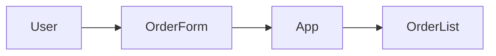

# Architecture-First Prompting

**Build features by describing structure, not just functionality**

---

## Overview

**Architecture-first prompting** means giving AI assistants the context they need to generate code that fits your system, not generic code that might work.

This template is for:
- Building new features
- Adding components to existing projects
- Implementing requirements with architectural clarity

**Time investment**: 5-10 minutes to write a good prompt (saves hours of refactoring)

---

## Why Architecture-First?

### The Problem

❌ **Vague prompt**:
```
"Add a shopping cart to my app"
```

**AI generates**:
- Redux store (but you're using useState)
- Class components (but you're using functional)
- Inline styles (but you're using CSS modules)

**Result**: Code that doesn't fit. Hours spent adapting.

---

### The Solution

✅ **Architecture-first prompt**:
```
**System**: Chat app SPA, React with hooks, no state library

**Architecture**:
- App.jsx holds state: {messages: [], currentUser: 'You'}
- Components: MessageInput.jsx, MessageList.jsx

**Requirement**: Add message reactions
- Display reaction buttons on each message
- Allow adding/removing reactions
- Show reaction counts

**Constraints**:
- Use existing state structure
- Follow functional component pattern
- Match existing naming conventions

Please implement.
```

**AI generates**: Code that drops right in.

---

## The Architecture-First Template

```
**Context**: [Brief system description]

**Tech Stack**: [Languages, frameworks, libraries]

**Architecture** ([View Type]):
[Describe structure — files, components, data flow]

**Current State**: [What exists now]

**Requirement**: [What you need to add]

**Constraints**: [Requirements, limitations, patterns to follow]

**Expected Behavior**: [User flow or data flow]

Please implement [SPECIFIC THING].
```

---

## Template Deep Dive

### Section 1: Context

**Purpose**: Orient the AI to your project

**What to include**:
- Project name or description
- Stage of development (prototype, production, learning example)
- Relevant devfoundry example if applicable

**Example**:
```
**Context**:
I'm building the chat app fullstack from devfoundry
(examples/04-chat-fullstack). It's a learning project demonstrating
client/server architecture with real-time messaging.
```

---

### Section 2: Tech Stack

**Purpose**: Specify exact technologies

**What to include**:
- Language and version (if relevant)
- Frameworks and libraries
- Build tools

**Example**:
```
**Tech Stack**:
- Frontend: React 18, Vite, TypeScript
- Backend: Node.js 18, Express 4.x
- Database: SQLite (better-sqlite3)
- No state management library (using useState + Context)
```

---

### Section 3: Architecture

**Purpose**: Show structure using architectural views

**What to include**:
- Specify which view (Module, Component-Connector, or Allocation)
- File/folder structure OR data flow OR deployment structure

**Module View Example**:
```
**Architecture** (Module View):
src/
  components/
    OrderForm.tsx
    OrderList.tsx
  utils/
    pricing.ts
  App.tsx
```

**Component-Connector View Example**:
```
**Architecture** (Component-Connector View):
User → OrderForm → App state → OrderList → Display
```

**Allocation View Example**:
```
**Architecture** (Allocation View):
Browser (React) ←HTTP→ Server (Express) ← SQLite
```

---

### Section 4: Current State

**Purpose**: Show what already exists

**What to include**:
- Existing code (relevant snippets)
- Current state shape
- Existing functions or components

**Example**:
```
**Current State**:

App.tsx holds this state:
```tsx
const [orders, setOrders] = useState<Order[]>([]);
const [total, setTotal] = useState<number>(0);
```

OrderForm.tsx accepts props:
```tsx
interface OrderFormProps {
  onAddOrder: (order: Order) => void;
}
```
```

---

### Section 5: Requirement

**Purpose**: Specify what you need

**What to include**:
- Feature description
- User-facing behavior
- Data changes needed

**Example**:
```
**Requirement**:
Add a "Remove Item" button to each order in OrderList.

Behavior:
- Each order row shows a "Remove" button
- Clicking removes that order from the state
- Total recalculates automatically
```

---

### Section 6: Constraints

**Purpose**: Specify limitations and patterns

**What to include**:
- Style guidelines (functional components, naming conventions)
- Performance requirements
- Compatibility needs
- Patterns to follow or avoid

**Example**:
```
**Constraints**:
- Must use functional components (no classes)
- Follow existing naming: camelCase for functions, PascalCase for components
- Keep components under 100 lines
- Reuse existing `calculateTotal` function from utils/pricing.ts
- No external libraries (use built-in React only)
```

---

### Section 7: Expected Behavior

**Purpose**: Describe the flow clearly

**What to include**:
- User interaction sequence
- Data transformations
- Visual updates

**Example**:
```
**Expected Behavior**:
1. User clicks "Remove" button on order #3
2. App state updates (removes order with id=3)
3. calculateTotal is called with new orders array
4. Total updates
5. OrderList re-renders without removed item
```

---

## Complete Example

### Scenario: Add Message Search Feature

```
**Context**:
I'm building the chat app SPA (devfoundry examples/03-chat-spa).
This is a learning project teaching React state management.

**Tech Stack**:
- React 18 (functional components with hooks)
- Vite (build tool)
- TypeScript
- No state library (plain useState)

**Architecture** (Module View):
src/
  components/
    MessageInput.tsx   (compose messages)
    MessageList.tsx    (displays messages)
    SearchBar.tsx      (new - search input)
  utils/
    messages.ts        (has formatMessage function)
  App.tsx              (holds state)

**Architecture** (Component-Connector View):
MessageInput → App.sendMessage() → MessageList.display()
SearchBar → App.filterMessages() → MessageList.display()

**Current State**:

App.tsx:
```tsx
const [messages, setMessages] = useState<Message[]>([]);
const [currentUser, setCurrentUser] = useState<string>('You');
```

utils/messages.ts:
```tsx
export function formatMessage(message: Message): string {
  return `${message.sender}: ${message.content}`;
}
```

**Requirement**:
Add a message search feature:
- Search bar at top of message list
- Filter messages by content as user types
- Highlight matching text in results

**Constraints**:
- Create new function: searchMessages(messages: Message[], query: string): Message[] in messages.ts
- Modify App.tsx to store searchQuery and filteredMessages in state
- Create SearchBar.tsx component
- Update MessageList.tsx to highlight matches
- Must not modify existing formatMessage function
- Follow TypeScript best practices (explicit types)

**Expected Behavior**:
1. User types "hello" in search bar
2. App filters messages containing "hello" (case-insensitive)
3. MessageList shows only matching messages
4. Matching text is highlighted in results

Please implement:
1. searchMessages function in utils/messages.ts
2. Updated state management in App.tsx
3. SearchBar component
4. Updated MessageList to highlight matches
```

---

## What Makes This Effective

✓ **AI knows the exact tech stack** (no wrong libraries)
✓ **AI sees the existing structure** (generates fitting code)
✓ **AI understands constraints** (follows patterns)
✓ **AI knows expected flow** (implements correctly)
✓ **Request is specific** (clear deliverables)

---

## Common Variations

### Variation 1: Referencing ADRs

If you have Architecture Decision Records:

```
**Context**:
Per ADR-0001, we use React functional components with hooks (no classes).
Per ADR-0002, we use Node + Express for backend.

[rest of prompt...]
```

---

### Variation 2: Referencing Diagrams

If you've drawn diagrams:

```
**Architecture** (Component-Connector View):



I want to add a ConfirmationModal between OrderForm and App:

User → OrderForm → ConfirmationModal → App

Please implement ConfirmationModal.tsx.
```

---

### Variation 3: Multi-File Changes

When changes span multiple files:

```
**Requirement**:
Add user authentication

**Files to modify**:
1. server/routes/auth.js (new file — login/signup endpoints)
2. server/middleware/auth.js (new file — JWT verification)
3. client/src/App.tsx (add login check, redirect if not authenticated)
4. client/src/components/Login.tsx (new file — login form)

Please implement each file with clear comments.
Show me the files one at a time, starting with server/routes/auth.js.
```

---

## Iteration Pattern

Architecture-first prompting enables clean iteration:

### Round 1: Core Implementation

```
[Full prompt as above]
Please implement the discount feature.
```

### Round 2: Refinement

```
Thanks! The search logic works. Now I want to:
- Search by sender name in addition to content
- Show "No results found" when search is empty

Update the searchMessages function and MessageList component.
```

### Round 3: Edge Cases

```
What happens if:
1. User removes items and subtotal drops below $50?
2. All items are removed?

Please handle these edge cases in App.tsx.
```

---

## Troubleshooting

### AI Generates Wrong Framework

**Problem**: You said React, but AI used Vue

**Fix**: Add to tech stack:
```
**Tech Stack**:
- React 18 (NOT Vue, NOT Angular)
```

---

### AI Ignores Existing Code

**Problem**: AI rewrites code you wanted to keep

**Fix**: Be explicit:
```
**Constraints**:
- DO NOT modify calculateTotal function
- DO NOT change existing state structure
- ONLY add new functionality
```

---

### AI Uses Wrong Patterns

**Problem**: AI uses class components when you wanted functional

**Fix**: Add to constraints:
```
**Constraints**:
- Functional components ONLY (no class components)
- Hooks for state (useState, useEffect)
- TypeScript with explicit types
```

---

## Checklist: Before Sending Prompt

- [ ] Specified tech stack clearly
- [ ] Described architecture (module/component/allocation view)
- [ ] Showed existing code (relevant snippets)
- [ ] Stated requirement clearly
- [ ] Listed constraints (patterns, conventions, limitations)
- [ ] Described expected behavior (user flow or data flow)
- [ ] Asked for specific deliverables

---

## Next Steps

### Practice

Use this template for:
- Exercises in devfoundry curriculum
- Your own projects
- Features in the chat app examples

### Related Templates

- Debugging — When things don't work (to be created)
- Designing Features — Planning before building (to be created)
- Iterative Refinement — Improving code (to be created)

---

## Summary

**Architecture-first prompting**:

1. ✓ Provide system context
2. ✓ Specify tech stack precisely
3. ✓ Show architecture (use views)
4. ✓ Describe current state (paste code)
5. ✓ State requirement clearly
6. ✓ List constraints explicitly
7. ✓ Describe expected behavior

**Result**: AI generates code that fits your system perfectly.

**Time saved**: Hours of refactoring → Minutes of clear prompting

---

**Ready to try?** Pick a feature from your current example and use this template!
